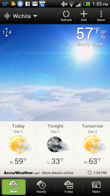
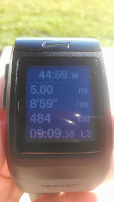

  

  
On Sunday I set out for my run having no distance or pace in mind. Not having a training plan right now is strange but these type of runs are fun. No expectation except to enjoy the run.  
  
About a quarter mile in I realized that it was December 1st and probably my best chance to run my [Fall 5 and 10 Virtual Race](http://www.mommyrunfast.com/virtual-run-series/fall-5-and10-registration/) so I started to speed up.  
  

  
  
It was unseasonably warm and I only had to wear a short sleeve t-shirt and shorts, in December!! I ran and just enjoyed the beautiful weather and the time spent by myself.   
  
One surprising thing is that more runner's weren't out to enjoy the weather. I think I only saw one other person while I was out.  
  
Soon it was time to turn around for my out and back route. Overall, a very uneventful run but memorable because of the warm weather.   
  

  
Back in September, when I started this series, my goal was to run each race a little faster. Each race I was able to increase my speed, that is, until the last one. I was so close too! My biggest problem was not checking what my pace should have been before I left the house. While running I honestly thought that I needed a 9 minute pace to meet my goal. Too bad last month I ran it with an 8:57 average pace.  
  

  

  

  
Distance: 5 miles  
Time: 44:59  
Average Pace: 8:59  
  
Read more about my first three runs from the 5 and 10 Virtual Race Series. **[September's Race](http://amotherspace.blogspot.com/2013/09/a-labor-day-bestrun-5-and-10-virtual.html#.UnfpWPlQEYk). [October's Race](http://amotherspace.blogspot.com/2013/10/octobers-fall-5-and-10-virtual-race.html#.UnfpTflQEYk). [November's Race](http://amotherspace.blogspot.com/2013/11/fall-5-and-10-virtual-race-series.html#.Up1GbMRQEYk).**   
  

**Are you participating in the Fall 5 and 10 Virtual Race Series?**

  

\-------------------------------

  

Find A Mother's Pace on...  
  
Twitter [@amotherspace3](https://twitter.com/amotherspace3)  
  
Facebook [amotherspace3](http://facebook.com/amotherspace3)  
  
Instagram [amotherspace](http://instagram.com/amotherspace)  
  
Pinterest [amotherspace](http://pinterest.com/amotherspace/)  
  
Bloglovin' [A Mother's Pace](http://www.bloglovin.com/en/blog/6680087)  
  
RSS [amotherspace](http://feeds.feedburner.com/amotherspace)
