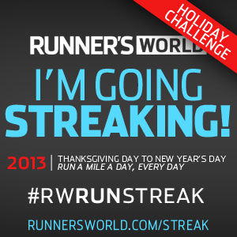
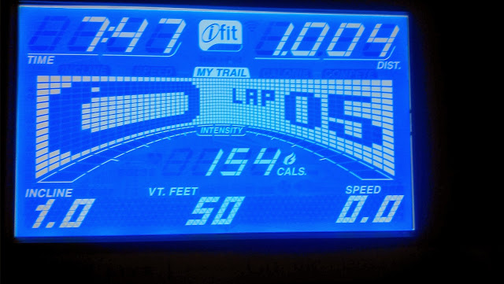
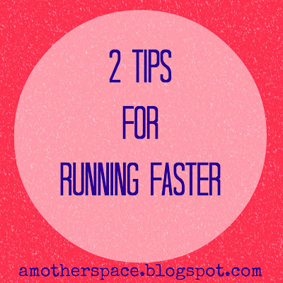

If you are following me on [Facebook](https://www.facebook.com/amotherspace3), [Instagram](http://instagram.com/amotherspace) or [Twitter](https://twitter.com/AMothersPace3) it will be no surprise to you that I'm streaking again. It's so motivating to participate in a streak like this especially since I don't have an official race on the calendar right now.   
  
It took me a week but I finally broke down and ran a fast mile during this round of the Runner's World Holiday Run Streak.  
  
Everything I've read about streaking tells you to run slowly on the 1 mile days because they are your rest days. I know my legs need rest but honestly, it's just too tempting for me to run faster.  
  
So I decided to give myself a break. I typically run two 1 milers a week to keep the streak going and I'm going to allow myself one day to go as fast as I want too.   
  
Yesterday was my fast day. I warmed up with a 5 minute walk on the treadmill and then started in on the run. I was a little nervous because I knew I wanted to hit a pace with a 7 at the beginning. I'm not sure I've ever ran a mile that fast before but I knew I could do it.  
  
I started my treadmill at 7.5 (an 8 minute pace) and gradually moved up to 8.0 (a 7:30 pace) by the end of the mile.   
  
I finished in 7:47!  
  

  
  
I walked for about 10 minutes to cool down.   
  
One of my favorite things about participating in a running streak is that it motivates me to do other kinds of exercise as well. I've been pretty bad about strength training and core work for the past few weeks but on these short run days I tend to follow up the run with something else.   
  
Yesterday I picked the Ab Burner workout from my Nike Training Club app on my phone. It's one of my favorites. After the Ab workout I decided to try a 2 minute plank. Ouch, that was tough!!  
  
My 7 minute and 47 seconds run turned into a 40 minute workout.   
  

During the last streak (just this past summer) I was running an 8:30 to 9:00 minute pace for my fast miles. Talk about progress! So, my advice to those who want to run faster (really, who doesn't want to run faster???) is to **stick with it** and **write it down**. I keep a training log and being able to flip back to a few months ago and see so much growth is very motivating. Nothing I'm doing is ground breaking. I've just added strides to the end of some easy runs, and I run a 400 interval run and a tempo run each week for speed work. It's all hard work but it really pays off.  
  
  

**Are you streaking? What do you think of the short 1 mile days, fast or slow?**

\-------------------------------

  

Find A Mother's Pace on...  
  
Twitter [@amotherspace3](https://twitter.com/amotherspace3)  
  
Facebook [amotherspace3](http://facebook.com/amotherspace3)  
  
Instagram [amotherspace](http://instagram.com/amotherspace)  
  
Pinterest [amotherspace](http://pinterest.com/amotherspace/)  
  
Bloglovin' [A Mother's Pace](http://www.bloglovin.com/en/blog/6680087)  
  
RSS [amotherspace](http://feeds.feedburner.com/amotherspace)
