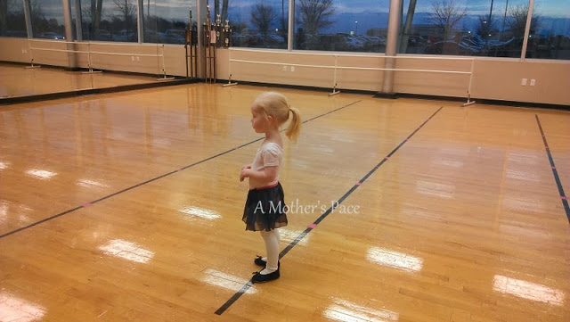
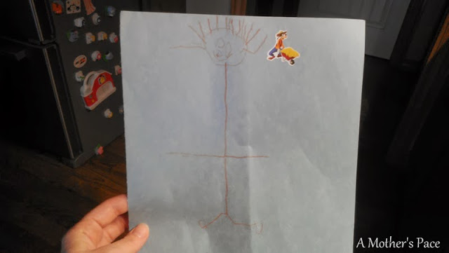
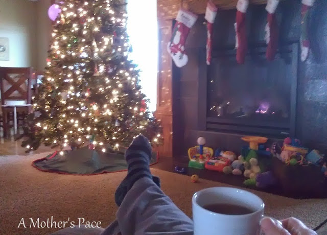

It seems as though this was the first normal week we have had in quite a while. The kids and I had all of our weekly activities again after the holiday and everyone was healthy the entire week. With little kids, having a routine is a must, so getting back to normal feels great.  
  
It's Friday so I have a few random thoughts for you today.  
  
\[1\]  
This week, my daughter started her first dance class all by herself. She'd previously gone to a class with parent (or grandparent) involvement so this is a big step for my shy little girl. Oh, and yes she was _all by herself_ in more ways than one. She was the only student in the class. I guess December is a low attendance month!  

  

  
\[2\]  
We don't have mountains or the ocean but we do have beautiful sunsets here in Kansas.   
  

  
  
\[3\]  
I'm a little in love with this self portrait of my son. Don't his little feet look like they are running???  
  

  
  
\[4\]  
What, isn't this what you would normally want to wear to go outside and play? It's all about picking battles with this little girl as she gets dressed for the day. Not worth the argument to try and get her to change out of her fancy dress!  
  

  
  
\[5\]  
Before I was a stay at home mom, I honestly thought there would be more of this in my life.  
  

  
  
Ha! I rarely enjoy relaxing by the fire with a cup of tea at any time of day but I took advantage of nap time earlier this week. Of course, I took the picture and about a minute later I was needed back in the bedroom to help the littles fall asleep.   
  

**What would you do if you had a little spare time in the middle of the day?**

  
  
  

\-------------------------------

  

Find A Mother's Pace on...  
  
Twitter [@amotherspace3](https://twitter.com/amotherspace3)  
  
Facebook [amotherspace3](http://facebook.com/amotherspace3)  
  
Instagram [amotherspace](http://instagram.com/amotherspace)  
  
Pinterest [amotherspace](http://pinterest.com/amotherspace/)  
  
Bloglovin' [A Mother's Pace](http://www.bloglovin.com/en/blog/6680087)  
  
RSS [amotherspace](http://feeds.feedburner.com/amotherspace)
