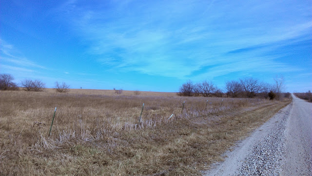
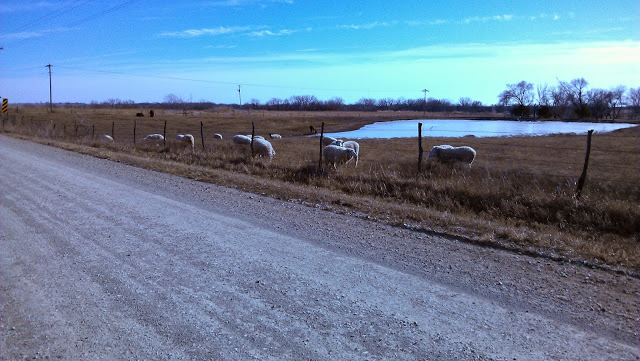
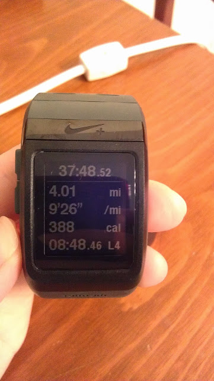
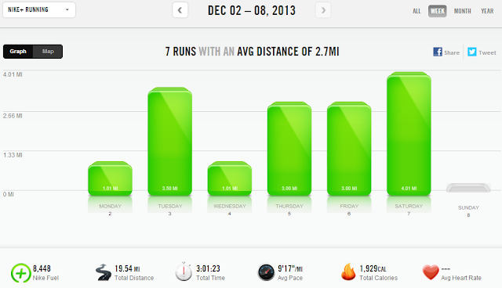

Cold weather has settled into our area and so most of my running last week was on the treadmill. Feels like 5 degrees Fahrenheit! Brrr, that's a bit too cold to run outside, especially in the morning before the sun is up.  
  
One morning I ran outside at 6 a.m. (it was in the 20's, so a little warmer). The night before a pack of coyotes woke us up at midnight and the memory of hearing them bark (is that what it's called??) was too fresh in my head to stray very far from my house. I knew that they had probably moved on in the 6 hours since I had heard them but it still kinda freaked me out. I ended up doing 3 miles of loops in my neighborhood. Not my favorite route by any means.  
  
The only other time I was outside was while we were traveling. We drove to Nana & Papa's house to celebrate Christmas early and I ran out in the country.   
  

  
4 solo miles on the dirt roads.  
  

  
I saw some sheep and a deer (not pictured) on my out and back route.   
  

  
It was bitterly cold and on my way out I was freezing (especially my face) because I was running into the wind. On the way back I was a little warm and unzipped my jacket. When I set out I was going to run between 1 and 3 miles, completely dependent on the weather. I ended up enjoying the run so much that I ran 4 instead!  
  

  
  

  
**Weekly Workouts**  
  
Monday: 1.01 miles (9:59 pace)  
  
Tuesday: 3.50 miles (9:24 pace)  
  
Wednesday: 1.01 miles (7:35 pace)  
  
Thursday: 3 miles (9:13 pace)  
  
Friday: 3 miles (9:13 pace)  
  
Saturday: 4.01 miles (9:26 pace)  
  
Sunday: 4 miles (9:31 pace)  
  

  
Imagine in the graph above that there is also a green bar on Sunday. I ran 4 miles but it didn't show up in the Nike+ graph for some reason.  
  
Total Running Miles: 19:53  
Weekly Average Pace: 9:17  
  
December Running Miles: 24.53  
2013 Running Miles: 531.59  
  
  
  

**When running outside, how cold is too cold for you?**

  

\-------------------------------

  

Find A Mother's Pace on...  
  
Twitter [@amotherspace3](https://twitter.com/amotherspace3)  
  
Facebook [amotherspace3](http://facebook.com/amotherspace3)  
  
Instagram [amotherspace](http://instagram.com/amotherspace)  
  
Pinterest [amotherspace](http://pinterest.com/amotherspace/)  
  
Bloglovin' [A Mother's Pace](http://www.bloglovin.com/en/blog/6680087)  
  
RSS [amotherspace](http://feeds.feedburner.com/amotherspace)
