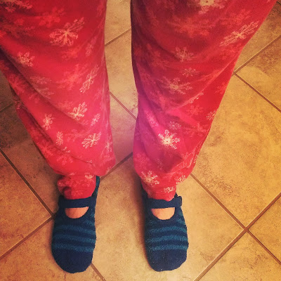
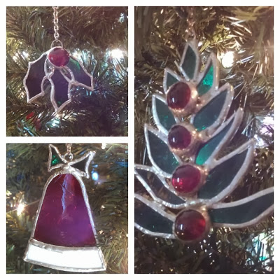

This week might be a first! A Friday Five post with no pictures or stories of my kids!? I'm not sure if that's a good thing or not because I'm missing their smiling faces in this post already. Read on for my thoughts on this Friday, they are mainly about running...go figure!  
  
\[1\]  
My new favorite thing about running after my husband gets off work in the evening is going straight to jammies after getting cleaned up.   
  

  
\[2\]  
I'm still streaking. Today marks the 15th day. My longest streak is 40 days which I completed this past summer. This official Runner's World Holiday Run Streak only lasts 34 days so I may have to extend it to better my streak.  
  

  
  
\[3\]  
I'm letting myself run 'fast' during one of my 1 milers each week. This week I increased my pace by 7 seconds and ran a 7:40 mile. It's so much fun to run fast!  
  

  
\[4\]  
I placed a cyber Monday order on Saucony's website. I'm always a little nervous to order clothes online without trying them on first. I'm happy to say that all of these items fit very well. I've worn the shorts on a treadmill run and LOVED them. They didn't ride up and the fabric is very light. _(In no way does Saucony sponsor me {in my dreams!!} I just like their products and want to share that with you.)_  

  
  
\[5\]  
My grandmother used to make stained glass ornaments and decorations. They are my most treasured ornaments on the Christmas tree.  
  

**Do you have treasured ornaments on your tree?**

Happy Friday and have a wonderful weekend!  
  
  

\-------------------------------

  

Find A Mother's Pace on...  
  
Twitter [@amotherspace3](https://twitter.com/amotherspace3)  
  
Facebook [amotherspace3](http://facebook.com/amotherspace3)  
  
Instagram [amotherspace](http://instagram.com/amotherspace)  
  
Pinterest [amotherspace](http://pinterest.com/amotherspace/)  
  
Bloglovin' [A Mother's Pace](http://www.bloglovin.com/en/blog/6680087)  
  
RSS [amotherspace](http://feeds.feedburner.com/amotherspace)
