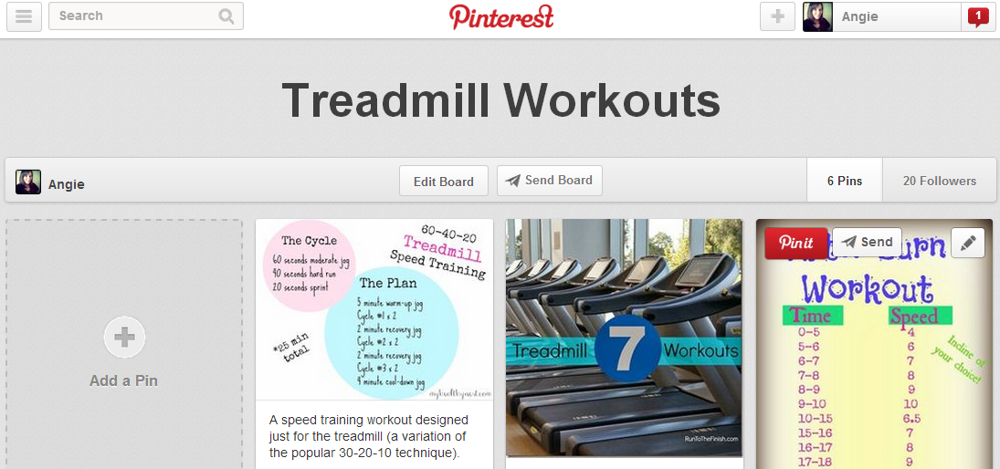
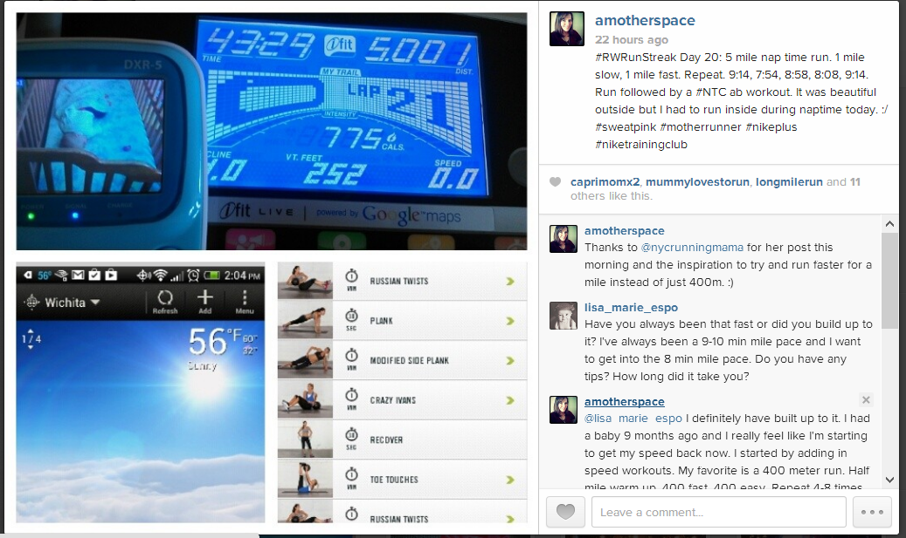

I've spent a lot of time on the treadmill lately. Both the weather and the convenience of running inside during nap time have been the deciding factors when choosing where to run.   
  
The treadmill can be boring but lately I've been mixing up workouts to keep things interesting. Following people that inspire me on social media is one way to discover new workouts.   
  

  
  
I've found that Pinterest is an excellent resource. (Shocking, I know!) I've pinned several workouts to my [**Treadmill Workouts**](http://www.pinterest.com/amotherspace/treadmill-workouts/) board. If I'm dreading a run I know that I can open my computer and find something new to try which makes the run much more interesting.   
  
I also love seeing workouts that people have accomplished on Instagram. Just this week I was planning on doing some sort of speed work on the treadmill. I saw a workout that Michele (@nycrunningmama) had completed that morning. Now I am no where near as fast as she is but her workout still inspired me to try something new.   
  

  
  
Instead of my typical 400 meter workout I ran a mile repeat. 1 mile slow, 1 mile fast. I repeated it and then cooled down for a mile. Michele's post encouraged me to try and run fast for an entire mile instead of just 400 meters.  
  
These are just two examples of current inspiration for running. I could go on (blog posts, comments on my blog, twitter, running magazines, in real life conversations, etc.) but I'll leave those for another day.  
  
Follow me on **[Pinterest](http://www.pinterest.com/amotherspace/)** to find pins on real food recipes, strength workouts, treadmill workouts and more.  
  
Follow me on **[Instagram](http://instagram.com/amotherspace)** to see my running and strength workouts plus some fun family and daily life happenings.   
  

**Are you on Pinterest? Share your username for your boards so I can follow you! (Please just share the username and not the whole link. Google doesn't like links in the comments on blogs!)**

**Are you on Instagram? Leave your username below!**

**Who inspires you on Instagram or Pinterest?**

  
  

\-------------------------------

  

Find A Mother's Pace on...  
  
Twitter [@amotherspace3](https://twitter.com/amotherspace3)  
  
Facebook [amotherspace3](http://facebook.com/amotherspace3)  
  
Instagram [amotherspace](http://instagram.com/amotherspace)  
  
Pinterest [amotherspace](http://pinterest.com/amotherspace/)  
  
Bloglovin' [A Mother's Pace](http://www.bloglovin.com/en/blog/6680087)  
  
RSS [amotherspace](http://feeds.feedburner.com/amotherspace)
