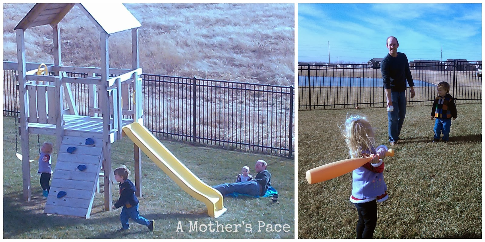

  

5:30 a.m. My alarm goes off but I ignore it for 15 minutes.   
  
6:00 a.m. I'm downstairs and ready to run on the treadmill. Only 1 mile today to keep the Runner's World Holiday Run Streak going. I finish my run and have time to do some strength training. I'm in the middle of squats, calf raises, planks, push ups and resistance band moves when my littles start coming down the stairs to find me.  
  
They play with toys while I finish and also join in on a few exercises.   
  
  

  
7:30 a.m. A quick egg breakfast and we're off to school.  
  
  

  

  
9:00 a.m. Daddy took his last vacation day of the year to spend with the kids on their Christmas party day at school. They loved having him visit for the day!  
  
  

  
11:30 a.m. Lunch back at home. Leftover chili plus a salad with lemon cake for dessert for me.   
  
  

  
12:00 p.m. The kids go outside with Daddy and I stay inside to tackle the mountain of dishes. How do we end up with so many dishes???  
  
  

  
12:45 p.m. I go outside to enjoy the kids and the beautiful weather we are having in December.   
  

  
It's a little crazy that the first time Little E has seen a lady bug is in December. I'm enjoying this warm weather while we still have it.  
  
  

  
1:30 p.m. Nap time for the kids. They all go down pretty easily. My husband has a work phone call and I work on my blog for awhile. I also pull out the Christmas cards that need to be addressed still and work on those for a bit. Oh, and a selfie. This is how I look today.  
  
3:30 p.m. Kids wake up from napping and start watching Dora. They each get to pick one 20 minute show a day. I keep working on my computer and addressing the envelopes. My husband is up from his meeting and starts to fix dinner.   
  

  
4:30 p.m. We have a VERY early dinner because it's a busy night tonight. Pasta with sausage, mushrooms and red sauce is on the menu. A side of pears and Stone Hearth Bread from a local bakery.  
  
5:15 p.m. It's our last night at the Y for awhile and we start with Little A's dance class. She's the only one in class at the beginning but is joined by another girl soon. I love sitting outside the window and watching her during dance. So cute!  
  

  
5:45 p.m. We head over to Little O's gymnastics class. It amazes me how much he's learned in only the few months that he's been taking gymnastics.  
  
7:00 p.m. Back at home and time blends together at this point in the day. We are busy getting the kids ready for bed but have a little time before reading books and heading to bed so we start to rebuild the track. My son LOVES trains and has for the past two years. He's pretty lucky because he's gotten some great track and train presents from our family.   
  
8:30 p.m. The kids are in reading with Daddy and I stay out and work on the track. Little O wants me to finish it for him as a surprise the next morning.  
  
9:15 p.m. It's time to wind down with a beer and a little t.v. before bed. We're currently working through 30 Rock on Netflix.   
  

  
6:00 a.m. The next day. Little O wakes up and doesn't even come into our bedroom like he usually does. He is excited when he sees the new train track on the floor and stops to play with it.   
  
Not pictured: Many diaper changes and nursing sessions. Also, a very successful day of potty training. Little A (3 years) has been potty training for awhile now but for the past 3 days she hasn't worn her diaper at all. Not even at night or during nap time. And she hasn't had any accidents!  
  
  
Today I'm linking up with [**Jill**](http://jillconyers.com/) and [**Angela**](http://www.happyfitmama.com/) for **A Day In the Life.**   
Want more? Read my first "[Day in the Life](http://amotherspace.blogspot.com/2013/09/a-day-in-life.html#.UrIZYfRDtSc)" post from back in September.  
  

\------------------------------------------

  
Find A Mother's Pace on...  
  
Twitter [@amotherspace3](https://twitter.com/amotherspace3)  
  
Facebook [amotherspace3](http://facebook.com/amotherspace3)  
  
Instagram [amotherspace](http://instagram.com/amotherspace)  
  
Pinterest [amotherspace](http://pinterest.com/amotherspace/)  
  
Bloglovin' [A Mother's Pace](http://www.bloglovin.com/en/blog/6680087)  
  
RSS [amotherspace](http://feeds.feedburner.com/amotherspace)
