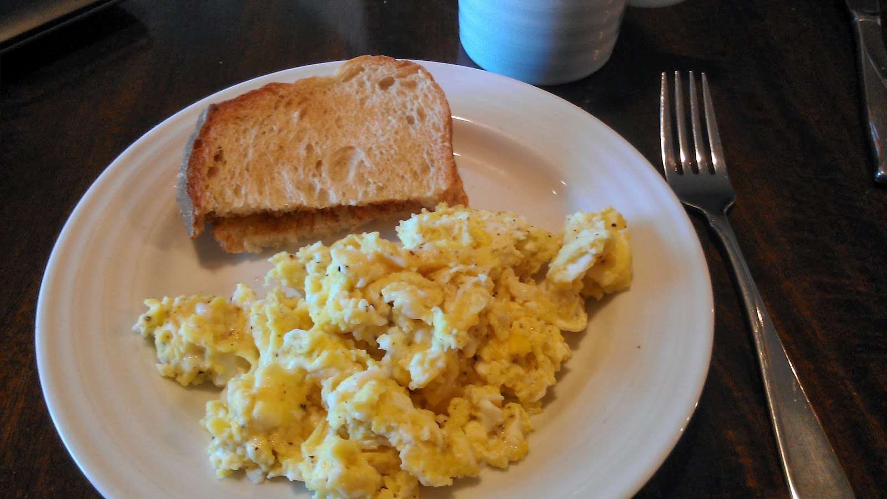
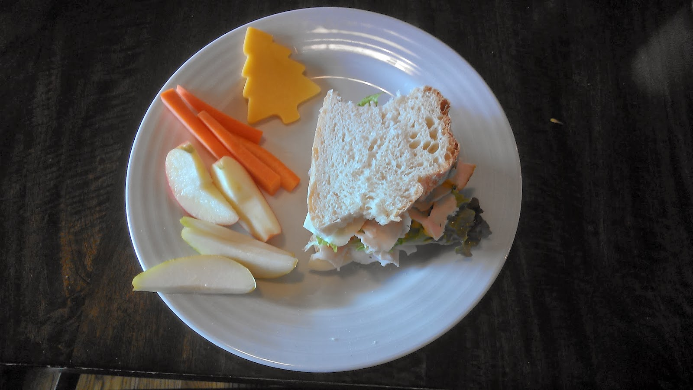
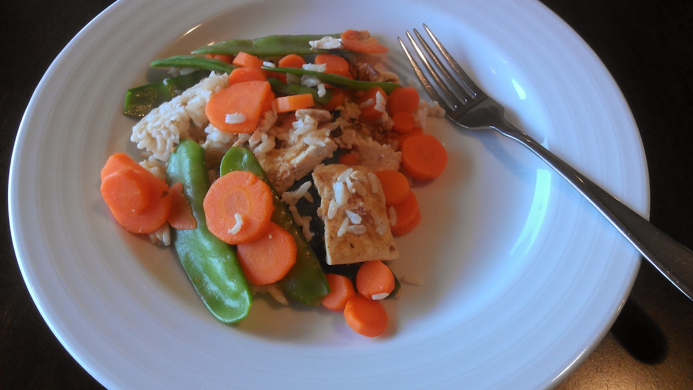
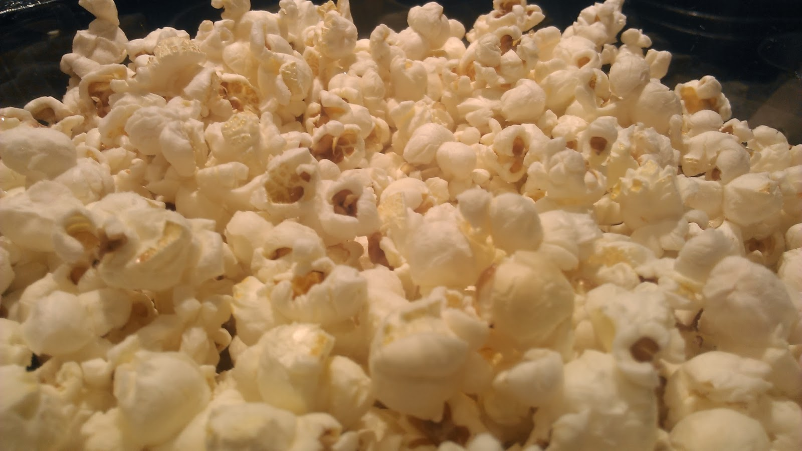
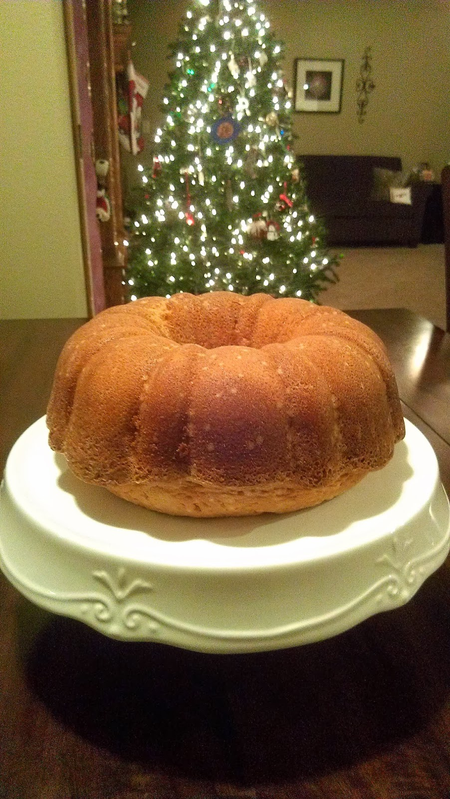
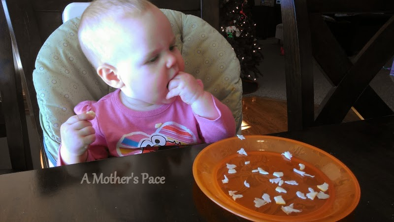

My first week of sharing my meal plan was a success! I didn't completely stick with the plan but it was helpful to have it ready by the beginning of the week. It's much easier to get all the grocery shopping completed before the week starts.  
  
Do you ever plan a meal and then when you get to that day you are completely not in the mood for it? That's what happened to me with the [Cheeseburger Skillet Pie](http://www.realsimple.com/food-recipes/browse-all-recipes/cheeseburger-skillet-pie-00100000064429/index.html) last week. It's a tasty meal but I wasn't in the mood to make the biscuits from scratch that go on top. We were saved from the meal by an invitation to eat over at an Aunt and Uncle's house. I'll keep it in the back of my head and maybe make it soon.  
  
Here's a glimpse at some of my meals last week.  
  
\[breakfast\]  
I ran out of granola this week and didn't get any more made so it was mainly eggs for breakfast this week.  
  
  

  
\[lunch\]  
I bought lunch meat at the store for my husband (he eats a turkey sandwich almost every day for lunch.) and when I got home I realized that he had bought some a couple of days before. Needless to say, we have a lot of turkey to eat over the next several days.  
  
  

  
\[dinner\]  
My brother comes over for dinner on Thursdays every week and, since he is vegan, we always have something vegan friendly. This week on the menu was Nutty Tofu and Veggies. We've made this quite a few times over the past couple of years but I had never thought about it as specifically a vegan meal before. It was a hit with everyone, including Little E!  
  
  

  
\[snack\]  
We had popcorn as a movie night snack this week. It's been a long time since I've made popcorn. Too long because it is so good. I make it with coconut oil so it's full of healthy fat.  
  
  

  
  
\[treat\]  
Book Club was at my house and my favorite thing that I made this time around was this Lemon Vanilla Bundt Cake from the [Magnolia Bakery Cookbook](http://amzn.to/18DBCvz). I've loved everything I've made out of this cookbook and this cake was no exception.  
  
  

  
\[baby food\]  
Little E is now sitting pushed up to the table and loving it. She no longer wants to be fed. She wants to hold the spoon and feed herself. Not much gets in her mouth so she eventually gives up and lets someone feed her. She's also loving all kinds of finger foods. She entertains us at meal times while she is exploring her food.  
  
  

  
  
Here's the plan for next week:  
  
Monday: [Spinach, Bacon and Feta Frittata](http://onceamonthmeals.com/spinach-bacon-feta-frittata/) from Once a Month Mom  
Tuesday: Tacos and Quesadillas   
Wednesday: Christmas Ham with Roasted Veggies  
Thursday: Leftovers  
Friday: Pizza Night  
Saturday: Pasta with Ham and Peas  
Sunday: [Split Pea Soup](http://www.100daysofrealfood.com/2011/09/28/recipe-easy-split-pea-soup/) from 100 Days of Real Food   
  
  

**What are you eating this week? Do you ever scrap a meal idea because you aren't in the mood anymore?**

  
  

\-------------------------------

  

Find A Mother's Pace on...  
  
Twitter [@amotherspace3](https://twitter.com/amotherspace3)  
  
Facebook [amotherspace3](http://facebook.com/amotherspace3)  
  
Instagram [amotherspace](http://instagram.com/amotherspace)  
  
Pinterest [amotherspace](http://pinterest.com/amotherspace/)  
  
Bloglovin' [A Mother's Pace](http://www.bloglovin.com/en/blog/6680087)  
  
RSS [amotherspace](http://feeds.feedburner.com/amotherspace)
