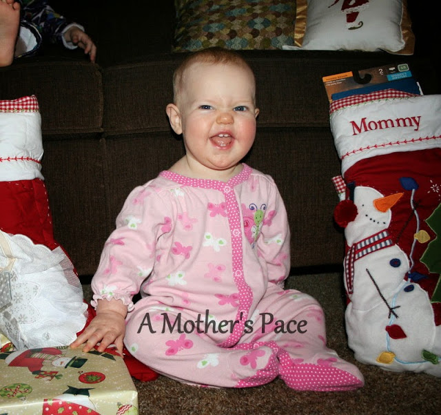
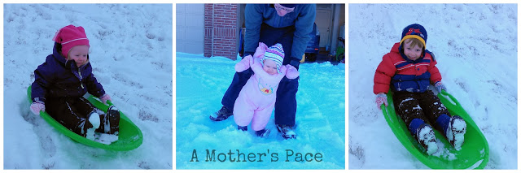
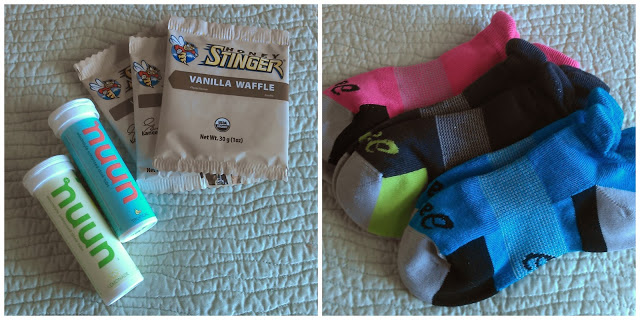
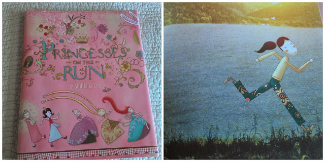

It's all things Christmas around our house for the past couple of days so I thought I would share some of my favorites from the holiday today.   
  
\[one\]  
This little girl turned 10 months old on Christmas. She was much more interested in the wrapping paper than in the actual presents.   
  

  
\[two\]  
We had a white Christmas this year. The kids loved sledding, making a snowman, shoveling and making snow angels. Snow makes Christmas even more magical for little ones.  
  

  
\[three\]  
Santa brought me a couple of running related gifts. I'm stocked up on my Nuun now with a couple of new flavors and I now I have a few more of my favorite Honey Stinger waffles. I also have fun new running socks!   
  

  
\[four\]  
I was able to get in a quick run on Christmas day. Luckily it was my short 1 mile 'rest' day anyway (to keep the streak going) otherwise I don't know if I would have accomplished much more. I wasn't feeling well (scratchy throat, achy ears, headache) but I did rest a little in the afternoon and then hopped on the treadmill for a mile. I'm still streaking!   
  

  
\[five\]  
My mom bought "[Princesses on the Run](http://amzn.to/1dbbnMj)" for my daughter. What a cute idea for a book. My daughter and I both love it!  
  

  
  
I hope you had a Merry Christmas!   
  

**Did you receive any running related gifts? Did you run on Christmas day?**

  
  
  

\-------------------------------

  

Find A Mother's Pace on...  
  
Twitter [@amotherspace3](https://twitter.com/amotherspace3)  
  
Facebook [amotherspace3](http://facebook.com/amotherspace3)  
  
Instagram [amotherspace](http://instagram.com/amotherspace)  
  
Pinterest [amotherspace](http://pinterest.com/amotherspace/)  
  
Bloglovin' [A Mother's Pace](http://www.bloglovin.com/en/blog/6680087)  
  
RSS [amotherspace](http://feeds.feedburner.com/amotherspace)
