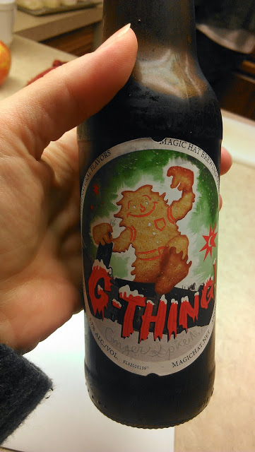
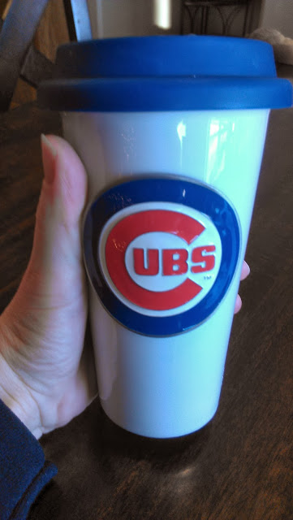
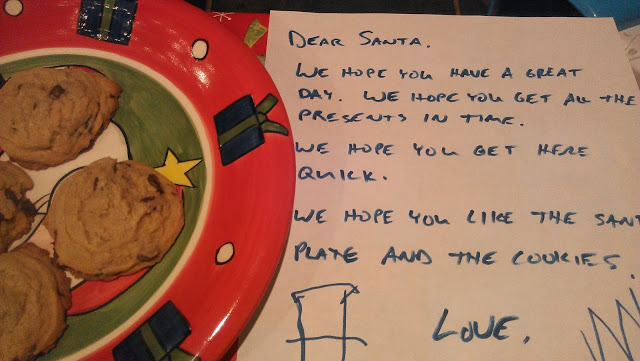
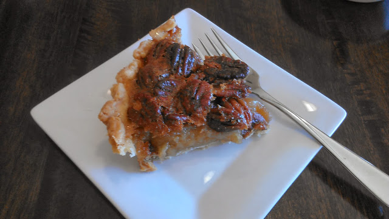

As it turns out, a holiday week isn't such a great week to take photos of food. I evidently like to take pictures of drinks and dessert instead.  
  
\[beer\]  
This holiday brew from Magic Hat is pretty tasty.  
  
  

  
  
\[coffee\]  
I'm loving my new coffee cup that my kiddos gave me for Christmas. Go Cubbies!  
  
  

  
  
\[tea\]  
A warm pot of tea in the afternoon is my beverage of choice lately. My husband (he works from home) and I have been sipping on a mug of hot tea throughout the midday hours lately.  
  
  

  
  
\[santa cookies\]  
Of course, I didn't eat these...cough, cough...but I did eat a few other chocolate chip cookies from the batch.  
  
  

  
  
\[pecan pie\]  
My favorite pie that my mom makes. So delicious!  
  
  

  
  
Our menu for next week:  
  
\[monday\]  
Ham with Pasta and Peas  
  
\[tuesday\]  
Carnitas (from the freezer, leftover from when my BIL made them over Thanksgiving...YUM!)  
  
\[wednesday\]  
Sweet potatoes with chili on top. Haven't tried this yet? Do it, so good!  
  
\[thursday\]  
[Chicken, Sweet Potatoes and Green Beans](http://www.julieseatsandtreats.com/2012/08/green-beans-chicken-potatoes/)   
I don't follow the recipe in the link exactly. I've changed the potatoes to sweet potatoes, I use a lot less butter and I add my own spices instead of the packet. It's really an easy and delicious meal.  
  
\[friday\]  
Sushi, Dinner Out! Our 5 year anniversary date!   
  
\[saturday\]  
Homemade Pizza Night  
  
\[sunday\]  
Minestrone Soup  
  
  

  
  
  
  
  

\-------------------------------

  

Find A Mother's Pace on...  
  
Twitter [@amotherspace3](https://twitter.com/amotherspace3)  
  
Facebook [amotherspace3](http://facebook.com/amotherspace3)  
  
Instagram [amotherspace](http://instagram.com/amotherspace)  
  
Pinterest [amotherspace](http://pinterest.com/amotherspace/)  
  
Bloglovin' [A Mother's Pace](http://www.bloglovin.com/en/blog/6680087)  
  
RSS [amotherspace](http://feeds.feedburner.com/amotherspace)
