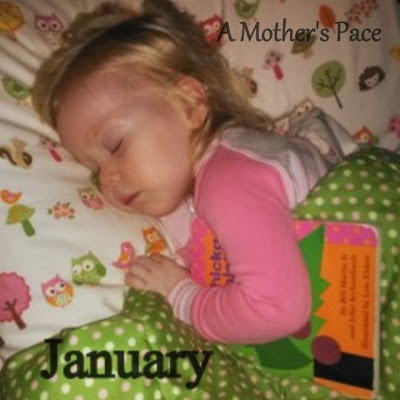
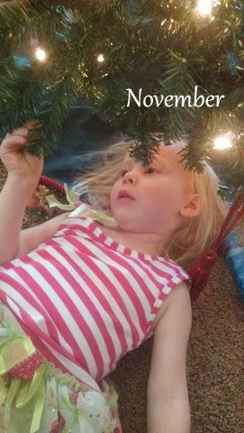
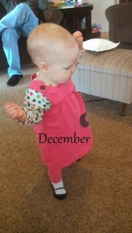
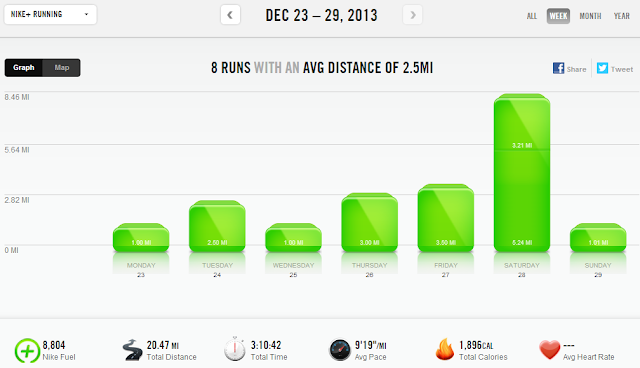

I saw a fun hashtag on Instagram (#my12picsof2013) and I instantly knew I would have to play along. During the last 12 days of 2013 I posted a favorite photo from the 12 months of the year.   
  
I loved looking back on my photos for the year and some months it was very hard to pick a favorite. The 12 photos are pretty kid heavy but I'll be the first one to admit that I'm biased when it comes to my children.   
  
And if you can make it through the following pictures you'll find my normal Monday weekly training log at the end of this post.  
  
\[january\]  

  

  
I'm pretty happy that all of my children love books. They always have books with them in bed and I often find them snuggling with them after they've fallen asleep.  

  
\[february\]  
  
  

  
I cannot believe I was ever this huge! 9 months pregnant and I love this photo because our daughter was born a couple of weeks later in the middle of another snow storm.  
  
\[march\]  
  
  

  
Train love and baby love. Both are a big deal in our house. This photo is my favorite from the entire year.   
  
\[april\]  
  
  

  
Little A loves to get dirty and painty. I have fond memories of this afternoon specifically because she played with the cars and paint for a very long time. Thoroughly enjoying every minute.  
  
\[may\]  
  
  

  
Summertime! Outside! Bikes! So much fun.  
  
\[june\]  
  
  

  
Another sleeping photo. Little E fell asleep while watching the big kids play with trains.  
  
\[july\]  
  
  

  
I took a monthly photo of Little E and it was hard to just pick one for this project. I probably could have filled the whole year up with favorites from this photo shoot each month. It's such a joy to watch a baby grow and develop through the first year of life.  
  
\[august\]  
  
  

  
Little O finally learned how to ride his tricycle well and FAST. Watching him ride his bike was hands down one of my favorite things to do over the summer.  
  
\[september\]  
  
  

  
Happiness is an ice cream cone as big as your head. Need I say more?  
  
\[october\]  

  

  
My husband ran his first half marathon and I ran my 5th in October. I still am so proud of his accomplishment!  
  
\[november\]  
  
  

  
The last two photos I haven't put on Instagram yet but you get a sneak peak! This one is from the last day in November. We had just put up our tree and it was magical for my 3 year old.   
\[december\]  
  
  

  
And she's walking! At 10 months and 4 days old my Little E took her first steps. This is much earlier than my other two children and SO. MUCH. FUN!  
  
  
So you've made it though all of the photographs and now I'm going to wrap up my last full week of running in 2013. 
  
  

  
**Weekly Workouts**  
  
Monday: 1 mile (9:07 pace) + 20 minutes strength  
  
Tuesday: 2.5 miles (9:50 pace)  
  
Wednesday: 1 mile (8:43 pace)  
  
Thursday: 3 miles (9:14 pace) + NTC Arm Definer  
  
Friday: 3.5 miles (9:14 pace)  
  
Saturday: 8.45 miles (9:29 pace)  
  
Sunday: 1.01 miles (8:07 pace)  
  
  
  
  

  
Total Running Miles: 20.46   
Weekly Average Pace: 9:19  
  
December Running Miles: 89.65  
2013 Running Miles: 596.71  
  
I'm so close to making my 600 miles goal for the year and with two days left I'm sure it will happen!!  
  
  

  
  

**Have you looked back on photos from 2013?**

  
  

\-------------------------------

  

Find A Mother's Pace on...  
  
Twitter [@amotherspace3](https://twitter.com/amotherspace3)  
  
Facebook [amotherspace3](http://facebook.com/amotherspace3)  
  
Instagram [amotherspace](http://instagram.com/amotherspace)  
  
Pinterest [amotherspace](http://pinterest.com/amotherspace/)  
  
Bloglovin' [A Mother's Pace](http://www.bloglovin.com/en/blog/6680087)  
  
RSS [amotherspace](http://feeds.feedburner.com/amotherspace)
