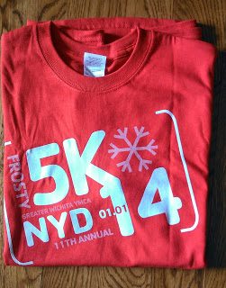

Happy New Year!  
  
Today I'm kicking off 2014 with a local 5K race. Our local Frosty 5K that they YMCA puts on each year.  
  
I've never been one to set New Years resolutions and then check on them throughout the year. Last year I [**wrote a post**](http://amotherspace.blogspot.com/2013/01/a-new-year-fitness-goals.html#.UsGszfRDtSc) about my goals for the year and then didn't look at it again until the end of December. I'm pretty sure that isn't the way that goal setting is supposed to go.  
  
I must have picked goals that were meant for me because reading over that post is almost exactly what happened in 2013. 
  
So, I may or may not read over this post again until December 2014 but I will keep this one in my thoughts more than the last one. I have big goals for 2014, goals that require attention and hard work.  
  
First is my goal race. I'm going big again this year and will train for the Chicago Marathon in the fall. My **[first marathon](http://amotherspace.blogspot.com/2012_10_01_archive.html#6408708857477500559)** I ran to finish it and this marathon I want to run to see what I can do.  
  

I also want to do more races this year. I love the race environment and the way that it pushes a runner to do their best. I signed on to run 14 races in the year 2014 with Jill and Jen's challenge. You can read more about the challenge and find out how to sign up by following **[this link](http://amotherspace.blogspot.com/2013/12/14-races-in-2014.html#.UsMi9_RDtSc)**.  
  
This week I also upped my mileage goal for 2014. For awhile now I've wanted to complete 1,000 miles in a year.  In 2013 I completed just over 650 with only 9 months of running. Some of those were light running months after giving birth to my 3rd child.  
  

When I saw that **[Run This Year](http://runninghutch.com/runthisyear/)** was offering a challenge to run the year in kilometers (2,014 kilometers = 1251.4 miles) I decided that was a challenge I would like to take on. It is significantly higher than my initial goal and double the amount of miles I ran this year but I'm in. And I'm excited about it.  
  

**Do you make new year's resolutions? Do you have running goals for 2014?**

\-------------------------------

  

Find A Mother's Pace on...  
  
Twitter [@amotherspace3](https://twitter.com/amotherspace3)  
  
Facebook [amotherspace3](http://facebook.com/amotherspace3)  
  
Instagram [amotherspace](http://instagram.com/amotherspace)  
  
Pinterest [amotherspace](http://pinterest.com/amotherspace/)  
  
Bloglovin' [A Mother's Pace](http://www.bloglovin.com/en/blog/6680087)  
  
RSS [amotherspace](http://feeds.feedburner.com/amotherspace)
