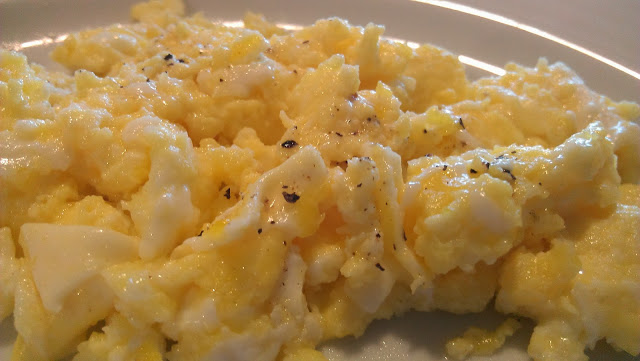
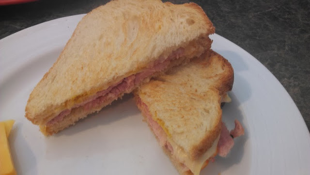
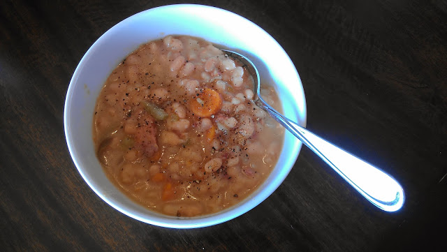
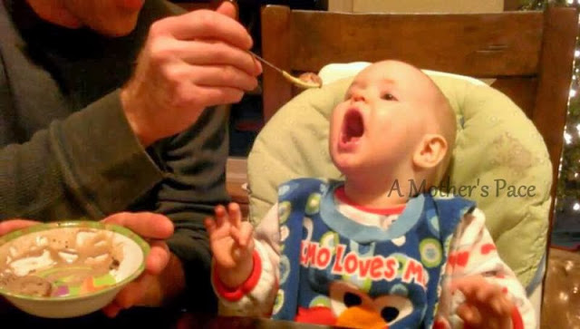

Lately, it seems, I've had good intentions with menu planning. The past couple of weeks I've had a hard time sticking with it. We've eaten out a bit more than normal and I have a lot of excuses. But that's what they are, excuses, so I'm trying to get back on track and really stick to a menu plan this week. Wish me luck!  
  
\[breakfast\]  
Yogurt with homemade granola or eggs this week.   
  
  

  
\[lunch\]  
Leftover Christmas spiral cut ham was delicious on sandwiches this week! This local 3 ingredient bread is a favorite of ours.  
  
  

  
\[dinner\]  
Slow Cooker Ham and Beans with the leftover ham bone from Christmas.   
  
  

  
\[dinner out\]  
We celebrated our 5th wedding anniversary this week with dinner and a movie. Sushi and Catching Fire!  
  

  
\[babyfood\]  
I'm absolutely sure that one of the benefits of being a third child is that you get ice cream and chocolate before your first birthday. Little E has had ice cream a couple times now and, she's just like her mommy, she LOVES it.  
  
  

  
  
Here's what I have planned for this week.  
  
\[monday\]   
[Sausage Bake](http://amotherspace.blogspot.com/2013/10/sausage-bake.html#.Ushuv_RDtSc)  
  
\[tuesday\]   
Carnitas (from the freezer)  
  
\[wednesday\]   
Leftovers  
  
\[thursday\]  
Sweet Potatoes with Chili on top  
  
\[friday\]  
Chicken, Potato and Green Bean Bake  
  
\[saturday\]  
Leftovers  
  
\[sunday\]  
Taco Soup  
  
  

**What are you eating this week?** 

  
  

\-------------------------------

  

Find A Mother's Pace on...  
  
Twitter [@amotherspace3](https://twitter.com/amotherspace3)  
  
Facebook [amotherspace3](http://facebook.com/amotherspace3)  
  
Instagram [amotherspace](http://instagram.com/amotherspace)  
  
Pinterest [amotherspace](http://pinterest.com/amotherspace/)  
  
Bloglovin' [A Mother's Pace](http://www.bloglovin.com/en/blog/6680087)  
  
RSS [amotherspace](http://feeds.feedburner.com/amotherspace)
