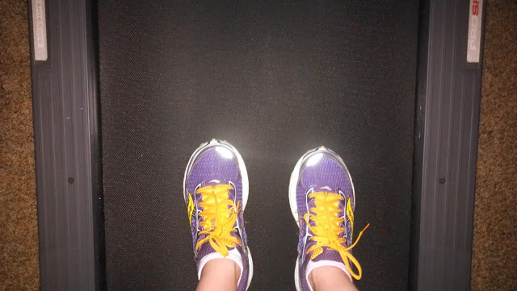
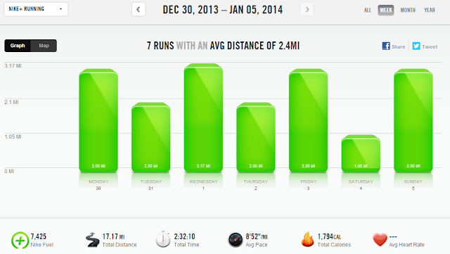
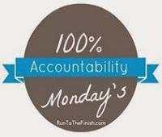

The Runner's World Holiday Run Streak officially ended on New Years Day but I kept running. It didn't seem right to end a streak when I was so close to running more consecutive days than the last streak. Last summer I ran 40 days in a row (**[read about it here](http://amotherspace.blogspot.com/2013/07/what-i-learned-from-streaking.html#.UsmaAPRDtSc)**) so this time around I wanted to run at least 41 days.   
  
41 days will be Monday, today, except I'm writing this a day earlier, of course.  
  
This time around the streak was mainly on the treadmill. I'm certain that without a treadmill at home it would have been a lot harder. Not impossible because I could have ran inside at the Y but I know that would have been difficult to accomplish every day.  
  
  

  
  
My most difficult run was just last week. I had a busy day and had to run at night before bed. This was _after_ dinner out for pizza and beer at a local brewery. Not my wisest decision but time spent with visiting family was more important than a quality run on that day!  
  
  

  
Run Streak Miles: 117.83 (\*updated to add Monday's mileage for the streak\*)  
1 milers (typical non-running rest days): 11  
  
I'm guessing that Runner's World will have another streak in the summer but I'm planning on sitting that one out. My fall marathon will be my focus at that point.  
  
  

  
  
**Weekly Workouts**  
  
Monday: 3 miles (8:44 pace)   
  
Tuesday: 2 miles (9:14 pace)  
  
Wednesday: 3.17 race miles (8:13 pace)  
  
Thursday: 2 miles (9:15 pace)  
  
Friday: 3.01 miles (9:14 pace)  
  
Saturday: 1 mile (8:32 pace)  
  
Sunday: 3 miles (8:58 pace)  
  
  
  

  

  

Total Running Miles: 17.18  
Weekly Average Pace: 8:52  
  
January Running Miles: 12.18  
2014 Running Miles: 12.18  
  
2014 in Kilometers: 19.60  
  
  
  
  
  
  

**Did you participate in the Runner's World Run Streak? What was your most difficult run this week?**

  

  

  

  

\-------------------------------

  

Find A Mother's Pace on...  
  
Twitter [@amotherspace3](https://twitter.com/amotherspace3)  
  
Facebook [amotherspace3](http://facebook.com/amotherspace3)  
  
Instagram [amotherspace](http://instagram.com/amotherspace)  
  
Pinterest [amotherspace](http://pinterest.com/amotherspace/)  
  
Bloglovin' [A Mother's Pace](http://www.bloglovin.com/en/blog/6680087)  
  
RSS [amotherspace](http://feeds.feedburner.com/amotherspace)
