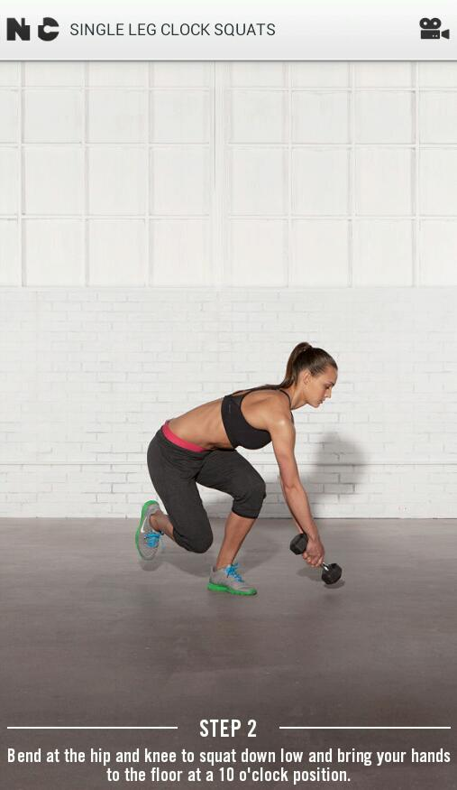

Today I'm participating in [Cori's](http://olivetorun.com/2014/01/02/would-you-rather-running-style-survey-7/) 7th Would You Rather Survey and it's all about....wait for it...running!  
  
So here are her questions and my answers.  
  

**#1. Would you rather run in a thunderstorm or a snowstorm?**

I'm terrified to run in lightning so my answer is easy, snowstorm. 

**#2. Would you rather breathe through your nose or breathe through your mouth?**

If I had to pick one it would be to breathe through my mouth. I find that I usually breathe through both when I am running.

**#3. Would you rather do 100 squats or 100 crunches? \[Now take a break and go do them. ;)\]**

Squats! I rarely do crunches anymore, I'm all about planks for core fitness.

  

These Single Leg Clock Squats from Nike Training Club's Butt Burner workout are serious.

**#4. Would you rather have a baked good for dessert or an extra serving of your favorite entree?**

Baked good. I have a serious sweet tooth.

**#5. Would you rather run on a treadmill for an hour or run around the same street block for an hour?**

Lately the treadmill is my friend so I choose to run inside on the mill. Give me a fan and Netflix and I'm good for at least an hour.

**#6. Would you rather have a headache during a run or a side stitch?**

A headache. I've only had a side stitch once while running and it was horrible. I had to slow down to a walk until it went away. 

**#7. Would you rather have a rest day on a work day or a day off?**

I'm a stay at home mom but I still like rest days on one of my husbands days off from work. Sunday is a great rest day.

**#8. Would you rather be a race director or a race volunteer?**

A race volunteer. I haven't done it yet and my excuse is that I've either been pregnant or nursing for the past 5 years and so it's been hard to dedicate the amount of time to volunteer. It's something that's important to me and I would love to do it eventually.

**#9. Would you rather spend your money on running gadgets \[HRM, GPS watch, Headphones\] or running shoes?**

I could easily answer this as 'all of the above' but shoes will always win out in the end. I'm getting close to needing a new pair and can't wait to go in to my local running store!

  

**#10. Would you rather run in a relay or do the run portion of a distance triathlon?**   
  
I haven't done either before but I pick the run portion of the distance triathlon. Right now in life I think that would be more manageable although I have heard that relays are awesome and I would love to run one eventually.  
  

**Now it's your turn. Pick a question and answer it in the comments OR answer all in your own blog post and link up with Cori.**

  

\-------------------------------

  

Find A Mother's Pace on...  
  
Twitter [@amotherspace3](https://twitter.com/amotherspace3)  
  
Facebook [amotherspace3](http://facebook.com/amotherspace3)  
  
Instagram [amotherspace](http://instagram.com/amotherspace)  
  
Pinterest [amotherspace](http://pinterest.com/amotherspace/)  
  
Bloglovin' [A Mother's Pace](http://www.bloglovin.com/en/blog/6680087)  
  
RSS [amotherspace](http://feeds.feedburner.com/amotherspace)
