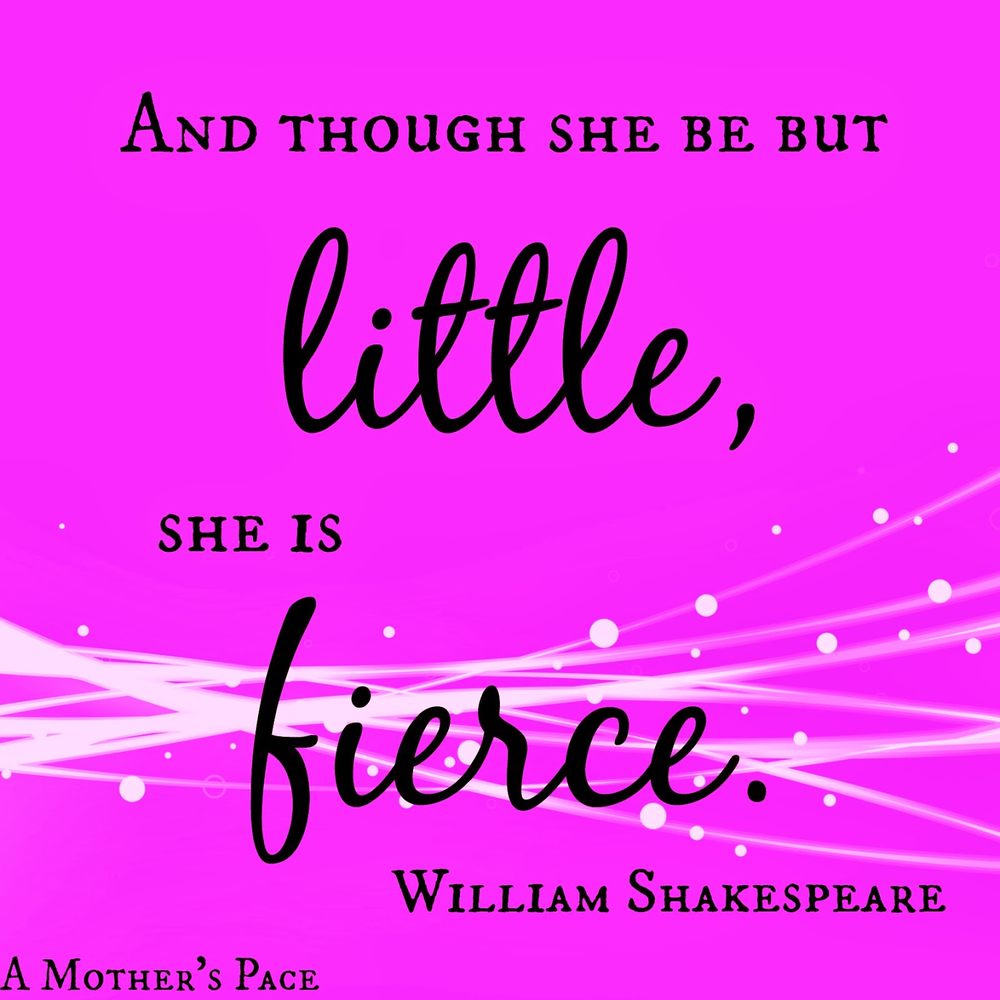
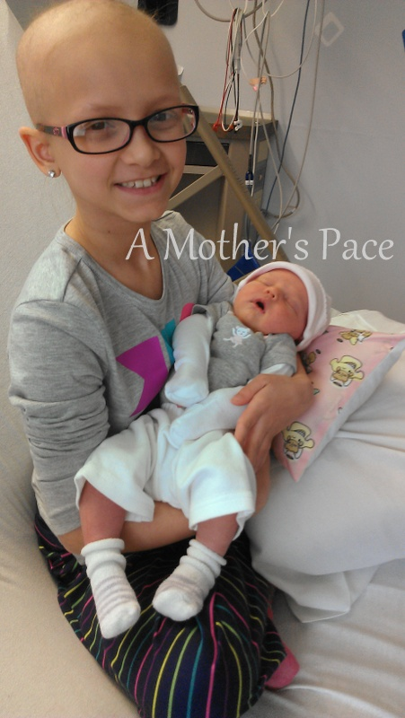

As my 10 year old niece prepares for a bone marrow transplant today, this quote has taken on new meaning.  
  
  

  
She's been battling leukemia off and on since just before she turned 4 years old and she's the strongest and bravest person I know. I'm impressed daily by how she handles what has been thrown her way.   
  
  

<table align="center" cellpadding="0" cellspacing="0"><tbody><tr><td></td></tr><tr><td>My niece with my youngest daughter.&nbsp;</td></tr></tbody></table>

Including all that goes with the bone marrow transplant. It's the hardest and scariest obstacle she's had yet but she is fierce and that's what will get her through it.  
  
She's the reason I've completed 3 races with [Team in Training](http://www.teamintraining.org/) to raise money for the Leukemia and Lymphoma Society and she's the reason I'm running again in her honor for my next half marathon.  
  
My Friday Five today is all about being a bone marrow donor. I dedicate it to the amazing young man who choose to save a little girls life by donating his bone marrow. I also dedicate it to my niece as she prepares for this next chapter in her life.  
  
\[one\]  
A person may easily get on the bone marrow registry by finding a drive in your area or sending away for a kit that is delivered right to your door. It's as simple as a cheek swab!  
  
\[two\]  
Donors are typically between the ages of 18 and 44. If you don't fit this criteria but want to help, you can volunteer at a local drive or donate funds to help others join the registry.   
  
\[three\]  
Approximately 1 out of every 500 people on the registry get the opportunity to save a life.  
  
\[four\]  
You might find the idea of donating bone marrow to be overwhelming but to give something so important to another is such a selfless and worthy action. I can't put into words my gratitude for the young man that is helping my niece.   
  
\[five\]  
To find out more information, order a kit or find a drive close to you go to [bethematch.org](http://bethematch.org/).   
  
  
  
  
  
\------------------------------- 

  

Find A Mother's Pace on...  
  
Twitter [@amotherspace3](https://twitter.com/amotherspace3)  
  
Facebook [amotherspace3](http://facebook.com/amotherspace3)  
  
Instagram [amotherspace](http://instagram.com/amotherspace)  
  
Pinterest [amotherspace](http://pinterest.com/amotherspace/)  
  
Bloglovin' [A Mother's Pace](http://www.bloglovin.com/en/blog/6680087)  
  
RSS [amotherspace](http://feeds.feedburner.com/amotherspace)
