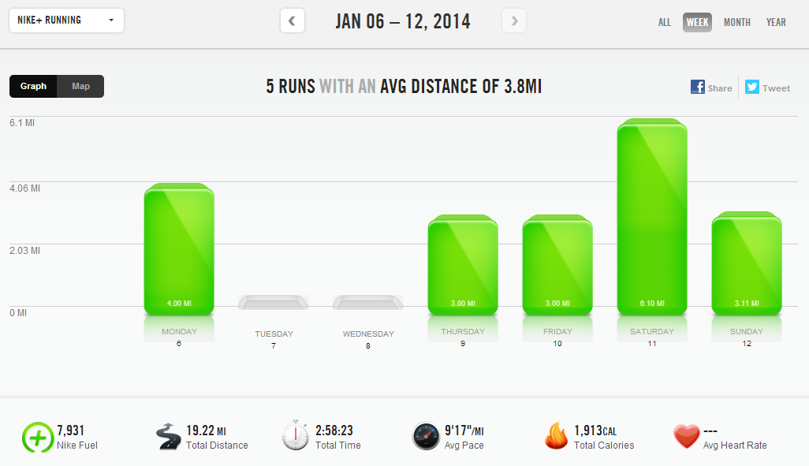
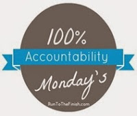

I'm currently in the brief period of time in between training cycles which means I'm figuring out (again) what to do in the off season. I just wrapped up the Runner's World Holiday Run Streak, which helped me to stay motivated over the holidays. And now I've also discovered a great way to stay motivated during the rest of my off season.  
  
I created a training plan for my next half that scares me. It's going to be tough and I can't wait.  
  
I basically merged two plans again but this time I bumped it up a bit. I used the 'Own It' plan from [Train Like a Mother](http://amzn.to/10eETuP) and the [Intermediate Plan](http://halhigdon.com/training/51132/Half-Marathon-Intermediate-Training-Program) from Hal Higdon. I'll share more about my training plan the closer I get to starting it (at the beginning of February) but I will tell you now that this plan contains specific days to strength train, the long runs start at 8 miles and I also plan on cross training on our trainer in the basement.   
  

  
I want to be ready for all three of these things so I've already started strength training on specific days of the week and I hope to start on the bike this week too.   
  
I'm planning on mixing up my strength training too so I'll be sure to share what I'm doing with you each week. Last week I decided to up my usual 15 minutes to a 30 minute Nike Training Club Body Sculptor Workout. I was feeling this one for a few days.  
  
  
  
  

  
**Weekly Workouts**  
  
Monday: 4 miles (8:46 pace)   
  
Tuesday:  Rest Day  
  
Wednesday: Rest Day  
  
Thursday: 3 miles (9:14 pace)  
  
Friday: 3 miles (9:13 pace) + 30 Minute NTC Body Sculptor Workout  
  
Saturday: 6.10 miles (9:34 pace)  
  
Sunday: 3.11 miles (9:32 pace)  
  
  

  

  

Total Running Miles: 19.21  
Weekly Average Pace: 9:17  
  
January Running Miles: 31.39  
2014 Running Miles: 31.39  
  
2014 Kilometers: 50.52  
  

**What keeps you motivated in the off season? Do you create your own training plans?**

  

  

  

  

\-------------------------------

  

Find A Mother's Pace on...  
  
Twitter [@amotherspace3](https://twitter.com/amotherspace3)  
  
Facebook [amotherspace3](http://facebook.com/amotherspace3)  
  
Instagram [amotherspace](http://instagram.com/amotherspace)  
  
Pinterest [amotherspace](http://pinterest.com/amotherspace/)  
  
Bloglovin' [A Mother's Pace](http://www.bloglovin.com/en/blog/6680087)  
  
RSS [amotherspace](http://feeds.feedburner.com/amotherspace)
