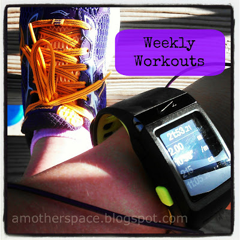

  
Saturday I joined thousands all over the world and ran for Meg. I ran for her husband, her three small children, and her friends and family who lost her too early to a drunk driver.   
  
  

  
The information above was taken from [Meg's Miles](https://www.facebook.com/events/489458451159627/) page on Facebook.  
  
  

  
I ran from my house and out of my neighborhood. Anytime I do this I have to run on a narrow street that doesn't have a shoulder. I HATE running on this street but unless I drive to a different location and park before running I have no other option on a long run. As every car passed me on this short road (about a quarter mile) I thought of Meg.  
  
I thought of how sad it is that she was doing something that she loved when something so horrible happened.   
  
But I did also take the time to be grateful for the moment I was in. To enjoy my surroundings and enjoy doing one of my favorite things, running.  
  
  

  
I finished 7 miles for Meg on Saturday. But that's not the last time I'll run for her. She'll be in my thoughts often as I hit the road to log my miles.  
  
  

  
  
  
  

  
**Weekly Workouts**  
  
Monday: 2 miles (9:14 pace) + 30 Min NTC Body Sculptor Workout  
  
Tuesday: Rest  
  
Wednesday: 3 miles (9:07 pace)  
  
Thursday: 3 miles (9:14 pace) + 20 minutes strength  
  
Friday: 3.18 miles (9:11 pace)  
  
Saturday: 7.01 miles (9:46 pace)  
  
Sunday: 50 minute Spin Bike + Core Workout ([Core and More Workout](http://www.cottercrunch.com/2014/01/move-it-monday-core-and-more/))  
  
  

  
  
The numbers from Nike are way off this week (39 miles in a week? Not me!) but the daily miles in the chart above are pretty accurate.  

  

  

Total Running Miles: 18.19  
Weekly Average Pace: Not sure this week due to Nike inaccuracy.  
  
January Running Miles: 49.58  
2014 Running Miles: 49.58  
  
2014 Kilometers: 79.79  
  
  
  

**Did you run for Meg this weekend?**

  

  

Today I'm also linking up with [Nikki](http://www.grabyourkicks.com/2014/01/20/center-your-energy/) and [Katie](http://www.healthydivaeats.com/uncategorized/mimm-83-hashtag-style.html).

  

\-------------------------------

  

Find A Mother's Pace on...  
  
Twitter [@amotherspace3](https://twitter.com/amotherspace3)  
  
Facebook [amotherspace3](http://facebook.com/amotherspace3)  
  
Instagram [amotherspace](http://instagram.com/amotherspace)  
  
Pinterest [amotherspace](http://pinterest.com/amotherspace/)  
  
Bloglovin' [A Mother's Pace](http://www.bloglovin.com/en/blog/6680087)  
  
RSS [amotherspace](http://feeds.feedburner.com/amotherspace)
