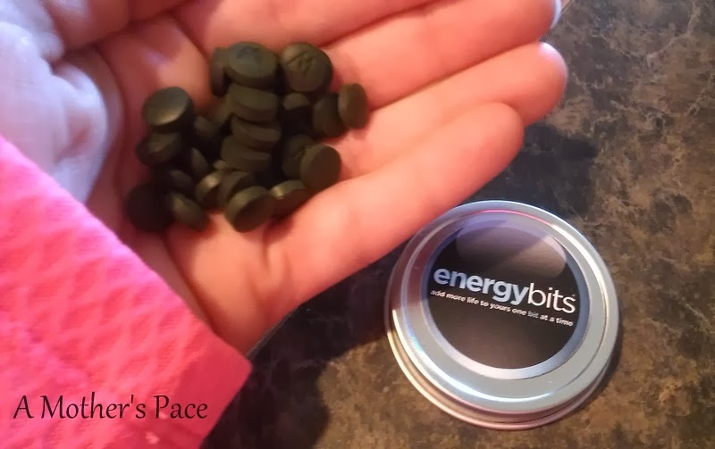
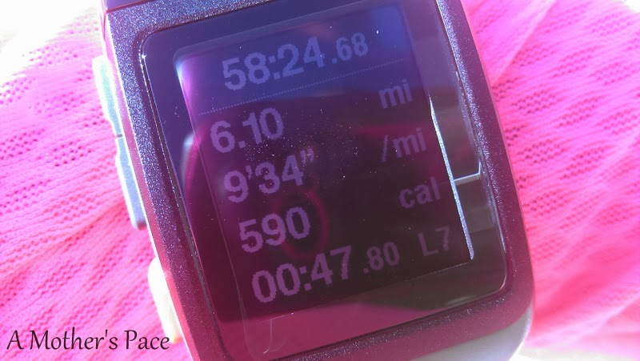
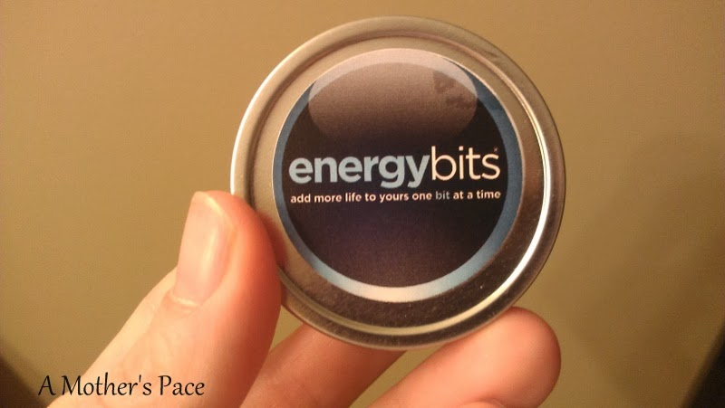

_Recently I was given the opportunity to try ENERGYbits and review my experience. I was sent a sample tin of bits for my review but all opinions are my own._

  
I've been curious about ENERGYbits for quite awhile now and after I finally was able to try them out they did not disappoint.   
  
I received a sample tin that has enough bits for two workouts. I planned to use one during a long run and one during a speed workout.  
  
**The Long Run**  
  
According to the directions, I took 30 ENERYbits about 15 minutes before leaving on my run. I drank them with water and about 10 at a time. This was the part that concerned me the most about the bits. Taking 30 at a time seemed overwhelming but it turned out that it wasn't a big deal. They went down easily and, although they didn't smell the best, I couldn't taste them. Even more importantly, I couldn't taste them later after I had already swallowed them!  
  
  

  
These days I consider anything 6 miles or more a long run. That will change soon when marathon training begins! I had six miles planned for the day and at mile 3 I needed to turn around for my out and back route. I felt like I could have kept running and if I didn't have children waiting at home I would have kept on going.  
  
  

  
I was running outside and it was beautiful.   
  
On the way back there's a hill coming in to my neighborhood, and usually at the end of a run it's tough. On this day I just cruised on up it. My breathing wasn't different at the top and my pace hadn't slowed. I really didn't consiously think about running up the hill. That is the first time I haven't struggled to some degree on that hill.  
  
After the hill I have a half mile before I'm at my house. I was feeling so good that I finished fast.  
  
  

  
Usually when I get home from a Saturday morning run I'm famished right away. I don't typically eat much before a run and when I come home I am starving. Before I left I ate a handful of granola, a glass of watermelon Nuun and the 30 ENERGYbits. After I got home I foam rolled, stretched, showered, nursed my baby and then was able to eat. I don't recommend waiting this long to eat after running but life happened and I really wasn't hungry until about 11:00. 
  
**The Speed Workout**  
  
I waited about a week before trying ENERGYbits again because I wanted to put them to the test during a speed work session. I've been doing speed work on the treadmill lately so I took the 30 bits before heading downstairs to run.  
  
  

  
My run started with a 12 minute warm up and then I did 4 5 minute repeats at 10k pace with 2 minutes of recovery in between. Last week I attempted this workout and only could get in two repeats without the bits. Yesterday I ran the entire 5 miles with plenty of energy.  
  
I didn't notice as big of a difference with the bits on the treadmill but I did complete a longer run on the treadmill and that has been tough for me lately.  
  
**What are ENERGYbits?**  
  
So did that make you curious? What exactly are ENERGYbits?   
  
ENERGYbits are 100% natural organic spirulina algae. They are 100% NON GMO, they contain no sugar, no chemicals, no caffeine, no gluten, no soy and no additives of any kind. They have just one calorie per tab.  
  
Spriulina is a nutrient dense food that has been used safely worldwide for 50 years.  
  
**What did I think?**  
I was very impressed with the ENERGYbits. I was surprised by how much they filled me up without making me feel full before a workout. That energy stayed with me for the entire workout.   
  
Will I buy ENERGYbits in the future? Yes! Right now they are about $3.25 a serving. Considering that I would eat them before quality workouts to give an extra boost, I think that price is affordable.  
  
It's hard to explain how you feel after consuming the bits. I felt energized and had a clarity during my runs. Because it's a little hard for me to explain, I want to give you a chance to try ENERGYbits as well.   
  
Yes, that's right, I'm doing a GIVEAWAY for a free sample of ENERGYbits! Enter below for your chance to win but enter soon. The giveaway ends on 1/28. U.S. only, please.  
  
  

_ENERGYbits are only available at [ENERGYbits.com](http://energybits.com/), and Jonathan (their Brand Manager) has shared with me that he'd be happy to connect anyone with a current ambassador to share a discount on a bag of bits - you can email him at [jlevitt@energybits.com](mailto:jlevitt@energybits.com)_

  
  
[a Rafflecopter giveaway](http://www.rafflecopter.com/rafl/display/1b7f590/)  
  
  

\-------------------------------

  

Find A Mother's Pace on...  
  
Twitter [@amotherspace3](https://twitter.com/amotherspace3)  
  
Facebook [amotherspace3](http://facebook.com/amotherspace3)  
  
Instagram [amotherspace](http://instagram.com/amotherspace)  
  
Pinterest [amotherspace](http://pinterest.com/amotherspace/)  
  
Bloglovin' [A Mother's Pace](http://www.bloglovin.com/en/blog/6680087)  
  
RSS [amotherspace](http://feeds.feedburner.com/amotherspace)
