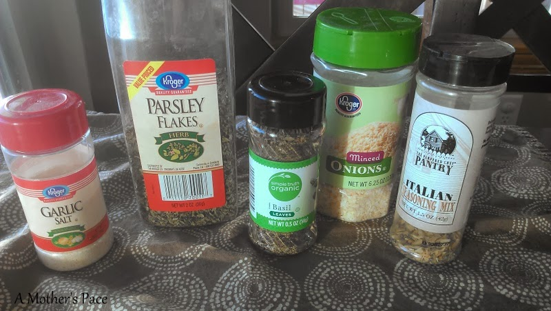
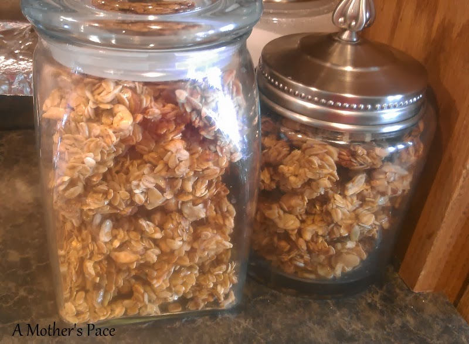
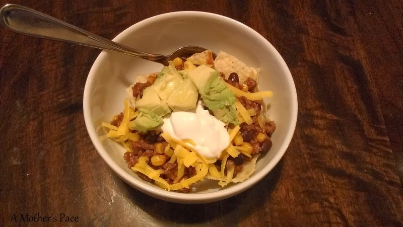
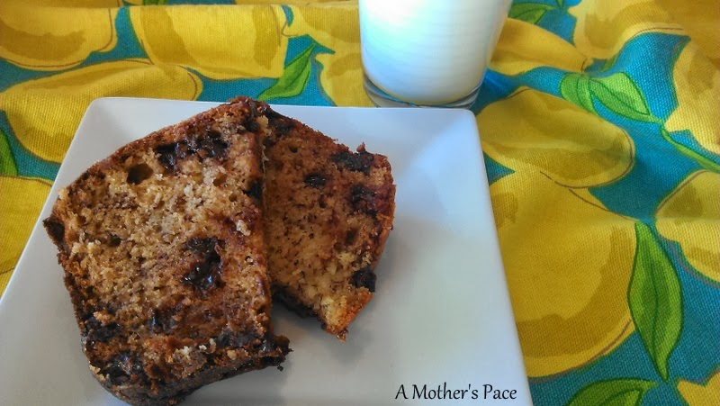
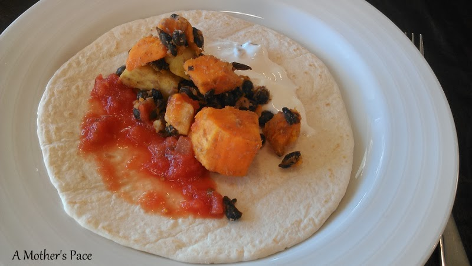

I've been working on perfecting this recipe for our family for months and I think I've finally got it. I originally found the [recipe](http://www.julieseatsandtreats.com/2012/08/green-beans-chicken-potatoes/) through [Pinterest](http://www.pinterest.com/amotherspace/) but knew that I wanted to tweak it and make it my own.  
  
This meal can literally be thrown together in 5 minutes and then is ready in an hour.   
  

  
**Chicken, Green Beans and Sweet Potatoes**  
Ingredients:   
1 lb. Chicken Pieces (your choice, we usually use organic chicken thighs)  
1 package frozen green beans (we buy Private Selection Harvest Whole Green Beans)  
2 Sweet Potatoes, pealed and cut into 1 inch pieces  
4T Butter  
Spices, to taste  
  
Line the chicken pieces down the middle of an 9x13 baking dish. Put green beans on one side and sweet potatoes on the other.  
  
Cut up butter into small pieces and put over all the ingredients. Season to taste. I don't measure the spices (I know, I hate when people say that too!) but I use what we have on hand and it always turns out great. Last time I made it I used garlic salt, parsley flakes, basil, minced onions and Italian seasoning mix.  
  

  
Now you're ready to put it in an oven set to 350 degrees for an hour.  
  
How did I change the recipe? I greatly decreased the butter, added my own spices instead of using a packet and I use sweet potatoes instead of white potatoes.  
  
Here are some of my meals from last week.  
  
\[breakfast\]  
Yep, more granola. I either had this over yogurt or I ate eggs for breakfast every morning this week.  
  

  
\[lunch\]  
Leftover **[Taco Soup](http://amotherspace.blogspot.com/2014/01/healthier-taco-soup.html)**. It's even better the next day!  
  

  
\[snack\]  
[Chocolate Chip Banana Bread](http://www.foodiecrush.com/2012/05/chocolate-chip-banana-bread/). It's one that my son requests often and he usually doesn't have to twist my arm too much.  
  

  
\[dinner\]  
Black Bean and Sweet Potato Tacos. A family favorite and so easy. I'll share the recipe soon!  
  

  
Here's what we have on the menu for next week.  
  
\[monday\]  
Leftovers  
  
\[tuesday\]  
Quesidillas with Sweet Potato Black Bean Quinoa Salad  
  
\[wednesday\]  
Slow Cooker Pot Roast  
  
\[thursday\]  
Leftovers  
  
\[friday\]  
Pizza Night  
  
\[saturday\]  
[Lentil Sloppy Joes](http://budgetbytes.com/2011/06/sloppy-joes-plus-1097-recipe-137.html)  
  
\[sunday\]  
[Chicken and Rice Soup](http://recipes.sparkpeople.com/recipe-detail.asp?recipe=2216457)  
  
  

**Have you tweaked a pinterest recipe to make it your own?** 

  

\-------------------------------

  

Find A Mother's Pace on...  
  
Twitter [@amotherspace3](https://twitter.com/amotherspace3)  
  
Facebook [amotherspace3](http://facebook.com/amotherspace3)  
  
Instagram [amotherspace](http://instagram.com/amotherspace)  
  
Pinterest [amotherspace](http://pinterest.com/amotherspace/)  
  
Bloglovin' [A Mother's Pace](http://www.bloglovin.com/en/blog/6680087)  
  
RSS [amotherspace](http://feeds.feedburner.com/amotherspace)
