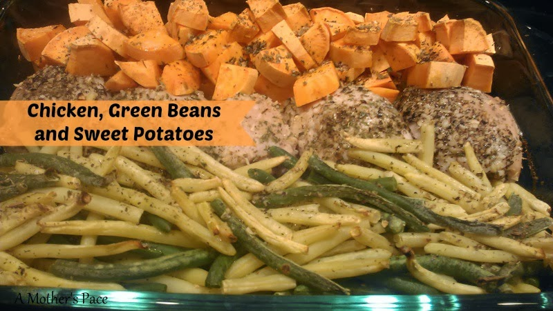
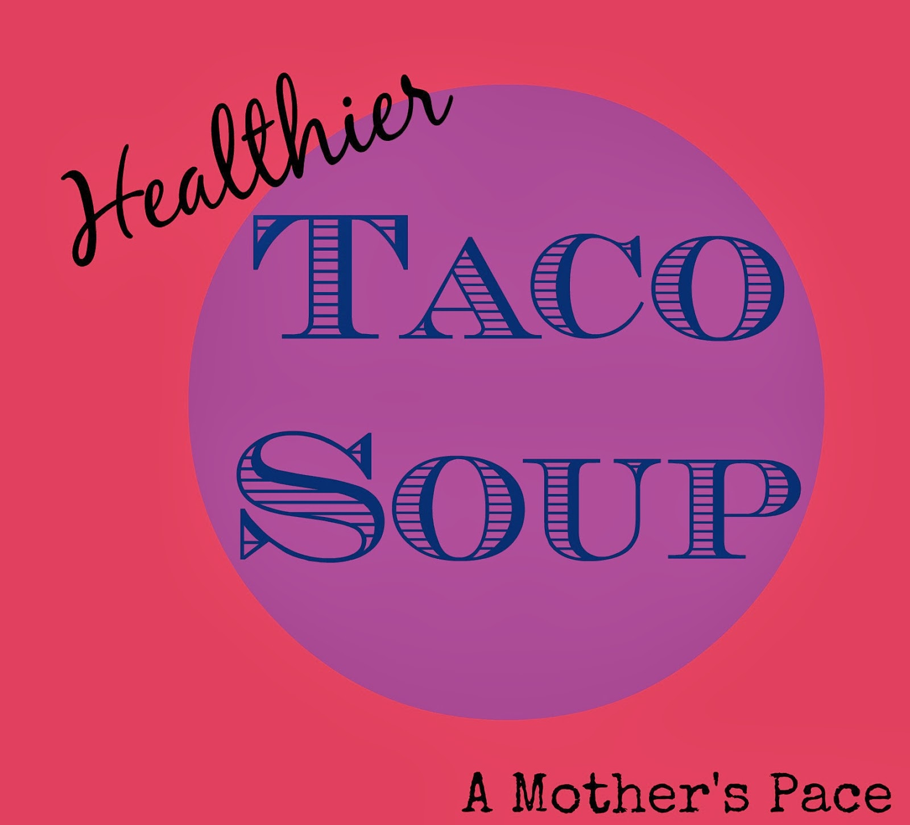
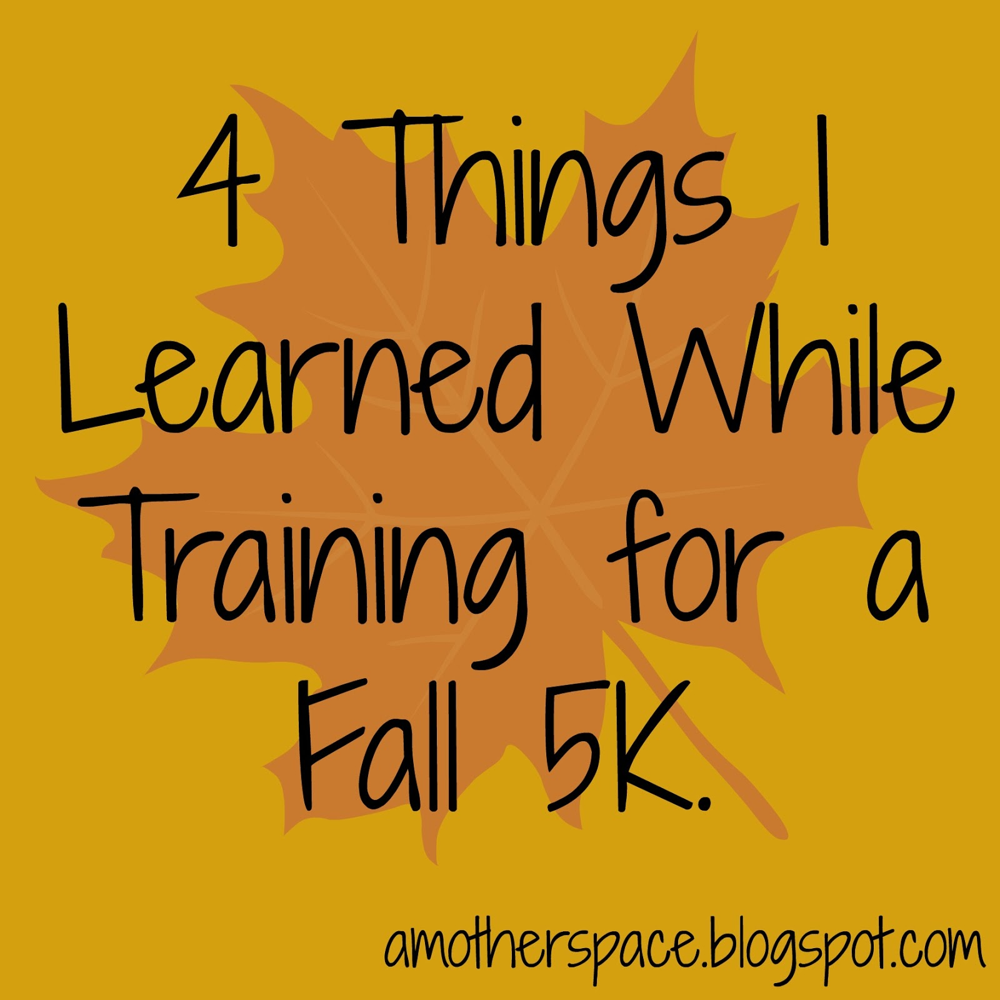

It's Pin It Party time!  
  
Lindsay over at [**The Lean Green Bean**](http://theleangreenbean.com/) is hosting a pinning party and I'm joining in on the fun. Be sure to visit her blog to find a bunch of great posts to pin or to link up your own Pin It Party post.  
  
Are you following me on Pinterest? If not **[click here](http://www.pinterest.com/amotherspace)**. I pin recipes, strength workouts, treadmill workouts, motivational quotes and much more!  
  
Here are a few of my favorite posts from A Mother's Pace over the past couple of months. Click on the title or the photo for a link to the original post then pin away!  
  
  
[**Tempo Treadmill Run**](http://bit.ly/186Z1yi)  
  
Need a new workout to bust the winter treadmill boredom? I explain the workout below in the original post. I've found that pushing buttons and changing it up helps to get through a treadmill run.  
  

  
[**Chicken, Green Beans and Sweet Potatoes**](http://amotherspace.blogspot.com/2014/01/chicken-green-beans-and-sweet-potatoes.html#.UulJRvldVSc)  
  
This is an easy meal to put together (5 minutes!) and so delicious. I've made this 'pinterest' find my own clean eating recipe.  
  

  
[**Two Tips for Running Faster**](http://amotherspace.blogspot.com/2013/12/2-tips-for-running-faster-and-im.html#.UulJjfldVSc)  
  
Everyone always wants to run faster. Click to find out two of my tips I used while participating in a running streak.  
  

  
[**Healthier Taco Soup**](http://amotherspace.blogspot.com/2014/01/healthier-taco-soup.html#.UulJWvldVSc)  
  
My attempt to make my traditional Taco Soup recipe a little healthier was successful! It's one of our favorites at my house.  
  

  
  
[**4 Things I Learned During my 5k Training Cycle**](http://amotherspace.blogspot.com/2013/11/4-things-i-learned-during-my-5k.html#.UulJm_ldVSc)  
  
Just a few things I learned about training while I went through a 5k training cycle. I usually train for longer distances so this was a new experience for me.  
  

  
  
Still want more pins? Here are links to the [second](http://bit.ly/1872aht) and [third](http://bit.ly/1873rVV) Pin It Parties.  
  

**Are you participating in the Pin It Party? Leave your Pinterest user name below so I can follow you.**

  
  
  

  

\------------------------------------------

  
Find A Mother's Pace on...

  
Twitter [@amotherspace3](https://twitter.com/amotherspace3)

  
Facebook [amotherspace3](http://facebook.com/amotherspace3)

  
Instagram [amotherspace](http://instagram.com/amotherspace)

  

Pinterest [amotherspace](http://pinterest.com/amotherspace/)

  

Bloglovin' [A Mother's Pace](http://www.bloglovin.com/en/blog/6680087)

  

RSS [amotherspace](http://feeds.feedburner.com/amotherspace)
