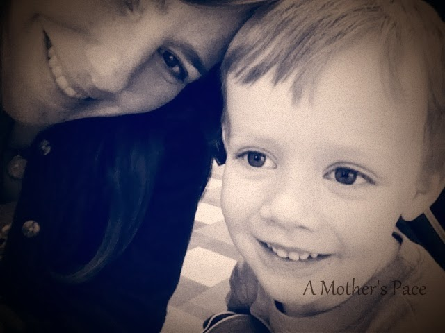
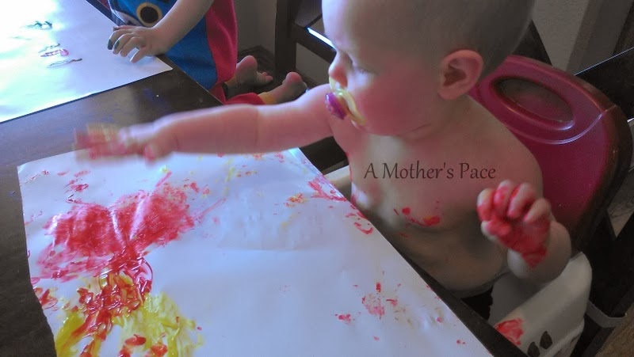
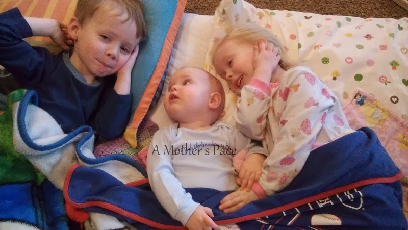
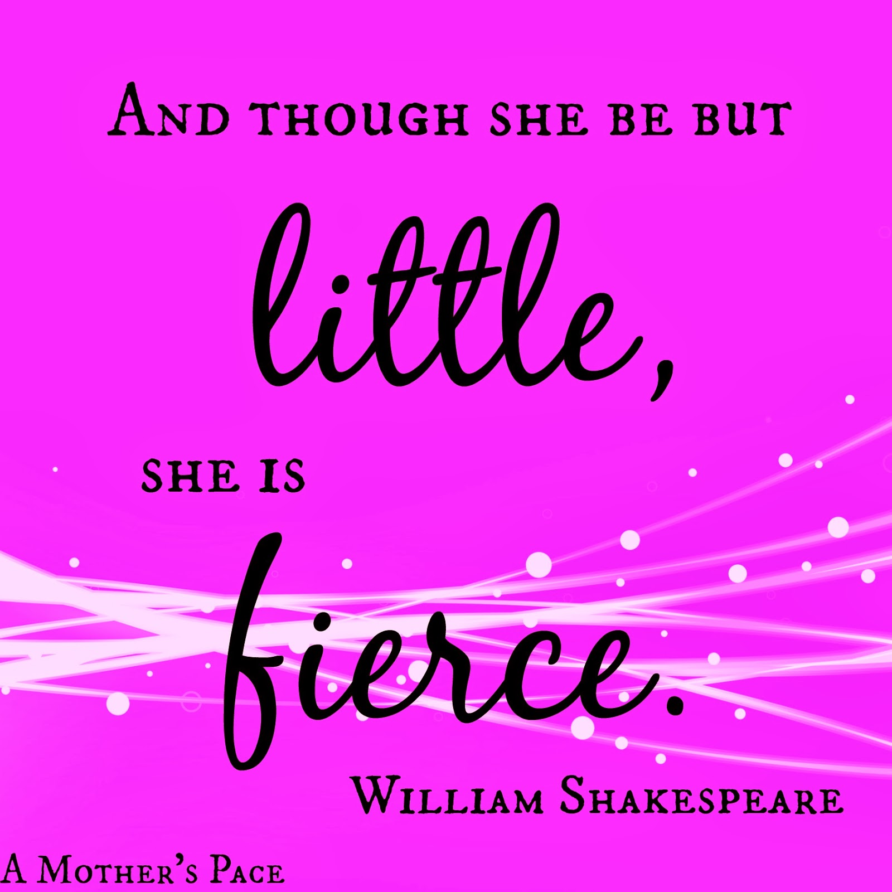
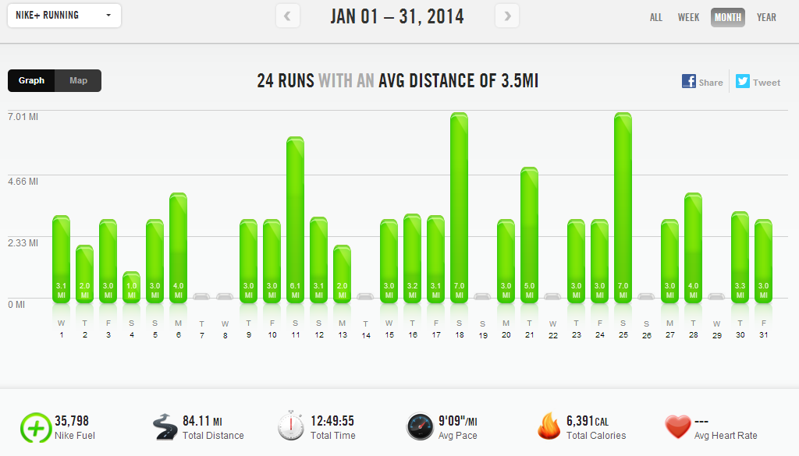

Since January is now over I'm here to wrap up the month. I love these posts because I can easily look back on family and blog favorites and keep track of my workouts for the month.  
**Mothering Moments**  
  

  
Little O loves to take selfies. He also likes to play with the filters. Future blogger??? Haha!  
  
  

  
Little A always wants me to braid her hair. And then she wants me to take a picture of it so she can see what it looks like.   
  
  

  
Little E wants to do everything the big kids do. That includes painting and other artwork too. My trick to keep her from eating the paint is to stick a paci in her mouth.  
  
  

  
They are really the best of friends. It's so exciting to watch them have fun and play together.  
  
**14 in 2014 Update**  
  

  
1 race down 13 more to go. I ran the **[Frosty 5k](http://amotherspace.blogspot.com/2014/01/2014-frosty-5k-race-recap.html#.UuvKmfmwJed)** on New Years Day.  
  
**Challenges**  
I didn't complete any challenges in January but I'm gearing up for a couple in February.  
  
[February Ab Challenge](http://www.runtothefinish.com/2014/01/ab-challenge-calendar.html)  
Amanda over at Run to the Finish is hosting this challenge and it is a perfect fit to help strengthen my core for half marathon training.  
  
[Move Nourish Believe Challenge](https://www.facebook.com/events/571617342921583/?ref=22)  
This Sweat Pink and Lorna Jane challenge starts on Monday and looks like a fun one.   
  
Here are some details from their Facebook page:  
  
Here's how it works:1\. Each day throughout the month there is a new challenge. Conquer the daily challenges and post a picture of yourself doing so on Twitter or Instagram. Tag @LornaJaneActive @FitApproach along with #mnbchallenge #sweatpink #lornajane  
2\. At the end of each week, recap your successes on your blog and/or Facebook page. Each blog post equals five bonus entries! Share the blog post on Twitter and tag @LornaJaneActive @FitApproach.  
\*\*In order to win the $1000 shopping spree, you MUST participate in all 21 of the daily photo challenges.   
    
I'm going to make February count! You can still join in as well. Just click on the link above to find out more information.  
  
**A Few of My Favorites from A Mother's Pace**  
  
[**Bart Yasso's Favorite Treadmill Workouts**](http://amotherspace.blogspot.com/2014/01/bart-yassos-favorite-treadmill-workouts.html#.UuvM4fmwJec)  
Need a few new ideas to mix up your treadmill running? Bart Yasso shared his on Twitter and I've done them a few times already.  
  
**[5 Items I Wish We'd Bought With Our First Baby](http://amotherspace.blogspot.com/2014/01/5-items-i-wish-wed-bought-with-our.html#.UuvM6fmwJec)**  
The title really says it all. Even after 3 children we are still finding new things that make life much easier.  
  
  

  
  
[**She is Fierce!**](http://amotherspace.blogspot.com/2014/01/she-is-fierce.html#.UuvNBPmwJec)  
My niece recently received a bone marrow transplant. She is still in the hospital and is doing well. I'm so thankful for the young man that donated his bone marrow. He cared enough about saving a life to join the registry. I've been on the registry for a couple of years now and I shared ways that you can join or help out on this post.   
  
  

  
**[Green Beans, Chicken and Sweet Potatoes](http://amotherspace.blogspot.com/2014/01/chicken-green-beans-and-sweet-potatoes.html#.UuvNJPmwJec)**  
I shared one of my favorite easy recipes. It's easily adaptable if you don't like green beans or sweet potatoes. Put in your favorite veggies to make this meal your own.  
  
  

  
  
**Favorite Running Gear**  
  

  
My favorite gear this month is more about cross training than running and it's more equipment than gear but I'm going with it anyway. I've been loving our Spin Bike this month so much that I look forward to my Sunday workouts all week. What has happened to me? I'm not sure where the motivation is coming from but I'm taking advantage of it.  
  
Workouts in January  
  
  

  
  

Total Running Miles for January: 83.88  
  
Total Running Kilometers for January: 135  
  
Treadmill Miles: 33  
  
Stroller Miles: 0, way too cold!  
  
January Average Pace: 9:09  
  
Spin Bike: 2 Sessions: 1 hour, 15 minutes  
  
Strength Training: 13 Sessions: 4 hours, 15 minutes  
  

**How are your goals for 2014 coming along? Did you participate in any challenges or races in January?**

\------------------------------------------

  
Find A Mother's Pace on...  
  
Twitter [@amotherspace3](https://twitter.com/amotherspace3)  
  
Facebook [amotherspace3](http://facebook.com/amotherspace3)  
  
Instagram [amotherspace](http://instagram.com/amotherspace)  
  
Pinterest [amotherspace](http://pinterest.com/amotherspace/)  
  
Bloglovin' [A Mother's Pace](http://www.bloglovin.com/en/blog/6680087)  
  
RSS [amotherspace](http://feeds.feedburner.com/amotherspace)
