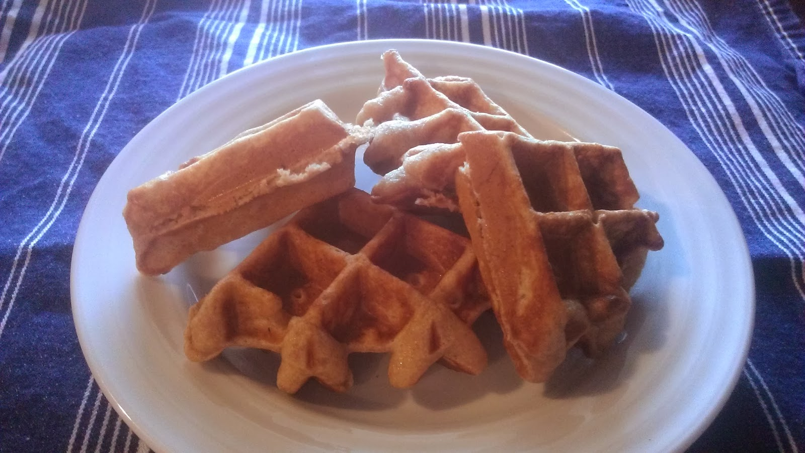
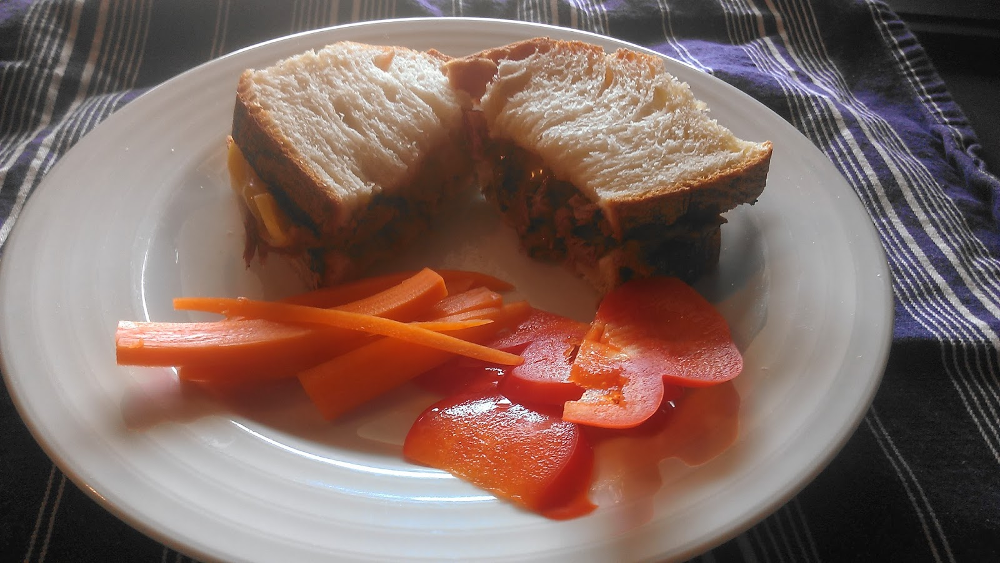
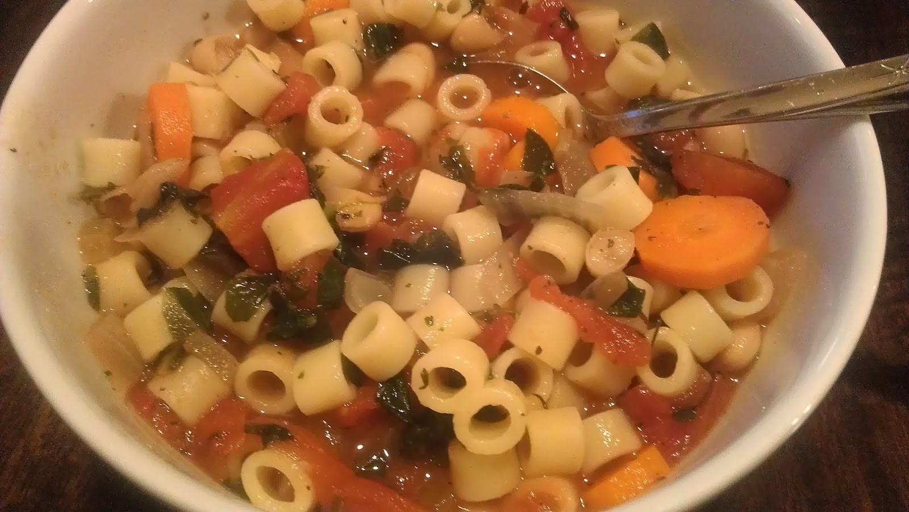

Last week we stayed on track for the most part but still ended up not making all the meals. When I planned out my week, I completely forgot about the Super Bowl and so dinner plans for Sunday changed. The bonus is that I just automatically get two meals already planned for this week!

  

\[breakfast\]

My husband is the breakfast chef in the family. I can make a pretty mean scrambled eggs meal but I leave just about everything else up to him. He found this [wonderful recipe](http://www.simplyscratch.com/2012/10/honey-buttermilk-waffles-vanilla-maple-syrup-a-winner.html) for waffles this week and it was a hit with everyone.

  

  

\[lunch\]  
After my run on Saturday, my husband had a hot sandwich waiting for me. It had Tillamook Cheddar, leftover slow cooker roast beef and our local 3 ingredient bread. Yummmm!  
  

  
\[dinner\]  
I'm trying to plan more with the slow cooker lately. We had this delicious [minestrone soup](http://www.foodnetwork.com/recipes/robin-miller/minestrone-soup-with-pasta-beans-and-vegetables-recipe.html) this week and it made enough to stick some in the freezer for later! My favorite kind of dish!  
  

  
I even have a bonus video of my daughter eating the soup. She loved it and it was too much fun to watch her enjoy it.  
  

  
  
Alright, here's what we have on the menu for next week.  
  
\[monday\]  
Leftovers  
  
\[tuesday\]  
[Cumin Lime Black Bean Quinoa Salad](http://ohsheglows.com/recipage/?recipe_id=6050695) from Oh She Glows. I found this recipe on Instagram. She had subbed out the carrots for a sweet potatoe and that's what we're doing this week.  
  
\[wednesday\]  
[Slow Cooker Cream of Chicken and Rice Soup](http://recipes.sparkpeople.com/recipe-detail.asp?recipe=2216457)  
  
\[thursday\]  
Leftovers  
  
\[friday\]  
Pizza Night  
  
\[saturday\]  
[Parmesan Broiled Tilapia](http://www.spendwithpennies.com/parmesan-broiled-tilapia/)  
  
\[sunday\]  
[Sweet Potato Shepherd's Pie](http://triedandtasty.com/2013/08/healthy-sweet-potato-shepherds-pie/)  
  
  

**Who cooks breakfast at your house on the weekends?** 

  

\-------------------------------

  

Find A Mother's Pace on...  
  
Twitter [@amotherspace3](https://twitter.com/amotherspace3)  
  
Facebook [amotherspace3](http://facebook.com/amotherspace3)  
  
Instagram [amotherspace](http://instagram.com/amotherspace)  
  
Pinterest [amotherspace](http://pinterest.com/amotherspace/)  
  
Bloglovin' [A Mother's Pace](http://www.bloglovin.com/en/blog/6680087)  
  
RSS [amotherspace](http://feeds.feedburner.com/amotherspace)
