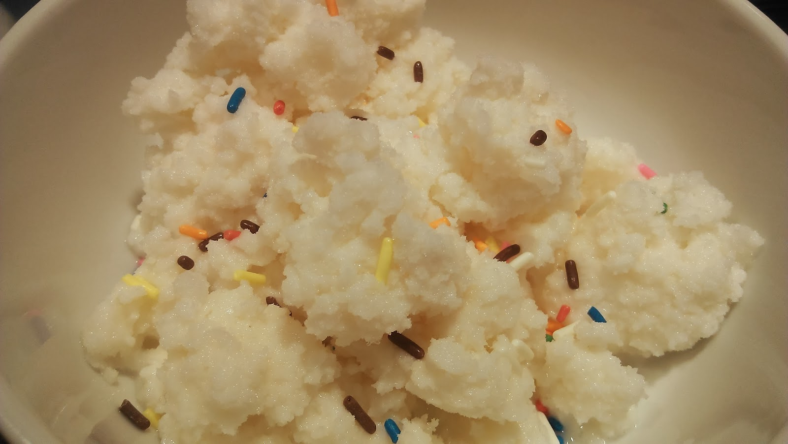
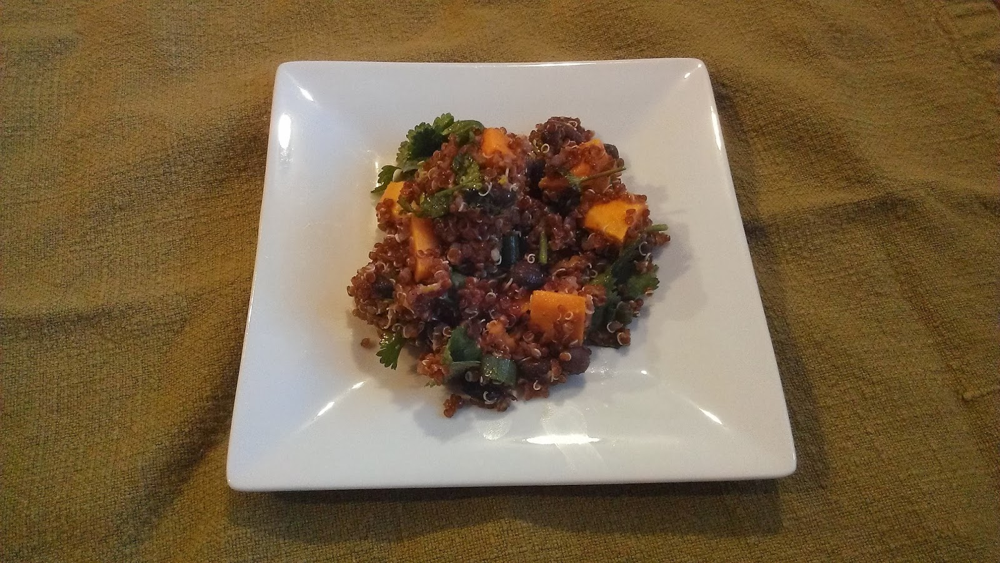
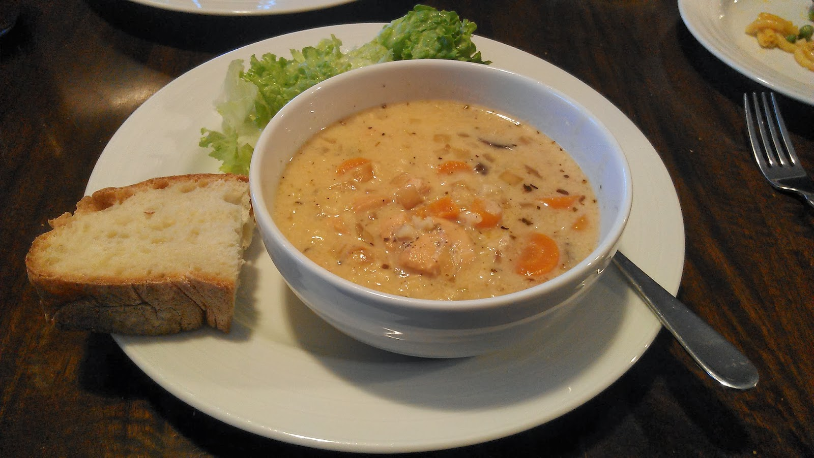
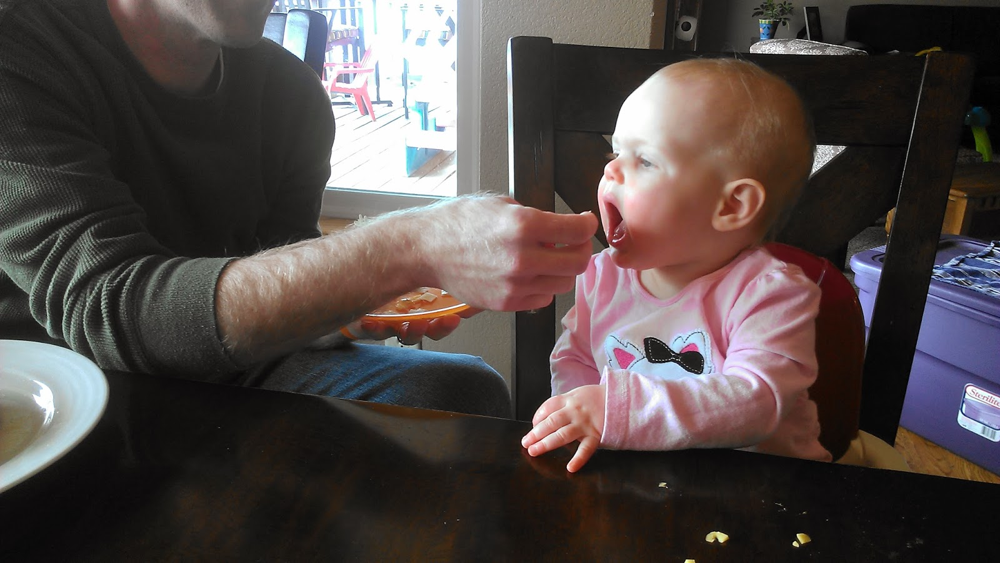

We're finally running out of some groceries. We've been snowed in all week. I literally have not left my house since last Sunday. Yes, that's a whole week!   
  
School was closed for three days and I could have gotten out on other days but I was happy to stay in our warm home. Dragging 3 children and myself out in the single digit weather just didn't seem like a good idea. So we've stayed at home and had a wonderful week. It's a good thing we were stocked up before the snow fell!  
  
\[fun\]  
We tried out [snow ice cream](http://www.gimmesomeoven.com/how-to-make-snow-ice-cream-recipe/) this week. The kids love anything that you can put sprinkles on and I like anything with vanilla in it. So I knew this one was going to go over well! (To see gorgeous pictures and find the recipe, just click on the link above.)  
  
  

  
\[dinner\]  
This quinoa salad was delicious. This picture does not do it justice. Again, if you want to see beautiful pictures go over to [Oh She Glows](http://ohsheglows.com/recipage/?recipe_id=6050695) and check out the recipe too. So good!  

  

  

\[slow cooker\]  
My new slow cooker meal of the week was [chicken and rice soup](http://recipes.sparkpeople.com/recipe-detail.asp?recipe=2216457). The recipe was o.k. but it has great potential with the right spices. I'm not finished with this recipe yet.  
  
  

  
  

\[breakfast\]  
It's no surprise that I had eggs for breakfast almost every day this week. Two fried eggs with a piece of toast has been my go-to breakfast lately. I need to make more granola soon!  
  
  

  
\[baby food\]  
Well, Little E grabbed my son's peanut butter and honey tortilla when we weren't looking and took a couple of bites. She's 11 months old and we usually don't give PB or honey until after the 12 month mark. She loved it and was pretty upset when we took it away so we compromised and gave her some PB on a tortilla. We'll save the honey for later on.  
  
  

  
And that brings us to next week. Here's what we have planned for the week ahead.  
  
\[monday\]  
leftovers  
  
\[tuesday\]  
Tacos  
  
\[wednesday\]  
BBQ Slow Cooker Chicken  
  
\[thursday\]  
Salmon with roasted veggies  
  
\[friday\]  
Tomato Soup with Grilled Cheese Sandwiches  
  
\[saturday\]  
[Sweet Potato Shepherds Pie](http://triedandtasty.com/2013/08/healthy-sweet-potato-shepherds-pie/)  
  
\[sunday\]  
Pasta with brussels sprouts and salad  
  
  

**Have you made snow ice cream before?**

**Do you use a slow cooker?**

\-------------------------------

  

Find A Mother's Pace on...  
  
Twitter [@amotherspace3](https://twitter.com/amotherspace3)  
  
Facebook [amotherspace3](http://facebook.com/amotherspace3)  
  
Instagram [amotherspace](http://instagram.com/amotherspace)  
  
Pinterest [amotherspace](http://pinterest.com/amotherspace/)  
  
Bloglovin' [A Mother's Pace](http://www.bloglovin.com/en/blog/6680087)  
  
RSS [amotherspace](http://feeds.feedburner.com/amotherspace)
