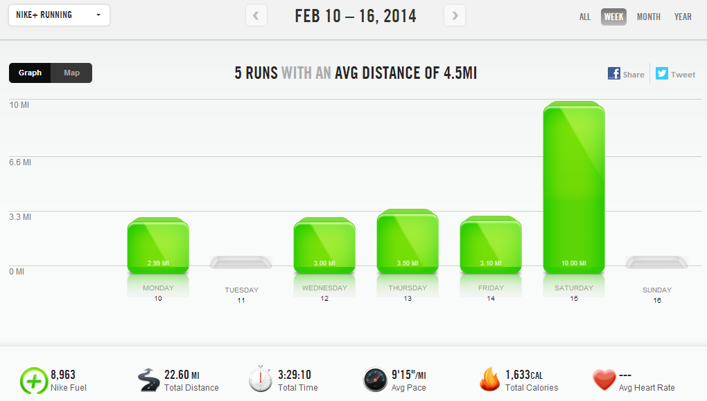

Only the second week into my training plan and I had a horrible week of running. The treadmill was not my friend last week and every mile felt like torture. I didn't accomplish the speed work that I wanted or reach my mileage for the week but then that all turned around on Friday.   
  

  
Friday was Valentine's Day and I was exhausted and slept through my alarm. That ended up being a great thing for me because instead of running on the treadmill in the morning, I managed to get out late in the afternoon and enjoy an outside run.  
  
When I started up my watch, I noticed that the last date on it was January 25th. The fact that it had been 20 days since I had ran outside is very depressing to me. I'm glad to have broken that indoor running streak!  
  

[+and+loved+every+second+of+it....a+little+Valentine's+gift+to+myself!+%23sweatpink+%23RunThisYear+.jpg "I Broke My Treadmill Running Streak | A Mother's Pace")](http://3.bp.blogspot.com/-mBl3bNJBFr8/UwEasFQqx-I/AAAAAAAAYkg/6g6CX2cRzIo/s1600/This+week+I+have+not+been+in+love+with+running.+Running+on+the+treadmill+has+been+hard.+Today+I+got+outside+(finally!)+and+loved+every+second+of+it....a+little+Valentine's+gift+to+myself!+%23sweatpink+%23RunThisYear+.jpg)

  
It was a beautiful run and I enjoyed every second of it.  
  
The next morning I was all set to run my long run of the week. I ended up driving to a local park and running on the paths. There were a lot of runners out and the paths were clear of snow. It was windy and chilly but I was so happy to be outside. I hit my first double digit run of the training cycle!  
  

  
The plan was for 10 miles with 2 mid miles at race pace. My fifth mile was at an 8:31 pace and my sixth mile at 8:51. At the time I was pretty disappointed because I thought my race pace was 8:30 and I was 20 seconds off. But when I got home I looked it up again and my race pace is actually a little over a 9 minute pace. So I guess I should be pretty happy with the times that I had!  
  
My husband has a vacation day today so I'm planning on running outside yet again.  
  
I'm looking forward to this week and I'm thankful that I get to try again. I'm hoping that my break from the treadmill will make it easier to get back on it this week because I have a lot of miles to cover on it.  
  
  
  

  
**Weekly Workouts**  
  
Monday: 3 miles (9:06 pace) + 20 minutes Jillian Michaels Circuit 1  
  
Tuesday: 15 minutes NTC: Leg Sculptor  
  
Wednesday: 3 miles (8:49 pace)  
  
Thursday: 3.5 miles (8:52 pace)  
  
Friday: 3.1 miles (8:50 pace)  
  
Saturday: 10 miles (9:42 pace)  
  
Sunday: 45 minutes Spin Bike + 15 minutes Core  
  

  

  

Total Running Miles: 22.6  
Weekly Average Pace: 9:15  
  
February Running Miles: 50.6  
2014 Running Miles: 134.48  
2014 Running Kilometers: 216.42  
  
  
  
  

**Have you been running outside? Did you run on Valentine's Day?**

  

  

  

  

\-------------------------------

  

Find A Mother's Pace on...  
  
Twitter [@amotherspace3](https://twitter.com/amotherspace3)  
  
Facebook [amotherspace3](http://facebook.com/amotherspace3)  
  
Instagram [amotherspace](http://instagram.com/amotherspace)  
  
Pinterest [amotherspace](http://pinterest.com/amotherspace/)  
  
Bloglovin' [A Mother's Pace](http://www.bloglovin.com/en/blog/6680087)  
  
RSS [amotherspace](http://feeds.feedburner.com/amotherspace)
