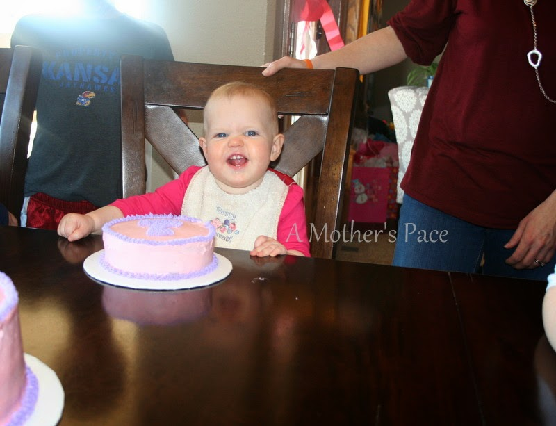
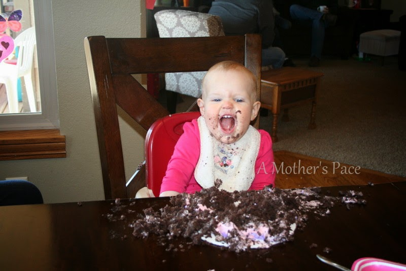
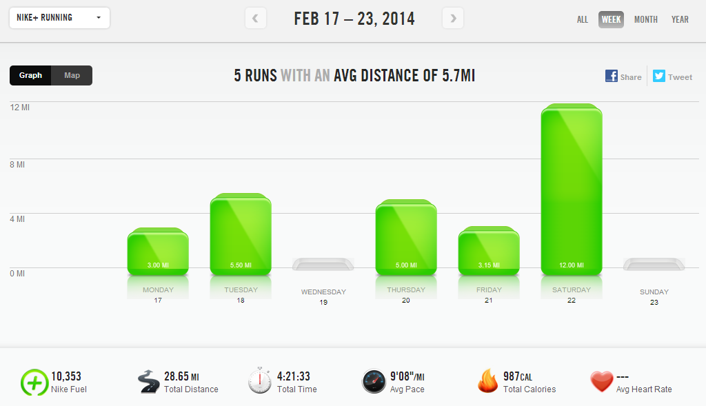

The mornings are slowly started to get just a little brighter a bit earlier. That means that running outside in the mornings will happen for me very soon! I did manage to get out a couple times last week and loved the fresh air.   
  
My long run was on the treadmill though. I ran a personal distance record of 12 miles on the mill! I'll write more about it later on in the week because it meant a lot to me for more than one reason.  
  
Week 3 of my half marathon training is all wrapped up and went really well. I accomplished all of my distance and pace goals for the week but I was lacking on the strength and cross workouts.  
  
I missed my typical spin session on Sunday morning. I had a house full of people and my spin bike is about 4 feet from where someone was sleeping. I have to admit that it was a little nice to sleep in instead of waking up early to workout. It was a busy week though and I'm hoping to fit in more strength workouts and cross training this week.  
  
We celebrated Little E's first birthday over the weekend.   
  

  

Somehow she's one already. Her personality is really shining and she had so much fun at the party  
  

  
She destroyed her cake. Yes, she had chocolate cake. Neither of my other children had eaten chocolate at all before turning one but Little E has probably been eating it since around 6 months. She loves it. She just wanted to eat what we were eating right from the beginning!  
  

  
  
  

  
**Weekly Workouts**  
  
Monday: 3 miles (9:29 pace) + 15 minutes Strength  
  
Tuesday: 5.5 miles (9:06 pace)  
  
Wednesday: Rest  
  
Thursday: 5 miles (9:15 pace)  
  
Friday: 3.15 miles (9:14 pace)  
  
Saturday: 12 miles (9:20 pace)  
  
Sunday: Rest  
  

  

  

Total Running Miles: 28.65  
Weekly Average Pace: 9:08  
  
February Running Miles: 79.25  
2014 Running Miles: 163.13  
2014 Running Kilometers:262.53  
  
  
  

**Are you training for a race now? What race and are you on track?**

  

  

  

  

\-------------------------------

  

Find A Mother's Pace on...  
  
Twitter [@amotherspace3](https://twitter.com/amotherspace3)  
  
Facebook [amotherspace3](http://facebook.com/amotherspace3)  
  
Instagram [amotherspace](http://instagram.com/amotherspace)  
  
Pinterest [amotherspace](http://pinterest.com/amotherspace/)  
  
Bloglovin' [A Mother's Pace](http://www.bloglovin.com/en/blog/6680087)  
  
RSS [amotherspace](http://feeds.feedburner.com/amotherspace)
