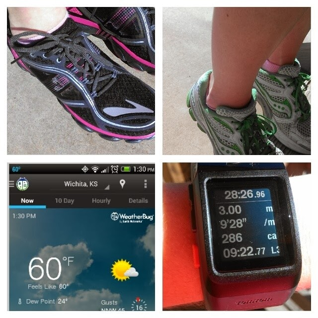

Last week was the third and final week of the [Move, Nourish Believe Challenge](https://www.facebook.com/events/571617342921583/) with the Sweat Pink community and [Lorna Jane](http://www.movenourishbelieve.com/). It's three weeks of moving, nourishing and believing to help stay on track with healthy goals for the year.  
  
So I took pictures throughout the week and shared them on Instagram. Are you on Instagram? [**Follow me**](http://instagram.com/amotherspace) and let me know your username below in the comments if I'm not following you already.  
  
**Week Three: BELIEVE**  
  
**Monday**: Spoil Yourself! Do something just for you today.  
  
  

  
  
My husband was off of work on Monday and I spoiled myself by working out in the afternoon instead of bright and early in the morning. That way instead of a treadmill run I was able to get outside and enjoy some beautiful weather. I also ran in brand new shoes, at least for a mile. I'm slowly adjusting my body to running in the lower drop Pure Flows, which I am loving so far.  
  
I also followed up my run with some calf raises and other strength training. I took the time for myself to get my workout in! It was my special 'me' time of the day.  
  
**Tuesday:** 5 Mindful Minutes. Do good to your body, meditate for 5 minutes and find your zen.  
  
  

  
I found my zen while waiting for my son to come out of his preschool. I had my coffee (probably not what most people drink during meditation...) and I just concentrated on breathing for a few minutes.  
  
**Wednesday**: Be Happy. Show us your happy place!  
  
  

  
My happy place is anywhere that these four are. We are pretty lucky that my husband works from home and we are able to eat lunch and dinner together almost every day. In a world that is so busy it is nice to have this little bit of time together every day!  
  
**Thursday:** Thankful Thursday. Let us know what you are thankful for!  
  
  

  
One year ago today, Little E was born. I'm thankful for so many things but today I am so thankful that we have this little blessing.   
  
**Friday:** Share the love. Shout out to your #1 supporter/motivator.  
  
  

  
Of course, my greatest supporter is my husband. He's my best friend and the love of my life. He believes in me and cheers me on in all areas of life, not just in running.  
  
And that's week three and the last week of the Move Nourish Believe Challenge. What a fun challenge! Click the following links to read my recaps from [Week 1: Move](http://amotherspace.blogspot.com/2014/02/move-nourish-believe-challenge-week-1.html#.UwttGPldVSc) and [Week 2: Nourish](http://amotherspace.blogspot.com/2014/02/move-nourish-believe-challenge-week-2.html#.UwttEfldVSc).  
  
  
  

\-------------------------------

  

Find A Mother's Pace on...  
  
Twitter [@amotherspace3](https://twitter.com/amotherspace3)  
  
Facebook [amotherspace3](http://facebook.com/amotherspace3)  
  
Instagram [amotherspace](http://instagram.com/amotherspace)  
  
Pinterest [amotherspace](http://pinterest.com/amotherspace/)  
  
Bloglovin' [A Mother's Pace](http://www.bloglovin.com/en/blog/6680087)  
  
RSS [amotherspace](http://feeds.feedburner.com/amotherspace)
