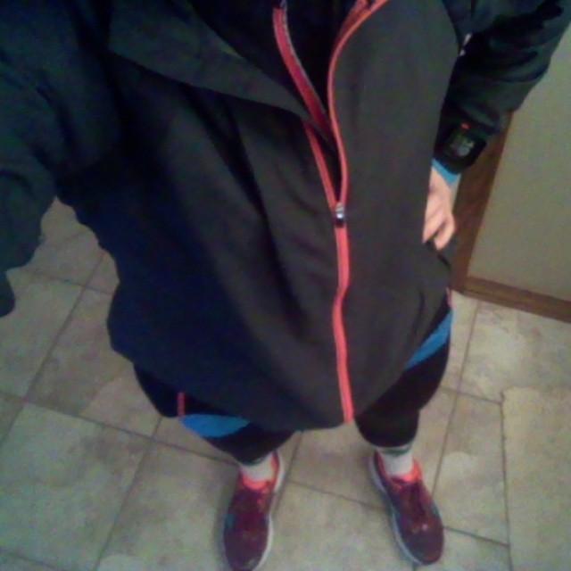
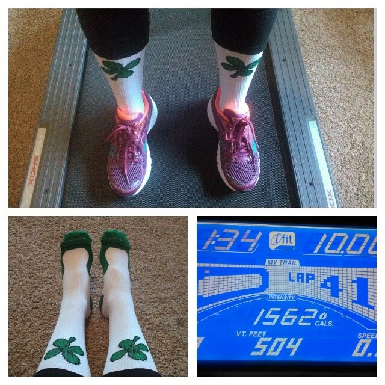
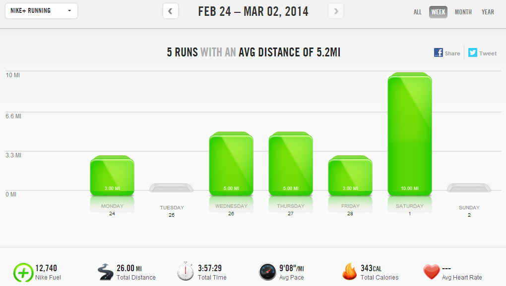

Welcome to my new home. My husband and I have spent some time over the past several weeks switching A Mother's Pace from Blogger to WordPress. We're here now, so welcome! I'm still learning the ropes so please leave a comment, send an email or tweet me if you see anything that needs attention.

 

My long run of the week was supposed to be a 10 miler and after being on the treadmill all week I was looking forward to getting out and enjoying some fresh air. It was a cold one on Saturday so I put on my layers of running clothes and headed outside.

 

 

I didn't get very far. I took one step onto the sidewalk, slipped on the ice and turned around to go inside. The winter weather had arrived earlier than I thought so my run would be inside instead.

 

Let me tell you that it's tough to switch gears and unexpectedly head down to the treadmill. That was the hardest 10 miles I've ran in a long time. I stopped the treadmill to stretch a few times but I always got back on to finish it out.

 

This was my first run in my brand new PROCompression shamrock socks. My husband and I both bought a pair to wear for our upcoming St. Patty's Day race and I couldn't wait to try them out. They are not as tight as my other compression socks, the CEP brand, but I did enjoy running in them.

 

**Weekly Workouts**

Monday: 3 miles (9:06 pace) + 25 minutes JM Circuit 1

Tuesday: Rest Day

Wednesday: 5 miles (8:50 pace) + 20 minutes NTC Leaner Legs + Core Work

Thursday: 5 miles (8:57 pace)

Friday: 3 miles (9:14 pace) + 20 minutes NTC Arm Definer + Core Work

Saturday: 10 miles (9:24 pace) + 15 minutes Leg and Core Work

Sunday: Spin Bike 40 minutes + 10 minutes Core Work

 

 

Total Running Miles: 26 Weekly Average Pace: 9:08

February Running Miles: 95.25

March Running Miles: 10

2014 Running Miles: 189.13 2014 Running Kilometers: 304.76

 

 

**Are you a blogger on WordPress? What's your must-have plugin? Did anyone else do a long run on a treadmill over the weekend?** 

 

\-------------------------------

Find A Mother's Pace on...

Twitter [@amotherspace3](https://twitter.com/amotherspace3)

Facebook [amotherspace3](http://facebook.com/amotherspace3)

Instagram [amotherspace](http://instagram.com/amotherspace)

Pinterest [amotherspace](http://pinterest.com/amotherspace/)

Bloglovin' [A Mother's Pace](http://www.bloglovin.com/en/blog/6680087)

RSS [amotherspace](http://feeds.feedburner.com/amotherspace)
