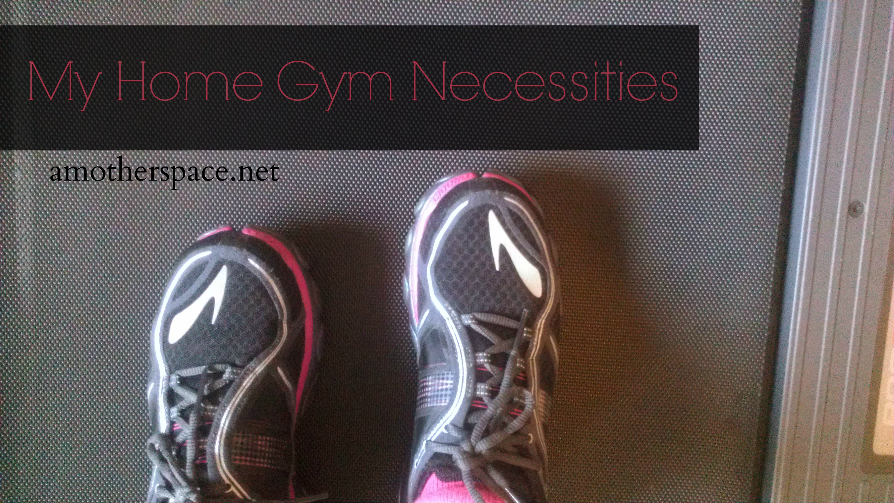
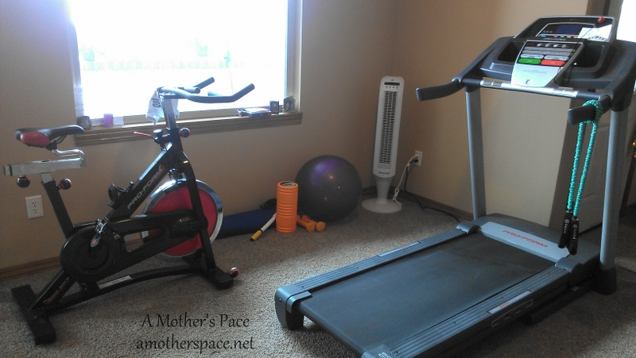
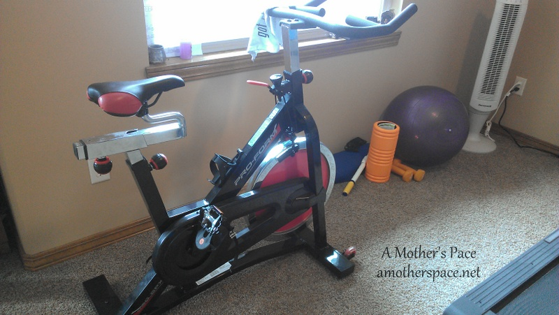
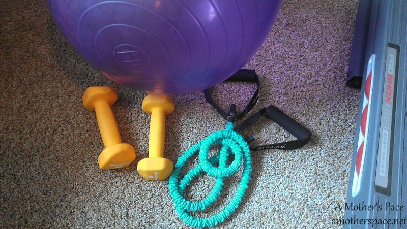
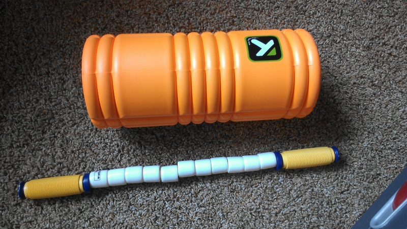
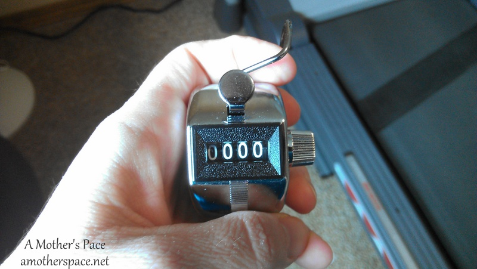

 

A few weeks ago my husband and I did a little organization downstairs. We've been spending more time downstairs watching the Olympics and playing on the Wii with the kids so it's just time to get it organized!

 

 

We started by putting all the exercise equipment in one area, essentially making a home gym. I spend at least and hour down there almost every morning so I thought I'd share my workout space and what's in it with you.

 

 

The big ticket item is the treadmill. During my last pregnancy we decided to buy one so that I could run at home for convenience, safety and, of course, to have my pregnant bladder close to the bathroom. We bought a **[ProForm](http://amzn.to/1ej2LQl)** no frills treadmill and it's worked very well for us.

It doesn't have the pace on the display (it only shows miles per hour) so if I need to hit a certain pace for a workout I look it up first. **[This website](http://www.hillrunner.com/training/tmillchart.php)** has a great pace conversion chart.

 

 

Next up is the **[spin bike](http://amzn.to/1fZZsCt)**, also a ProForm. We were very lucky to find this on sale when we bought it and got a great deal on it. I use the bike for my cross training right now and I'm down there on it every Sunday morning. My husband used to cycle more than run so we actually bought this for him years ago but I've been enjoying it more lately.

 

 

Now on to some smaller items. I've been incorporating strength training and regularly use the resistance band, weights and the balance ball. I would like to add a medicine ball and some heavier weights soon.

 

 

Recovery is also important. I use the foam roller more than I use [The Stick](http://amzn.to/OVlo8B) but I do like using the stick for tired legs. For sore legs I pull out the [Trigger Point Foam Roller](http://amzn.to/NOVodX). It's amazing how this roller helps after a long run.

 

 

One last tiny little thing. I bought my [lap counter](http://amzn.to/1kQSkJB) years ago because I used to run laps at the Y when the weather was bad outside. Now I use my lap counter for keeping track of intervals on the treadmill. I can't do any sort of math while running and I have miscounted intervals in the past. Now I just use my handy lap counter to take care of that for me and I don't have to think at all.

 

So there you have it. That's basically my home gym. We've slowly built it up over the years and I'm happy that I can just go downstairs and run and not have to worry about how to get to the gym. It's proven to be essential to my training with three young kids at home.

 

**Do you workout at home? What is your must-have item in your home gym?**

 

_This post contains affiliate links. Clicking on the link helps to support my blog. I purchased all the items in this post or received them from gifts from my family. No compensation was given for sharing my opinion. I'm just sharing what I use in my home gym._ 

 

\-------------------------------

Find A Mother's Pace on...

Twitter [@amotherspace3](https://twitter.com/amotherspace3)

Facebook [amotherspace3](http://facebook.com/amotherspace3)

Instagram [amotherspace](http://instagram.com/amotherspace)

Pinterest [amotherspace](http://pinterest.com/amotherspace/)

Bloglovin' [A Mother's Pace](http://www.bloglovin.com/en/blog/6680087)

RSS [amotherspace](http://feeds.feedburner.com/amotherspace)
