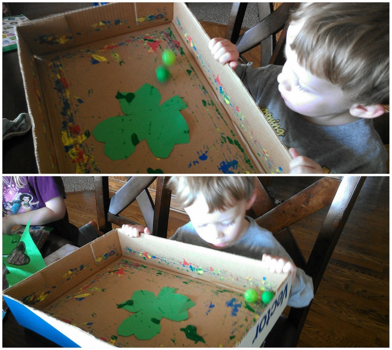
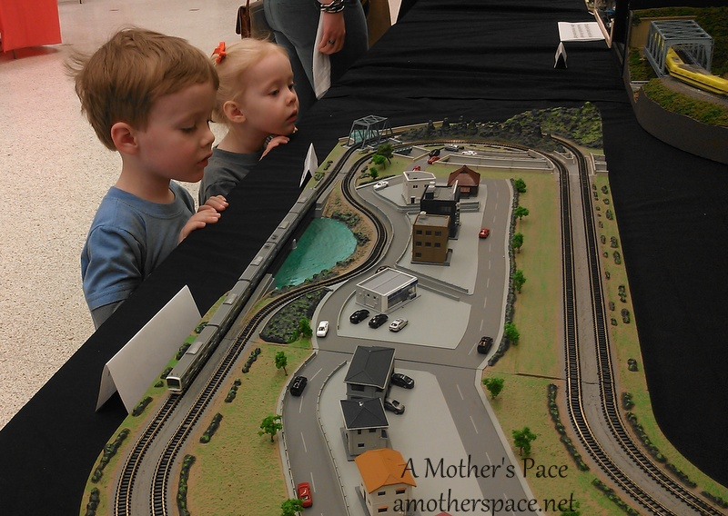
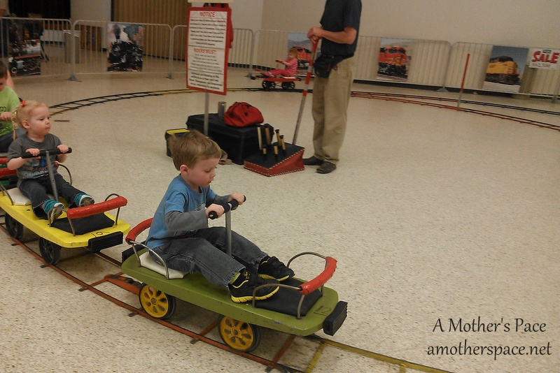
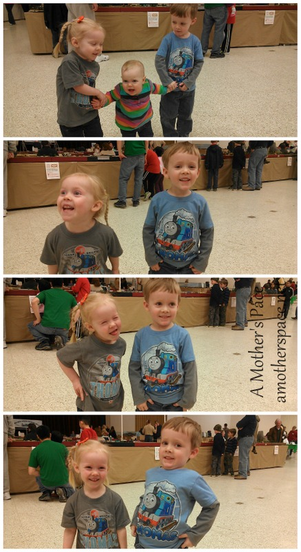
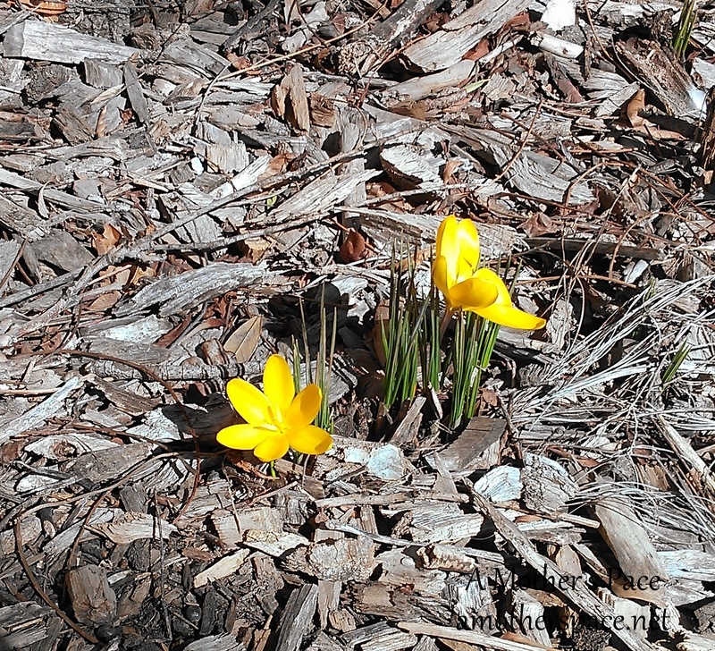
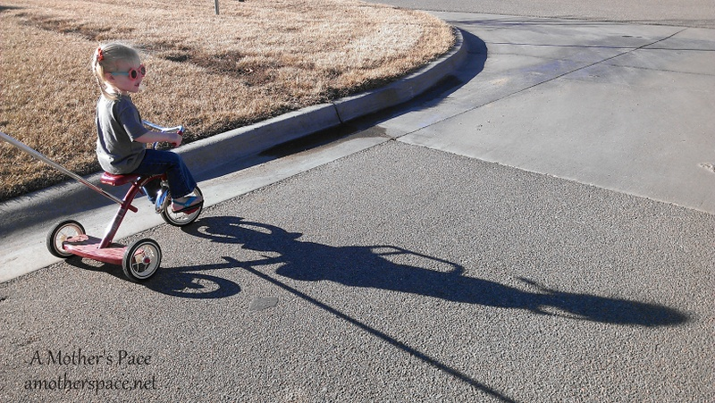

Thursdays are for [Thinking Out Loud](http://runningwithspoons.com) and this week I'm thinking Spring and all about life lately.

Marble painting is one of my favorite art projects to do with the kids. It's great for any holiday and this week we painted shamrocks for St. Patrick's Day.

 

Please excuse the blurry pictures, these were action shots! All you need to do this activity is a box lid, a marble or two, some paper and a little paint. My kids cut out a shamrock but you don't need to cut the paper into a shape at all. Just squeeze some paint on the paper and roll the marbles back and forth and all around.

We went to the Great Train Expo this past weekend. My kids are train fanatics and this was our second year to attend this expo. There were a lot of models to watch.

 

 

The kids loved the train to ride and got a great arm workout at the same time.

 

 

We also attempted to take a photo of the kids. Little A and Little O both had Thomas shirts on. I thought it would be cute. After the first pic with Little E we knew she wasn't going to cooperate. We tried with the other two and the results are pretty funny.

 

 

So I think most of us can agree that this has been a very long winter. We've seen a taste of spring this past week and I hope it's here to stay.

 

 

We've been going out on walks as a family more lately. The longer daylight hours in the evening are fantastic.

 

 

I've also started morning walks up again. I love walking with the kids and talking about the flowers, birds, trees and anything else that we see.

 

 

There's no filter on the photo above. Just good ole sunshine!

I'll wrap things up today with a little baseball. It's almost here! I admit that I watch much less baseball now that I have children and I'm not always up to date with what's going on with my team. But it doesn't mean I'm not a big Cubbie fan at heart. I can't wait to see how my Cubs do this year!

 

 

 

**Tell me 3 things about your life lately.**

 

 ----------------------------------------

Find A Mother’s Pace on…

Twitter [@amotherspace3](https://twitter.com/amotherspace3)

Facebook [amotherspace3](http://facebook.com/amotherspace3)

Instagram [amotherspace](http://instagram.com/amotherspace)

Pinterest [amotherspace](http://pinterest.com/amotherspace/)

Bloglovin’ [A Mother’s Pace](http://www.bloglovin.com/en/blog/6680087)

RSS [amotherspace](http://feeds.feedburner.com/amotherspace)
