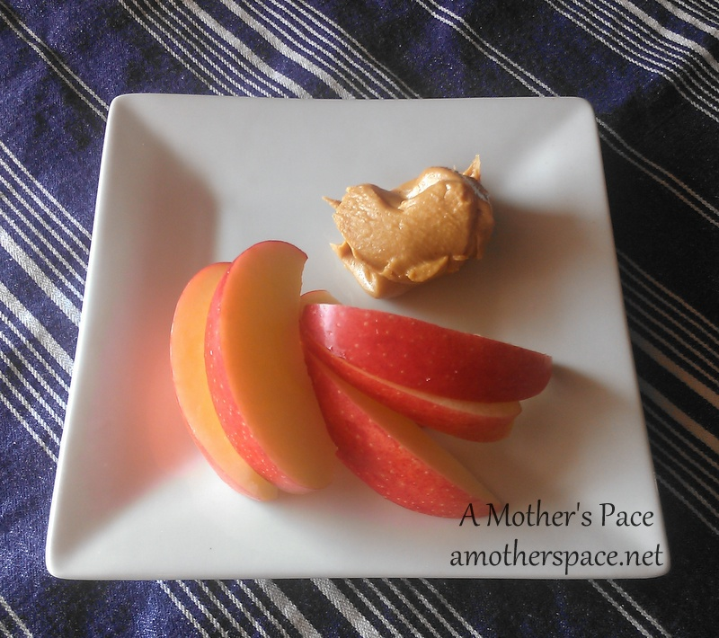
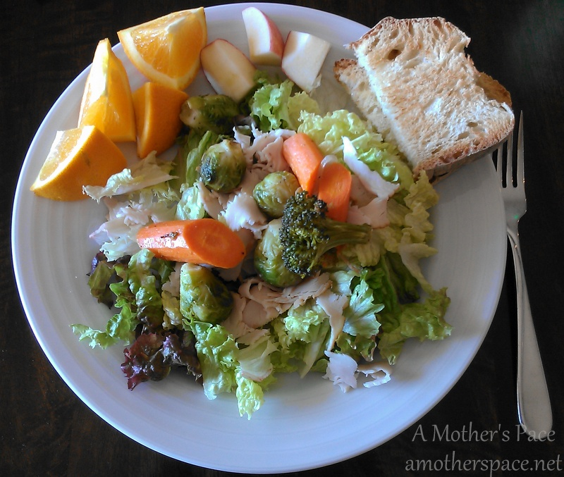
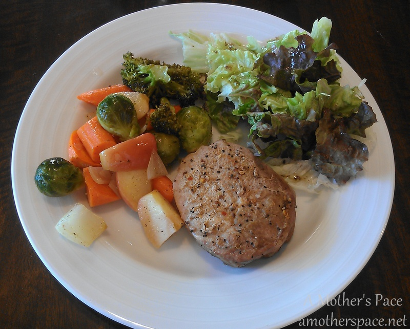

 

It's no secret that we love to roast veggies at our house. It's in our meal plan almost every week and I'm sure we'll keep on roasting even in the heat of the summer just because the veggies taste so good.

We have our standards, our favorites that make it into every batch. Those include sweet potato, carrots, onions and brussels sprouts. We also include an apple every time we roast veggies. It adds an extra bit of sweetness to the savory and is so tasty. And then we have our new favorites including beets and broccoli. Finally, we've been throwing any other veggie that we might have on hand to the mix to add variety.

 

 

This week when we tried roasted broccoli for the first time my 4-year-old son declared that broccoli was his new favorite veggie. This is the same boy that wouldn't even touch the stuff the day before. Makes a mama proud!

**Tips for Roasting Perfect Veggies**

- Preheat oven to 350 degrees.
- Cut veggies so that they are all similar in size. I usually try to cut mine so they are around an inch.
- Invest in a [silicone baking mat.](http://amzn.to/1m0Voq3) It makes clean up so easy and the veggies don't stick to the pan at all.
- Add veggies to the pan, I use a [jelly roll pan](http://amzn.to/1m0VMEQ). Drizzle olive oil and add seasonings. I usually only add salt and pepper to taste.
- Roast beets separately in another pan or dish to avoid turning other vegetables red. I also store them separately in the refrigerator if we have leftovers.
- Pick what you like but try something new. I'm trying radishes next time we roast.
- Finally, roast for about 30 minutes and then ENJOY!

I have just a couple of meals to share with you this week before I get to our menu plan.

**\[snack\]** Apples with Peanut Butter. So simple but so yummy.

 

 

**\[lunch\]** Salads. I've been topping greens with everything this week. Tuna salad, deli turkey meat, leftover steak, even leftover roasted veggies. I've been craving the greens.

 

 

**\[dinner\]** Pork Chop with (surprise!) roasted veggies and a salad.

 

 

Now on to our meal plan for the week. We ended up eating out more than anticipated last week and leftovers lasted longer than I thought so I have some repeats.

**\[monday\]** Something green. I'm still searching!

**\[tuesday\]** No Peak Chicken

**\[wednesday\]** leftovers

**\[thursday\]** [Quinoa Burgers](http://www.halfbakedharvest.com/epic-crispy-quinoa-burgers-topped-sweet-potato-fries-beer-caramelized-onions-gruyere/)

**\[friday\]** [Tilapia Tacos](http://www.tasteofhome.com/recipes/tilapia-tostadas)

**\[saturday\]** [Sausage Bake](http://amotherspace.net/2013/10/sausage-bake/)

**\[sunday**\] [Frittata](http://inspiredrd.com/2012/03/frittata-with-kale-and-purple-potatoes.html)

 

 **Do you roast veggies? What's your favorite? What are you eating on St. Patrick's Day?**

\-------------------------------

Find A Mother's Pace on...

Twitter [@amotherspace3](https://twitter.com/amotherspace3)

Facebook [amotherspace3](http://facebook.com/amotherspace3)

Instagram [amotherspace](http://instagram.com/amotherspace)

Pinterest [amotherspace](http://pinterest.com/amotherspace/)

Bloglovin' [A Mother's Pace](http://www.bloglovin.com/en/blog/6680087)

RSS [amotherspace](http://feeds.feedburner.com/amotherspace)
