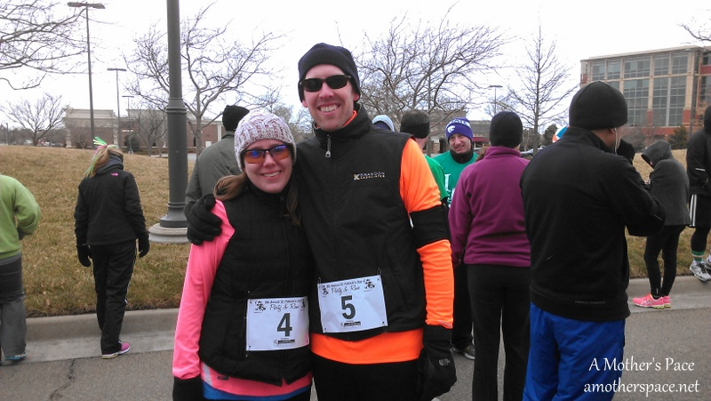
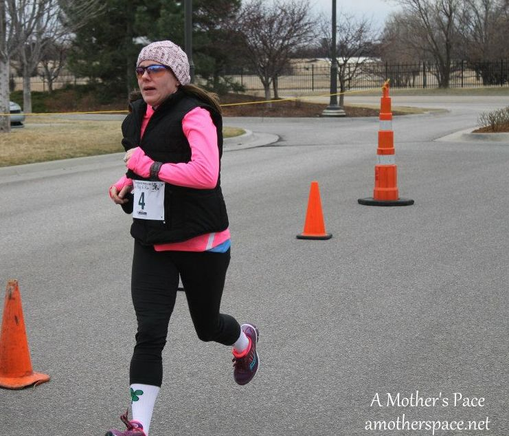
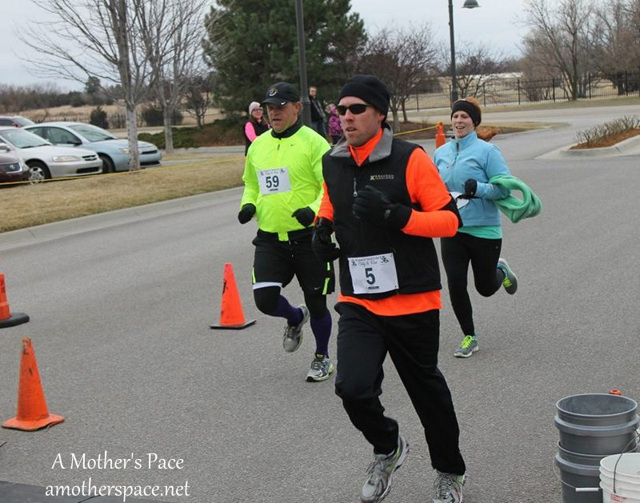
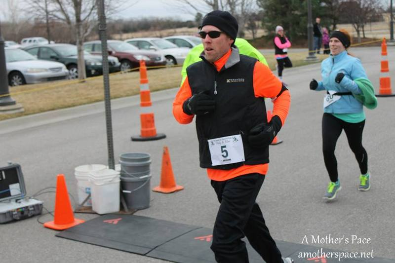
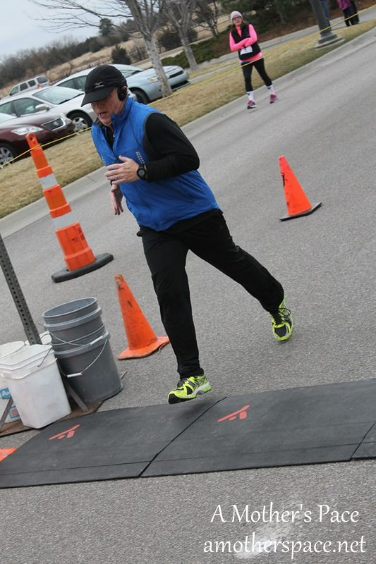
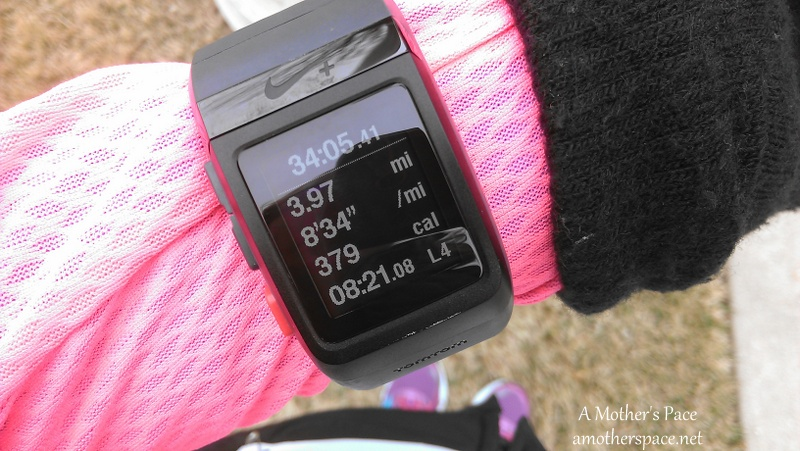
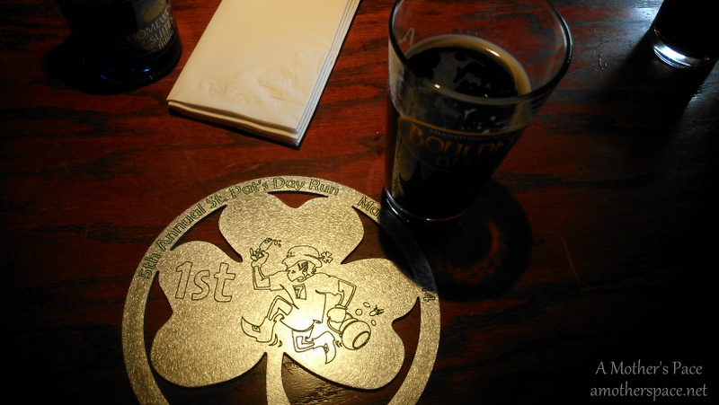

Sunday was the 5th Annual St. Patrick's Day Party and Run 4 Mile Race and this was my second time running in the race. It benefits the Leukemia and Lymphoma Society, which is near and dear to my heart, so it's a race I try to run (or spectate, like I did last year with my newborn) and enjoy every year.

This is my 2nd official race of 2014 and 4th race overall (including 2 virtual races) for my 14 in 2014 goal.

If you had asked me a week before this race what my goal was I would have told you to practice my goal half marathon pace in a race setting. That's a 9:05 pace and something that I know I can do, especially for 4 miles, but I want to get better about 'feeling' the pace.

That all changed on Saturday when I looked up what my finishing time was the last time I ran this particular race. I finished in 35:34 with an 8:54 pace. How could I not try and PR when my goal pace for this race was so close to my current PR???

I decided to go for it. I changed my goal to getting a PR and trying for an 8:30 pace for the 4 miles.

On Saturday I also looked at the weather again for Sunday. Cold, snowy and windy! I wasn't excited about that part at all, especially the wind.

The weather ended up being 30 degrees with a 'feels like' temperature of 22. And the wind gusts were coming in from the North at 36 MPH. Fun.

 

 

My husband and I ran the race, along with some other family and friends too.

The race started and we were off. The beginning was a little crowded as it is with most races and people didn't line up by pace so I had a little weaving to do towards the start of the run. It is a beautiful course that runs through a pretty neighborhood, around a couple of lakes and other landscaping in the Waterfront shopping area.

The wind wasn't too bad except when we were headed straight North. Then I could tell it slowed me down a little bit but I tried to just push through it.

I always make it a point to thank volunteers as I run by them but I made an extra effort today. They were standing out in the freezing cold wind so I could run in this race and they deserved a thank you from me at the very least.

I felt really good during this entire race. I know I didn't push myself as much as I could have but I'm very happy with the results, especially considering the wind. All this treadmill running over the winter has made me out of practice with this Kansas wind!

 

 

I cannot take a good finish line photo to save my life. I need to relax my shoulders! Ugh.

 

 

My husband, on the other hand, always takes great race shots. Could he be any more photogenic here?

 

 

Oh, wait, yes, yes he could and here it is. All joking aside, I'm very proud of my husband for running and having a fantastic race.

I didn't even notice that I was in the background of a lot of the finish line photos until my husband pointed it out to me. I don't know who this finisher is but the picture of me in the background makes me laugh! I really would have moved if I had realized that I was in all of these shots!

 

 

All the finish line photos are from the [Running Connection](https://www.facebook.com/RunningConnection).

 

 

After we watched the rest of our friends and family cross the finish line we went into Red Robin for post race nachos and beer. We warmed up inside for a few minutes and then headed back out for the award ceremony.

I was really hoping for an age group award because they were AWESOME. We were braving the cold during the awards and finally I asked my husband to go check the results to see if we really needed to stay for the awards. He came right back and said, Yes, we need to stay. A few seconds later my age group was up and they called my name out for FIRST PLACE!

 

 

We headed back inside to grab another beer and some lunch. This time we paid for our meal and drinks and I went with a chocolate stout.

 

 

Isn't that award fantastic?

 

Official Distance: 4 miles

Nike+ Distance: 3.97 miles

Official Time: 34:04

Nike+ Time: 34:05

Official Average Pace: 8:31

Nike+ Average Pace: 8:34

Overall Placement: 52/246

Age Group Placement: 1/34

Gender Placement: 12th

 

Read my recap of last St. Patrick's Day Party and Run 4 mile race [here](http://amotherspace.net/2012/03/st-patricks-day-party-run-race-recap/).

 

**Did you have a St. Patty's Day race over the weekend?**

\---------------------------

Find A Mother’s Pace on…

Twitter [@amotherspace3](https://twitter.com/amotherspace3)

Facebook [amotherspace3](http://facebook.com/amotherspace3)

Instagram [amotherspace](http://instagram.com/amotherspace)

Pinterest [amotherspace](http://pinterest.com/amotherspace/)

Bloglovin’ [A Mother’s Pace](http://www.bloglovin.com/en/blog/6680087)

RSS [amotherspace](http://feeds.feedburner.com/amotherspace)
