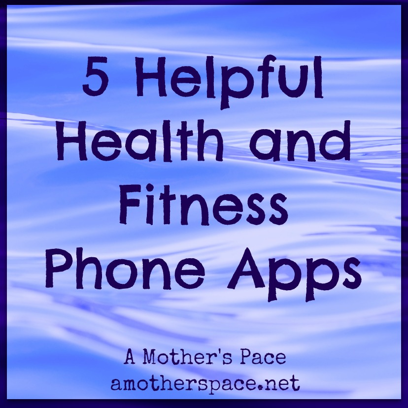
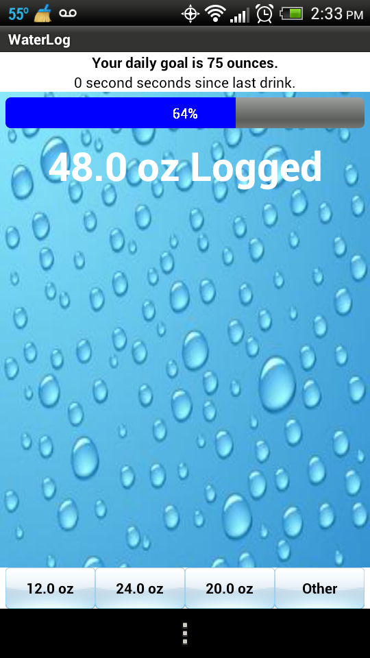
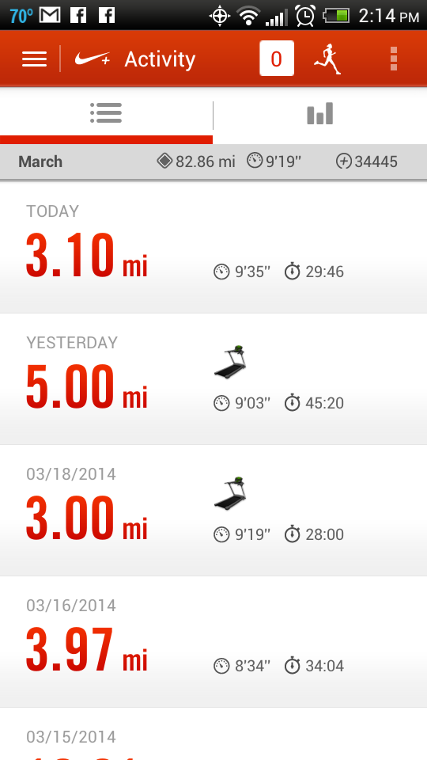
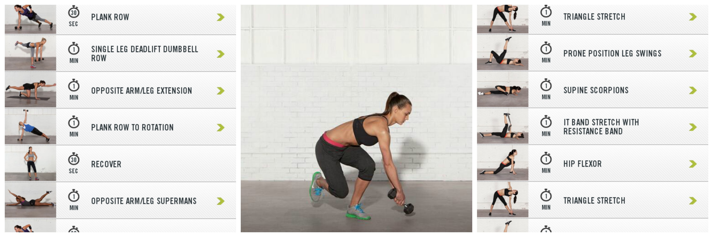

Recently I broke down and put an app on my phone that seems so silly to me. It's called WaterLog. It does exactly what it says. I click a button every time I drink water and it tallies it up for me.

For the past few weeks I have not been hydrating well enough and I've been waking up with a headache. I've been telling myself for two weeks to just drink more water but at the end of the day it's not happening. I'm not sure why because usually I'm a great water drinker. I download the app on my phone and it motivates me to drink more water. It's working and I'm hitting my hydration goal for the day.

Well, now I officially depend on my phone for just about everything, even drinking water. Today I'm sharing 5 of my favorite health and fitness phone apps that are helpful in my daily life.

 

 

**\[one\] WaterLog**

I found this app on my Android phone after I saw a lot of iPhone users using something similar. Simple but effective.

 

 

**\[two\] Nike Running App**

I have a Nike+ Sportwatch so this app goes hand in hand with that. Even if you don't have the Sportwatch, I highly recommend this app. It works outside with GPS and inside on the treadmill as well. It links up the run to the Nike+ website so that you can see splits and other feedback.

 

 

**\[three\] Nike Training Club**

This app has so much variety included in it that I'm amazed it's free. You can pick from a long list of workouts provided and then you also unlock more as you complete workouts. I use this app for 15-30 minute strength workouts usually about 3 times a week. I aim to get in a core, arm and leg workout each week.

 

 

**\[four\] Charity Miles**

How amazing is it that I can do something I love (run) and would be doing anyway but at the same time help to make a difference? Charity Miles is an app that allows you to choose from a wide range of charities to donate funds to that you earn by running. I just turn this app on before I run and the various sponsors donate funds to the charity of my choice. I always pick The Leukemia & Lymphoma Society because it is an important charity to my family.

 

 

**\[five\] Yoga App**

Here's where I need your help. I'm looking for a good yoga app for my phone. I've been wanting to add more yoga into my routine and I think this is the way to do it. I'm looking for something that has various levels of yoga and has routines that last around 15 minutes. It seems like I can always squeeze in a 15 minute workout throughout the day but any longer than that gets more difficult.

 

**What are your favorite health and fitness phone apps? Do you use a yoga app?**

\---------------------------

Find A Mother’s Pace on…

Twitter [@amotherspace3](https://twitter.com/amotherspace3)

Facebook [amotherspace3](http://facebook.com/amotherspace3)

Instagram [amotherspace](http://instagram.com/amotherspace)

Pinterest [amotherspace](http://pinterest.com/amotherspace/)

Bloglovin’ [A Mother’s Pace](http://www.bloglovin.com/en/blog/6680087)

RSS [amotherspace](http://feeds.feedburner.com/amotherspace)
