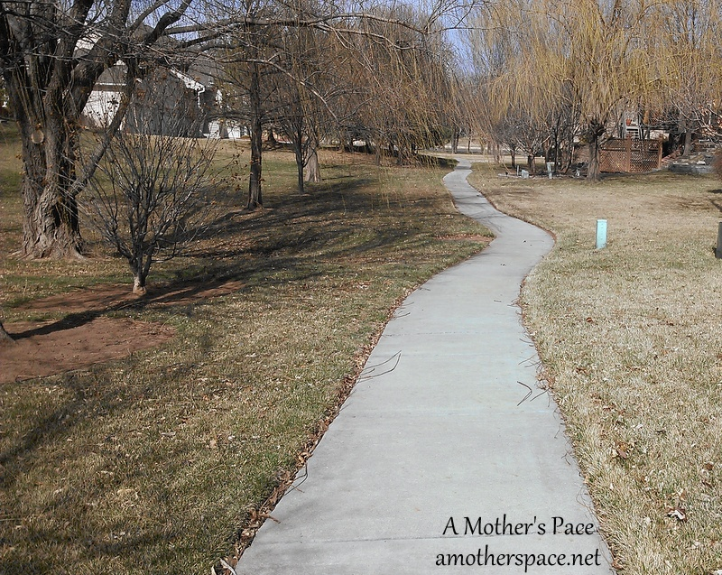
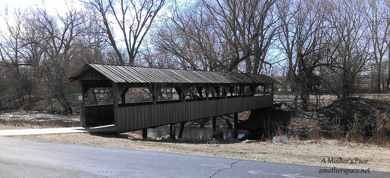
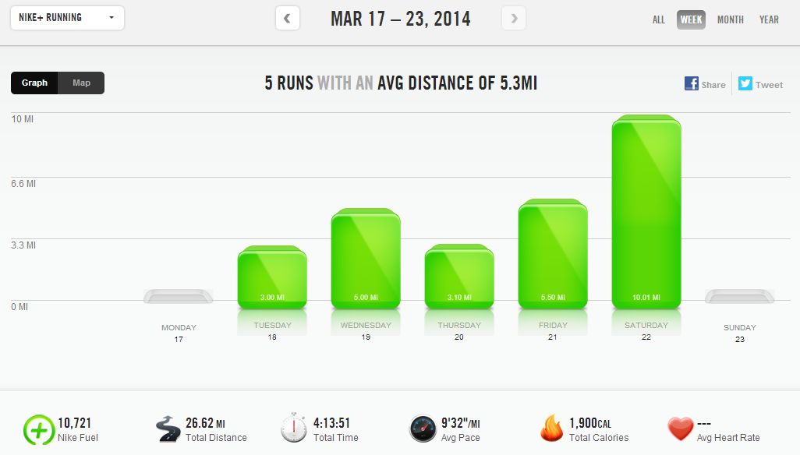

My [race](http://amotherspace.net/2014/03/st-patricks-day-party-and-run-race-recap-2014/) last week completely changed my training plan for practically the entire week. I rested on Monday instead of Wednesday and tried to jump back into it on Tuesday. My two treadmill runs of the week were tough but the light side of that is that I only had to run twice on the treadmill.

 

 

I was able to get out and enjoy our spring weather 3 times last week. I ran in shorts for the first time this spring in our neighborhood for a nice 5.5 mile run on Friday.

 

 

Then on Saturday I ran to a local park. It was cooler and wasn't quite shorts weather but it was a pleasant run all around. It was an out and back route and I was very thankful that the wind was at my back on the way home.

I wasn't feeling the strength training so much this week. It's much easier for me to complete an entire workout downstairs (treadmill + strength) without getting distracted. If I run outside, the second I come inside my 12 month old sees me, wants to nurse and my workout is finished. I suppose that means I need to wake up earlier and do strength before running outside!

 

 

**Weekly Workouts**

Monday: Rest Day

Tuesday: 3 miles (9:22 pace)

Wednesday: 5 miles (9:07 pace)

Thursday: 3.1 miles (9:36 pace)

Friday: 5.5 miles (9:56 pace)

Saturday: 10 miles (9:36 pace)

Sunday: Spin Bike + 20 minutes strength + core work

 

 

 

One of my main goals for 2014 is to Run This Year in kilometers. That's 2,014 kilometers or 1,251.44 miles.

Weekly Running Miles: 26.61

Weekly Average Pace: 9:32

March Running Miles: 98.07

2014 Running Miles: 277.20

2014 Running Kilometers: 446.11

 

 

**Is it spring like weather for you yet? How was your training last week?**

 

——————————-

Find A Mother’s Pace on…

Twitter [@amotherspace3](https://twitter.com/amotherspace3)

Facebook [amotherspace3](http://facebook.com/amotherspace3)

Instagram [amotherspace](http://instagram.com/amotherspace)

Pinterest [amotherspace](http://pinterest.com/amotherspace/)

Bloglovin’ [A Mother’s Pace](http://www.bloglovin.com/en/blog/6680087)

RSS [amotherspace](http://feeds.feedburner.com/amotherspace)
