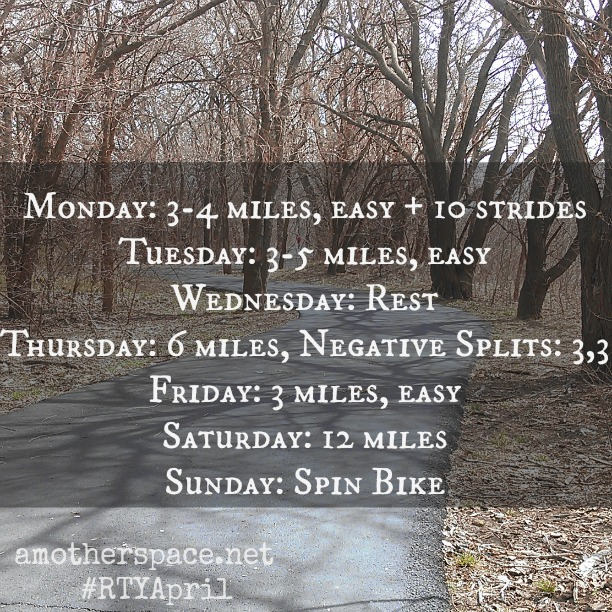
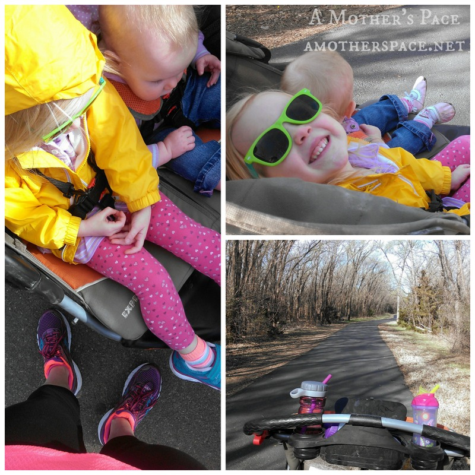
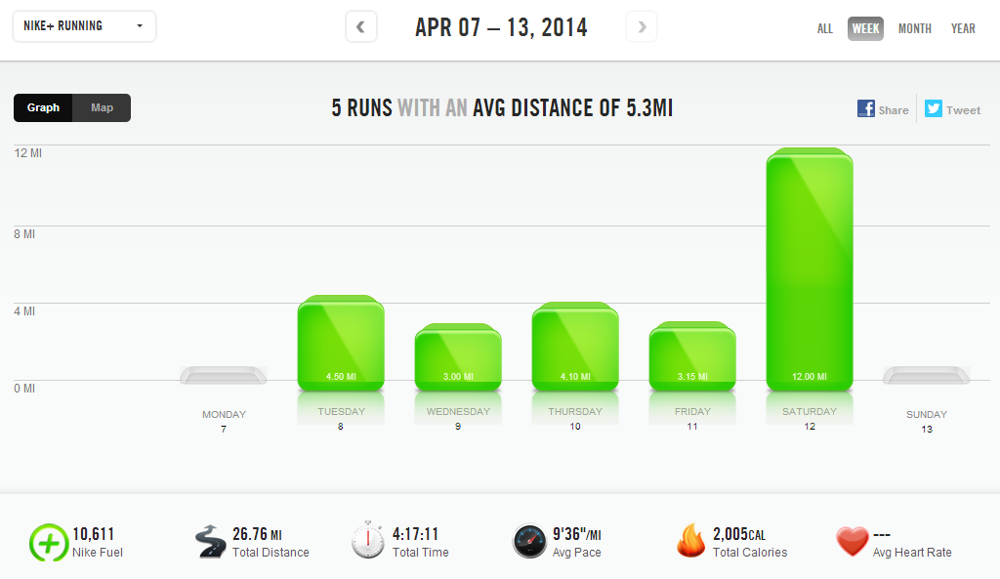

This week was a MUCH better week of running. I'm participating in a challenge over on Instagram with the Run This Year team and our challenge last Monday was to post a weekly workout schedule. (Not following me on Instagram yet? Click [here](http://instagram.com/amotherspace) to find my account.)

 

 

I'm amazed at how much this motivated me to stick to my running plan for the week. I always have a plan for the week but putting it out there before the week even started made me stick to it as much as possible.

I had to switch a few runs up. I turned Monday into my rest day but I just pushed back Mondays workout a day and skipped my rest day on Wednesday. Thursday I was supposed to try a negative split run but trying to do that with a double jogging stroller proved to be too hard.

All in all, I'm very happy with how the week turned out. For now I'm going to continue posting my weekly plan to Instagram to help put my best foot forward with accountability.

My first stroller run of the year happened this week. I was all dressed and ready to run early in the morning when we realized we were out of milk. My husband ran to the store instead. That's when I decided to take the girls out while my son was in preschool. Boy, I'm either out of practice or they've gotten a lot heavier over the winter. (probably both!) It was a challenging run for me but so much fun.

 

 

We talked the entire time. My 3-year-old loved pointing out all the animals (squirrels, rabbits, birds, turtles, etc...) and my 1-year-old pointed and giggled at everything. I was hoping to get in at least 3 miles but I ended up running just over 4 with them. The only issue was that the wind picked up while we were out and anytime we headed North it was coming straight at us. The girls didn't like that very much and I felt like I was running in place. Luckily we didn't have to run that direction for very long.

 

 

After the run we played at the park for awhile and enjoyed the beautiful spring morning. I loved this stroller run but I'm not sure how often I'll be able to do it with them and stick to my training plan. Speed work days happen to fall on the same days that my son is in school and I'm definitely not able to attempt speed work while pushing a stroller!

 

 

**Weekly Workouts**

Monday: Beginner Flexibility Yoga 15 minutes

Tuesday: 4.5 miles (9:14 pace)

Wednesday: 3 miles (9:14 pace) + 20 minutes strength + 15 minutes Relaxation Yoga

Thursday: 4.1 stroller miles (10:01 pace)

Friday: 3.15 miles (9:12 pace)

Saturday: 12.01 miles (9:49 pace)

Sunday: Spin Bike 40 minutes + 20 minutes strength

 

 

 

One of my main goals for 2014 is to Run This Year in kilometers. That's 2,014 kilometers or 1,251.44 miles.

Weekly Running Miles: 26.76

Weekly Average Pace: 9:36

April Running Miles: 44.89

2014 Running Miles: 355.54

2014 Running Kilometers: 572.19

 

 

**Does Instagram help to keep you accountable? Do you or have you ran with a stroller?**

 

——————————-

Find A Mother’s Pace on…

Twitter [@amotherspace3](https://twitter.com/amotherspace3)

Facebook [amotherspace3](http://facebook.com/amotherspace3)

Instagram [amotherspace](http://instagram.com/amotherspace)

Pinterest [amotherspace](http://pinterest.com/amotherspace/)

Bloglovin’ [A Mother’s Pace](http://www.bloglovin.com/en/blog/6680087)

RSS [amotherspace](http://feeds.feedburner.com/amotherspace)
