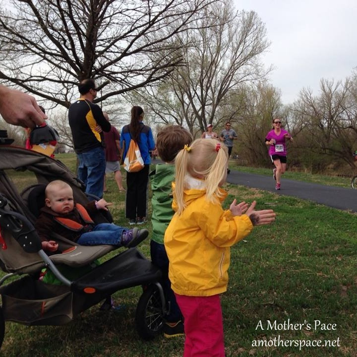

Earlier in the week, before this race, I was trying to figure out my long run plans for Saturday. It was Easter weekend and we were traveling Saturday afternoon to meet family for Easter.

The Easter Sun Run is a race I've done in the past and enjoyed so Thursday (two days before the race!) I just decided to make my long run a little shorter and run this 10k instead. I know that a lot of people sign of for races the morning of but that's not me and so this was a very last minute decision for me.

The weather was perfect. It was in the 50's and before the race started there was only a slight breeze. It picked up a little during the race but it wasn't bad at all.

The Easter Sun Run takes place at the Sedgwick County Park. It's mostly nice wide paths and it's a park I'm very familiar with because I run it a lot.

My goal for the race was to test a 10k pace that would translate into a sub-2 half marathon in a couple of weeks. According to [Greg McMillan](http://http://www.mcmillanrunning.com/index.php/site/calculator), if I want a 1:59 half (a 9:05 pace) I should be able to run a 10k at an 8:35 pace.

 

 

As soon as the race started people went out fast. I did not start too far ahead with faster people because I ended up passing a lot of the same ones later in the race. It was mentally tough to just let people fly by me at the beginning but it's much better than burning out and having them fly by me later in the race!

One way that I tried to keep my goal pace was to run the race in thirds. I ran the first two miles with my head, the third and fourth with my legs and the last 2.2 miles with my heart.

It was a great mantra to have in my head throughout the race. During that first mile repeating, run with your head, run with your head, helped me SO MUCH to NOT take off with everyone flying across the start line. I knew my goal pace was 8:30 and even though I ran my first mile at an 8:02 pace (way too fast) I actually slowed down quite a bit to run my own race.

 

([Source](https://www.facebook.com/RunningConnection))

I felt great in the 3rd and 4th miles and just settled in to the pace. My legs were strong and I repeated the second part to my mantra, run with your legs, many times during these miles.

At the 5k mark they called out 26:15...just 21 seconds off of my PR. Not bad for doubling the distance. I also saw my family just past the 5k mark. They are the best looking cheering squad out there!

 

 (Photo Credit: My Mom)

 

During the 5th and 6th mile I sped up a little (running an 8:21 pace) and the negative self talk seeped in. I repeated run with your heart over and over but I was still making deals with myself. "Why do I do this? I promise I won't make myself do this again after Chicago and so on." (Oops, yes, I'm running the CHICAGO MARATHON in the fall...I haven't officially made that announcement on the blog yet!!)

Of course, as soon as I cross the finish line I'm looking forward to the next race and all my bargaining before the end of the race meant nothing.

 

 

I crossed the finish line with an official time of 52:35. It's over a 1 minute PR and at an 8:28 pace I made my goal of hitting a pace that translates into a sub-2 half.

 

 

Official Distance: 10k

Nike+ Distance: 6.2 miles

Official Time: 52:35

Nike+ Time: 52:36

Offical Pace 8:28

Placement: 171/544

Age Placement: 11/65

 

 

This is my 3rd bib of the year and with 4 virtual races it brings my 2014 race total to 7. I'm half way to my #14in2014 race goal of the year!

After the race was finished I had thought about running home to complete my 10 miles for the day. Instead I found out that my son had been going down some serious slides while I was running and I wanted to spend the time watching him. I'm so proud of this guy. Until just a few days ago he wouldn't even go down the slide in our backyard! The girls did a fantastic job on the slides as well. We are starting Little E going down them early so maybe she won't be as scared of them.

 

 

The Easter Sun Run is a fantastic race for the entire family. There are various races (including a 2 mile run and a 2 mile walk) and a BBQ afterwards that smelled amazing. We had to leave so I didn't get to enjoy it this year. My children did enjoy getting a face tattoo and just missed the Easter egg hunt by a couple of minutes!

After this race, I plugged my time into Greg McMillan's running calculator again and it has changed my expected finish time for my half marathon coming up. According to the graph below, I should be able to run a half with an 8:57 pace and finish in 1:57:14. I'm going to shoot for it and hope to finally get my sub-2 half!

 

 

Want more? Read my 2 other 10k race recaps! [River Run 2012 10k](http://amotherspace.net/2012/06/river-run-10k-race-recap/) and [Easter SunRun 2012](http://amotherspace.net/2012/04/easter-sunrun-10k-race-recap/)

 

 

——————————-

Find A Mother’s Pace on…

Twitter [@amotherspace3](https://twitter.com/amotherspace3)

Facebook [amotherspace3](http://facebook.com/amotherspace3)

Instagram [amotherspace](http://instagram.com/amotherspace)

Pinterest [amotherspace](http://pinterest.com/amotherspace/)

Bloglovin’ [A Mother’s Pace](http://www.bloglovin.com/en/blog/6680087)

RSS [amotherspace](http://feeds.feedburner.com/amotherspace)
