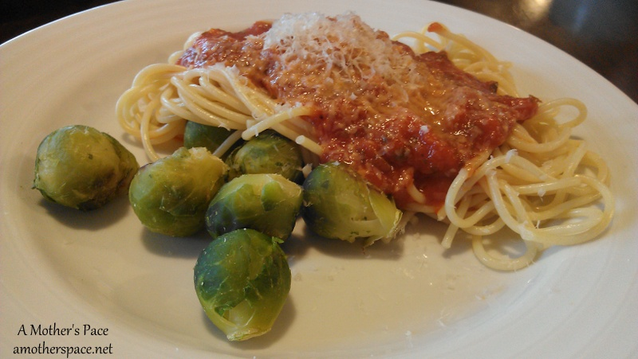

We are actually home this weekend and that means that I'm taking the time to meal plan. I have a few pictures of some recent food I've been eating and then I'm down to business with my meal plan.

**\[breakfast\]** These egg cups have been great for quick meals in the morning. It's nice to just warm and serve. No dirty pans and a quick, healthy meal!

 

 

**\[sweet snack\]** Sometimes you just need a little bit of chocolate, right? This is one snack that I fall back on when I'm craving chocolate and it really hits the spot!

 

 

**\[dinner\]** We've been grilling out a lot lately with spring in full swing now. We usually throw something on the grill and some veggies in the oven to roast while the grill is going. I'm sure once it gets warmer out we'll skip the oven and put the veggies on the grill as well. I just can't get over how good roasted veggies are though!

 

 

**\[side\]** Sweet potato fries are the go-to veggie at our house right now. They are so good and when we fix these I don't even miss regular fries at all.

 

 

**\[dinner\]** My favorite veggies to pair with pasta are brussels sprouts. There's just something about that mixture that I love!

 

 

**\[drink\]** My all time favorite beer is good ole Sammy Smith's Organic Chocolate Stout. We don't buy it often because it's a treat, but when we do I sure enjoy it.

 

 

Now that we're caught up with what I've been eating lately, here's a look ahead to next week. **\[monday\]** [Frittata](http://inspiredrd.com/2012/03/frittata-with-kale-and-purple-potatoes.html)

**\[tuesday\]** Fajitas

**\[wednesday\]** [Quinoa Burgers](http://www.halfbakedharvest.com/epic-crispy-quinoa-burgers-topped-sweet-potato-fries-beer-caramelized-onions-gruyere/)

**\[thursday\]** Leftovers

**\[friday\]** Pasta (Carb loading for my race!)

**\[saturday\]** Leftovers

**\[sunday\]** Grill Out (post race protein!)

 

**What meal do you eat to carb load for a race? Do you grill out a lot in the spring/summer?**

\-------------------------------

Find A Mother's Pace on...

Twitter [@amotherspace3](https://twitter.com/amotherspace3)

Facebook [amotherspace3](http://facebook.com/amotherspace3)

Instagram [amotherspace](http://instagram.com/amotherspace)

Pinterest [amotherspace](http://pinterest.com/amotherspace/)

Bloglovin' [A Mother's Pace](http://www.bloglovin.com/en/blog/6680087)

RSS [amotherspace](http://feeds.feedburner.com/amotherspace)
