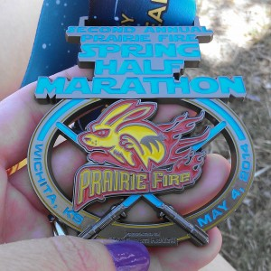
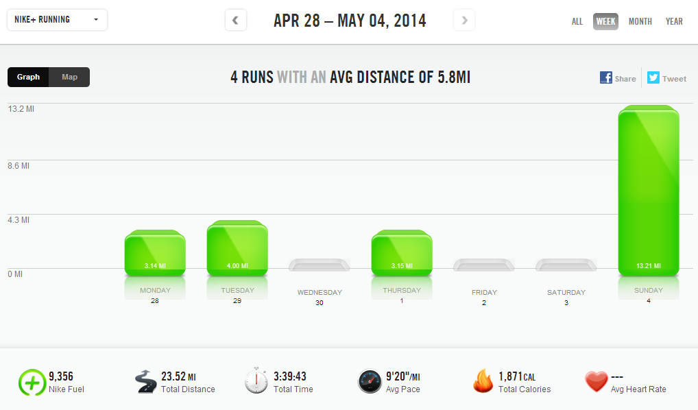

 

 

Just popping in quickly to update my training log this week. It's been a busy weekend of racing and family adventures. I'll be back soon with a recap from the Prairie Fire Half Marathon that I ran yesterday.  May the Fourth is a fun day to have a half marathon and I can't wait to share it with you!

Before I get to the training log...did you see this one yesterday? I just love Audrey and this [Google Doodle](http://google.com) is lovely.

 

 

Alright so here's my training log from last week. It's the week before a race so I tapered a little, of course.

 

**Weekly Workouts**

Monday: 3.14 miles (9:29 pace)

Tuesday: 4 miles (8:56 pace)

Wednesday:  Typical Rest Day

Thursday: 3.15 miles (9:24 pace)

Friday: Taper Rest Day

Saturday: Taper Rest Day

Sunday: RACE DAY! 13.21 (Nike Distance) (9:26 pace)

 

 

 

One of my main goals for 2014 is to Run This Year in kilometers. That's 2,014 kilometers or 1,251.44 miles.

Weekly Running Miles: 23.50

Weekly Average Pace: 9:20

May Running Miles: 16.36

2014 Running Miles: 431.57

2014 Running Kilometers: 694.54

 

 

**Did anyone else race over the weekend? Tell me about it!**

 

 

——————————-

Find A Mother’s Pace on…

Twitter [@amotherspace3](https://twitter.com/amotherspace3)

Facebook [amotherspace3](http://facebook.com/amotherspace3)

Instagram [amotherspace](http://instagram.com/amotherspace)

Pinterest [amotherspace](http://pinterest.com/amotherspace/)

Bloglovin’ [A Mother’s Pace](http://www.bloglovin.com/en/blog/6680087)

RSS [amotherspace](http://feeds.feedburner.com/amotherspace)
