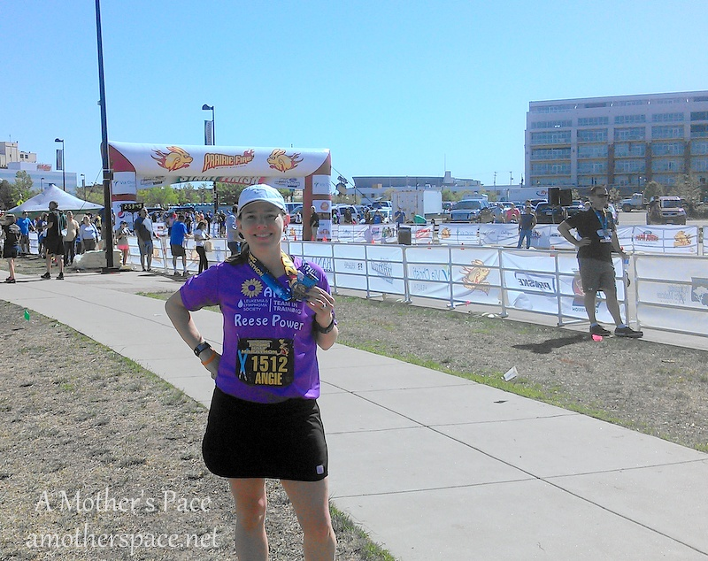
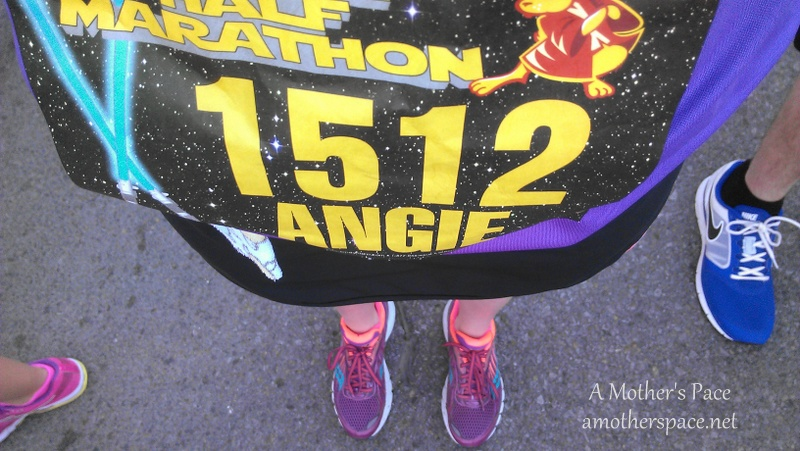
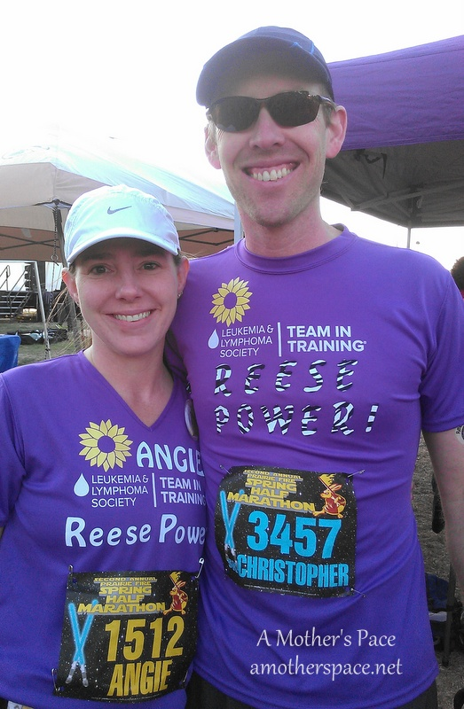
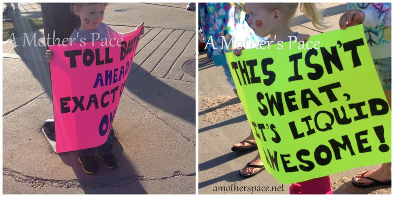
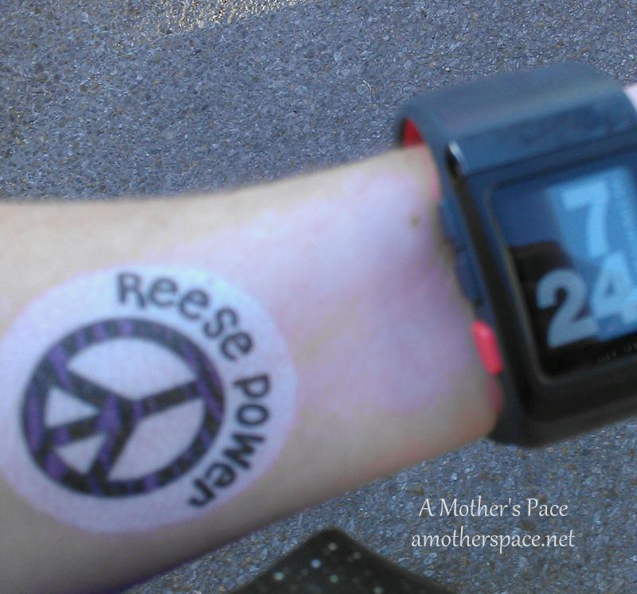
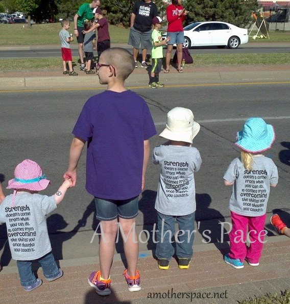
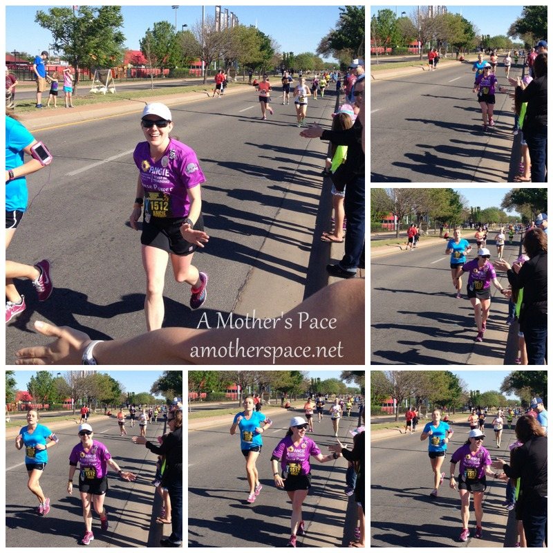
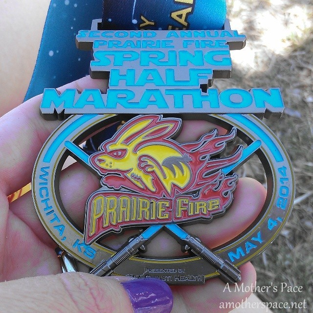
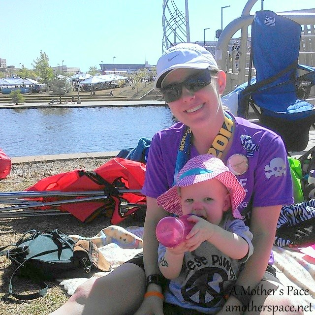
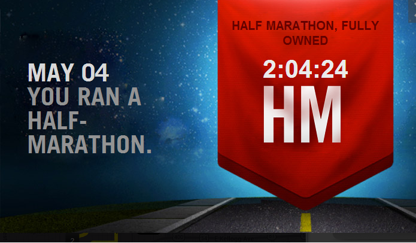

 

My 6th half marathon was last weekend and, even though I set a new PR, I missed my A goal by what seems like a lot. I'm getting ahead of myself, let me back up a bit.

Months ago I picked the Prairie Fire Spring Half Marathon as my goal race for the first part of the year. I started training in February with the 'Own It' plan from Train Like a Mother. I felt confident before the race that I would finally achieve my elusive sub-2 half marathon goal. I'd given up music and podcasts during most of my running and instead concentrated on how I felt during running. I also used this time to visualize hitting certain paces during race time and meeting my goal.

I woke up the morning of the race and felt good. Still confident but a little nervous about the weather. The weeks before this race I had been running in the morning hours with layers on because the temps were in the 30's and maybe low 40's. Race day ended up with a record setting high of 102 degrees. Not that it was 102 while I was running. During my portion of the race the temps were around 75 degrees.

When I hear '75 degrees' it doesn't sound extreme to me and that's why I didn't worry too much about it ahead of time. But when I thought about it after the race I realized that a 30 degree (or more!) difference from what I'm used to is a pretty big deal.

 

 

My husband and I headed out to the race. We both ran with Team in Training (TNT) in honor of our niece, Reese. You can read more of her story [here](http://amotherspace.net/2013/09/see-jane-run-half-marathon-wichita-race-recap/) and [here](http://amotherspace.net/2014/01/she-is-fierce/). In short, she is a leukemia survivor and recently had a bone marrow transplant. Our goal for team REESE POWER was to raise $100,000 so that Reese's family could pick a researcher.

 

 

My husband ran the 5k, along with many other family members and friends. This is my 4th event with Team in Training and it makes the whole experience so worthwhile. I feel so helpless when it comes to everything that my niece has to go through but one thing that I can do is run and raise funds to help my niece and others like her.

After waiting around, warming up and taking some pictures with the rest of the team it was time to go off to the starting line. I lined myself up close to the 2 hour pacers. I knew that I didn't want to run with them because they varied the pace too much during the race and I like to try and hit my pace and stay on it for the race. (Spoiler alert...that did NOT happen during this race!)

The pacers took off way too fast. They were ahead of me and I finished the first mile with an 8:30 pace. Mentally it was hard to see the pacing group (that was supposed to have a 9:30 pace at this point) far ahead of me but I tried to run with my head and run my own race. I kept my eye on them though and hoped to catch up to them at some point in the race.

At mile 4 I took my first vanilla Honey Stinger gel.

Average Pace Miles 1-7 (8:36, 9:11, 9:15, 9:04, 9:15, 9:06, 9:12)

To reach a 2 hour half marathon my average pace needed to be at a 9:05. I stuck to it during the first seven miles. I watched the average pace and it floated between 9 and 9:05. My goal was within my reach.

 

\[caption id="attachment\_2359" align="aligncenter" width="800"\] photo credit: my sister-in-law\[/caption\]

 

At mile 7 my mom met me and switched out my water bottle. (Thanks, Mom!!) My second water bottle had watermelon Nuun in it (my favorite) and I was looking forward to drinking it instead of water.

I was feeling great at this point but something happened during mile 8. My pace started to slow and I couldn't do anything about it. I'm guessing that my water intake was too low. I was only drinking from my handheld at this point and I should have picked up water from the stops as well.

I took my second Honey Stinger gel at mile 8, fruit smoothie this time.

The race took place mainly in Riverside Park, which is a favorite area of mine. I used to live close by and used to run these exact streets. Many times throughout the race I was struggling but still smiling just because I was running on streets I love.

Average Pace Miles 8-11 (9:22, 9:42, 9:48, 10:01)

As soon as I started to see my pace slow down I decided I needed more water and I started walking through the water stops to get it. I'm pretty sure that I got water at the last 3 stops. I also took another vanilla Honey Stinger gel at mile 10 or so.

 

 

At this point I was seeing an average pace that didn't make me happy. I didn't think I was going to set a new PR, much less run a sub-2 half. I looked down at my arm where I had a Reese Power tattoo a lot during this part of the race. Thinking about my niece helped me reach the finish line. Knowing that I would see her and my family during the 12th mile helped me get to the finish line.

 

\[caption id="attachment\_2357" align="aligncenter" width="568"\] The BEST cheer section out on the course! | Photo credit: my mother-in-law.\[/caption\]

 

My husband jumped in the race at mile 12 and ran with me. You'd think that this would have made me run faster but my legs felt like lead and try as I might they just wouldn't go any faster. I couldn't talk a whole lot but I did enjoy his encouragement during the little bit he ran with me. He left me towards the end of the 12th mile as we were coming up on the best cheering section on the course. It was a sea of TNT purple with a lot of smiling faces and high fives.

 

\[caption id="attachment\_2358" align="aligncenter" width="800"\] photo credit: my sister-in-law\[/caption\]

 

Average Pace Miles 12-13.1 (9:58, 9:59)

Somehow I squeaked a PR out of this one. I crossed the finish line at 2:04:21 which is 12 seconds faster than my old PR. Baby steps towards my sub-2 but I'm determined to get there one day.

The Prairie Fire race series is always put on very well. I've done several other races including the [full](http://amotherspace.net/2012/10/wichita-prairie-fire-2012/ "Wichita Prairie Fire 2012"), a [fall half](http://amotherspace.net/2013/10/prairie-fire-half-marathon-race-recap/) and a [5k](http://amotherspace.net/2013/05/spring-wichita-prairie-fire-5k-recap/). This race did not disappoint and I firmly believe I would have met my goal if the weather had cooperated a little.

Looking back on this race it pains me to see 10:00 minute miles. Not because I think this is slow or I think less of people that run 10:00 minute miles. I had set my goal to run the entire race between an 8:57 and 9:05 pace so these 10:00 minute miles hurt a little.

I wasn't the only one that was off on goals for that day though. Many others that I talked to after the race said that the heat did them in as well and the race was slower for them because of it.

I haven't given up on my goal. I won't give up until I've crossed that finish line in under two hours!

 

 

This race took place on May 4th and the Prairie Fire team, some runners and even spectators did a great job of taking advantage of the 'May the fourth' theme. We had a fun medal to take home and they also surprised the 5k runners with a medal!

2014 Prairie Fire Spring Half Marathon Results

Official Distance: 13.1 miles

Nike+ Distance: 13.22 miles

Official Time: 2:04:22

Nike+ Time: 2:04:24

Official Average Pace: 9:30

Nike+ Average Pace: 9:25

Overall Placement: 526/1438

Age Placement: 35/147

 

  
——————————-

Find A Mother’s Pace on…

Twitter [@amotherspace3](https://twitter.com/amotherspace3)

Facebook [amotherspace3](http://facebook.com/amotherspace3)

Instagram [amotherspace](http://instagram.com/amotherspace)

Pinterest [amotherspace](http://pinterest.com/amotherspace/)

Bloglovin’ [A Mother’s Pace](http://www.bloglovin.com/en/blog/6680087)

RSS [amotherspace](http://feeds.feedburner.com/amotherspace)
