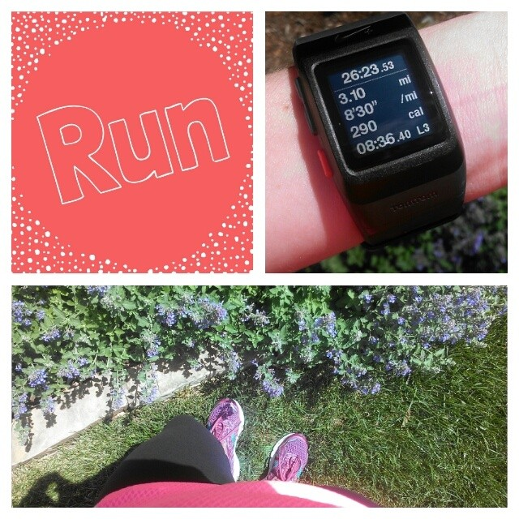
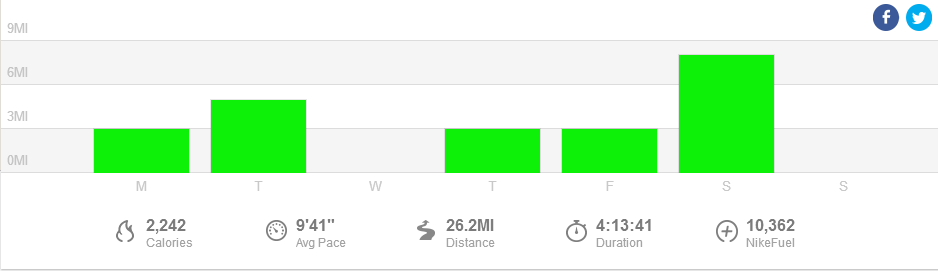

Running Lately...

Since my last half marathon race at the beginning of May I've considered myself in maintenance mode. I'm running all of my runs based on how I feel that day. Some have been fast (like the photo below!) but most have been at an easy relaxed pace.

 

 

I know that I have a big training cycle coming up at the beginning of June. Because of that I wanted to keep my mileage base up but still start the training refreshed and not worn down. The past few weeks I've still ran 5 days a week with a long run of 8 miles on the weekend. I'm on the spin bike weekly and still incorporating strength several times throughout the week. My new kettlebells (a Mother's Day gift) are helping that because they are just plain FUN.

I have just under two weeks before Chicago Marathon training begins and I'm planning on continuing with exactly what I'm doing. Running easy when I want to and faster when I feel like it is very refreshing!

 

 

 

**Weekly Workouts**

Monday: 3 miles (9:14 pace) + 25 minutes strength

Tuesday: 5.01 miles (9:44 pace)

Wednesday: 40 minute Spin Bike + 20 minutes strength

Thursday: 3 miles (9:45 pace) + 15 minutes NTC Ab Burner Core Workout

Friday: 3 miles (9:30 pace)

Saturday: 8.02 miles (10:10 pace)

Sunday: 1.06 miles: Fun Run with my son (12:24 pace) + 3.09 miles:  5k race (8:13 pace)

A recap from my race this past weekend is coming soon...stay tuned!

 

 

Please imagine that Sunday has a bar for my race with my son and my 5k. Not sure why Nike+ chose not to put it in the graph because the miles for the week are correct even if the graph is wrong. Hey, I ran a marathon this week!

 

One of my main goals for 2014 is to Run This Year in kilometers. That's 2,014 kilometers or 1,251.44 miles.

Weekly Running Miles: 26.18

Weekly Average Pace: 9:41

May Running Miles: 74.65

2014 Running Miles: 489.86

2014 Running Kilometers: 788.35

 

**How do you keep your fitness level up between training cycles? Do you have a goal race in the fall?** 

 

 

——————————-

Find A Mother’s Pace on…

Twitter [@amotherspace3](https://twitter.com/amotherspace3)

Facebook [amotherspace3](http://facebook.com/amotherspace3)

Instagram [amotherspace](http://instagram.com/amotherspace)

Pinterest [amotherspace](http://pinterest.com/amotherspace/)

Bloglovin’ [A Mother’s Pace](http://www.bloglovin.com/en/blog/6680087)

RSS [amotherspace](http://feeds.feedburner.com/amotherspace)
