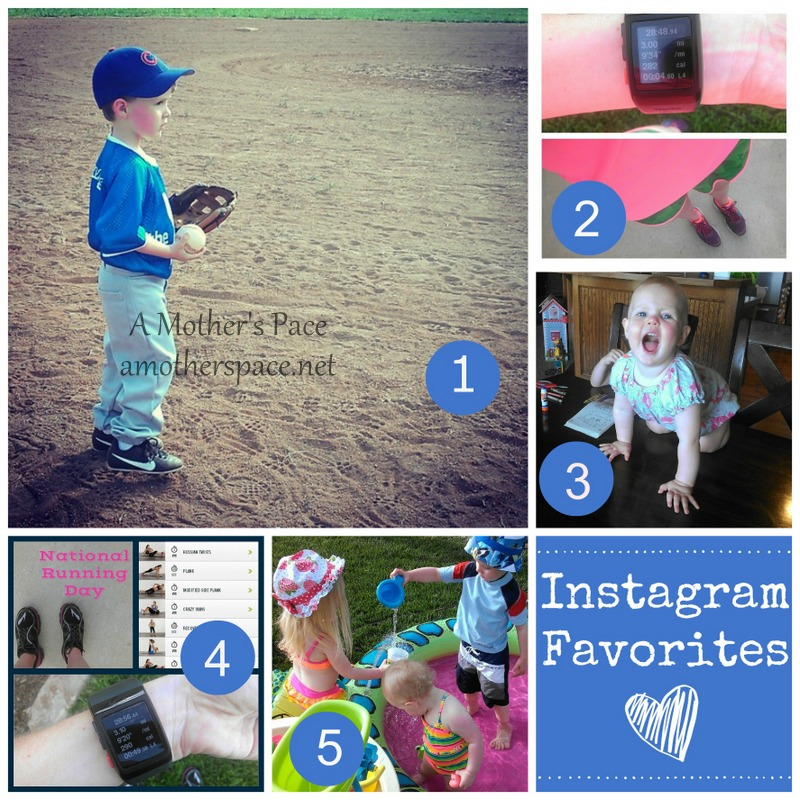
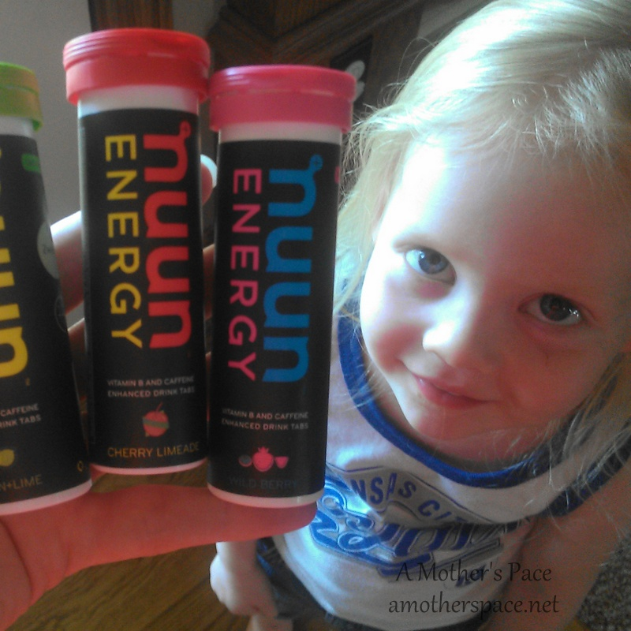
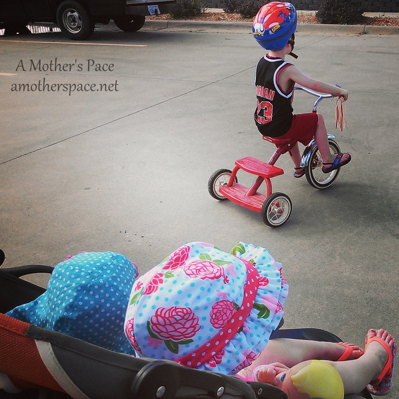
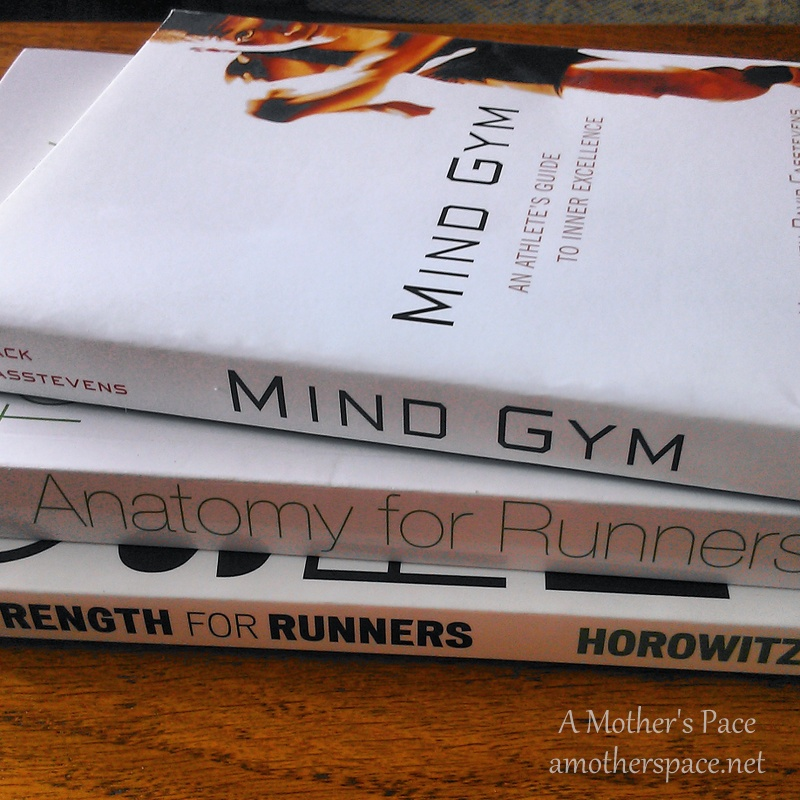

Yay for Friday! I'm glad it's here, finally. Strangely, all week (since TUESDAY!) I've been thinking that each day is Friday. That makes for a rough week, my friends! But we are here and I'm sharing some of my favorites of the week with you again.

## \[1\] Instagram

 

 

\[1\] Oh, boy this photo of my son is one of my all time favorites. I've been a long time baseball fan of the Cubs and watching my son play his first T-ball game with his baseball pants, glove and Cubs hat made this mommy proud. \[2\] I'm loving my bright, bright Saucony gear that I purchased a while back. No one will miss me in this outfit when I'm running! \[3\] Our lives changed this week. Little E is now a table climber. She's by far my most daring child to date. \[4\] I had a couple of good workouts for National Running Day on Wednesday. A morning run and an afternoon core workout. \[5\] I've discovered that putting the pool and water table out in the evening makes for a very relaxing and fun after dinner time activity.

Follow me on Instagram -----> [here](http://instagram.com/amotherspace).

 

## \[2\] Interesting Reads

 

[What Is a Tempo Run a Guest Post by @TinaMuir](http://www.runwiki.org/2014/06/02/what-is-a-tempo-run/?utm_content=buffer59713&utm_medium=social&utm_source=twitter.com&utm_campaign=buffer#.U4zxcfmwJec)  from Tina and Lisa over at RunWiki

[A Summer Like Nuun Other](http://healthystrides.blogspot.com/2014/06/a-summer-like-nuun-other.html?spref=tw&utm_content=buffera7130&utm_medium=social&utm_source=twitter.com&utm_campaign=buffer) from Healthy Strides

[Back to Basics Full Body Strength Workout](http://www.anniebrees.com/2014/06/back-to-basics-full-body-strength.html?utm_content=bufferc015a&utm_medium=social&utm_source=twitter.com&utm_campaign=buffer) from Annie over at Strong Brees

[Workout Wednesday: Modified Pull Up](http://apaceofbalance.blogspot.com/2014/06/workout-wednesday-modified-pull-ups.html?utm_content=buffer57476&utm_medium=social&utm_source=twitter.com&utm_campaign=buffer)s from Michele at A Pace of Balance

[Why Calories In VS Calories Out is Outdated](http://www.mommyrunfast.com/why-calories-in-vs-calories-out-is-outdated/?utm_content=buffer87d38&utm_medium=social&utm_source=twitter.com&utm_campaign=buffer) from Laura at Mommy Run Fast

 

## \[3\] Favorite Running Gear

 

 

This week I received a prize in the mail from the #RTYApril Instagram Challenge. The folks over at Run This Year put together a fun challenge back in April and I was one of the lucky winners. I'm excited to try out the new Nuun Energy flavors. Nuun is my hydration of choice to get electrolytes in before and during a long run.

 

## \[4\] Life Lately

 

 

Usually when the four of us go out for walks, my son is on his tricycle and I'm pushing the two girls in the jogging stroller. One day last week my son was booking it on his trike and I was walking fast and not really keeping up with him. It made me wonder if I would be able to keep up with him (while running) once we finally get around to getting him a real bicycle. I'm a little worried I won't be fast enough. I would love to take all 3 kids out with him to put in a few stroller miles every once in awhile.

## \[5\] Currently Reading

 

 

I purchased a few books this week with a gift card that I received for my birthday. (Thanks, Mom!) I started with [Strength for Runners](http://amzn.to/1pIVbJT) (affiliate link) but it was a hard decision. I just want to soak it all up! I'm hoping that this book will give me a better idea of how often I should strength train and what types of exercises I should be doing. I typically get in 3 or 4 15-25 minute workouts a week and I'll keep you updated on what I find out in this book.

 

### Have you ran with a child riding a bike? Are you currently reading any running books?

 

——————————-

Find A Mother’s Pace on…

Twitter [@amotherspace3](https://twitter.com/amotherspace3)

Facebook [amotherspace3](http://facebook.com/amotherspace3)

Instagram [amotherspace](http://instagram.com/amotherspace)

Pinterest [amotherspace](http://pinterest.com/amotherspace/)

Bloglovin’ [A Mother’s Pace](http://www.bloglovin.com/en/blog/6680087)

RSS [amotherspace](http://feeds.feedburner.com/amotherspace)
