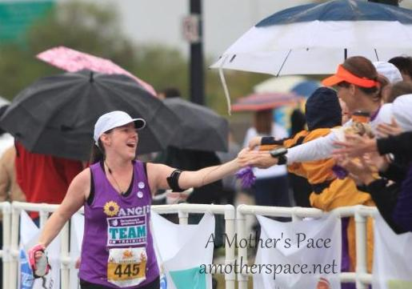
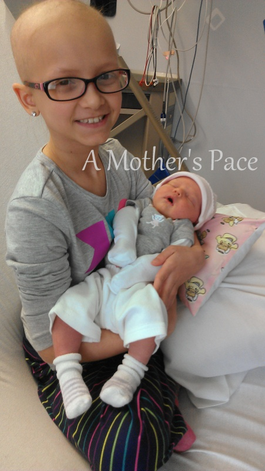
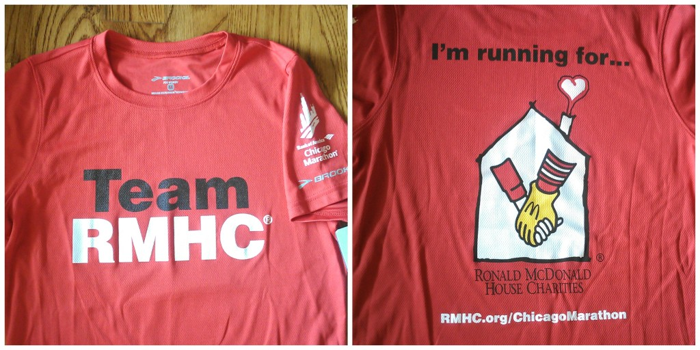

 

My first (and only) marathon was a few years ago in the fall of 2011. Immediately after the race and especially for several days after the race I swore I would never run another marathon. One and done, or so I thought.

 

\[caption id="attachment\_2457" align="aligncenter" width="515"\] I'm high-fiving my son at the finish line of my first marathon.\[/caption\]

 

Then, much like childbirth, some time goes by and I started to forget how sore my legs were after the race. Instead I started to think, what if? You see, things have changed for me since I ran my first marathon. I started keeping a running log. I bought a GPS watch and started paying attention to pace. I started reading more about running and soaking up information. I'm running consistently and racing more often too. So I started to think, what if I really pushed myself during training and trained to race instead of just to finish.

When I think about it that way there is no way that I couldn't do at least one more marathon, just to see the possibilities.

The difficulty with marathon training is the time and energy that it consumes. 20 milers, foam rolling, strength training and mid-week longer runs take a lot out of me. It's true that in order to train to do your best it takes up a significant amount of time. Because of that I'm not sure when, or if, I'll do another marathon. (Although, I'm hoping, of course, that this isn't my last 26.2!)

So my marathon couldn't be just any marathon, it had to be THE marathon. And that's why I picked the Chicago Marathon.

I've wanted to run the Chicago Marathon for a long time now. My sister lives in Chicago and it's my favorite big city. I love to visit and the thought of running the streets of Chicago with thousands of my newest running buddies is a dream come true.

I was highly disappointed when I found out that Chicago was moving toward a lottery system this year. Could I just leave it up to the odds as to whether or not I would be picked? I really didn't want to. I'd been planning on this marathon for awhile now and it would be devastating not to get in. That's when I decided to look into running for a charity.

I'll be honest here, it's not something that I intended to do when I planned out my year of races. I've ran for charity in the past with Team in Training and it was a great experience. But this year I was just going to run on my own.

 

\[caption id="attachment\_2459" align="aligncenter" width="451"\] My niece and my youngest daughter, less than a week old.\[/caption\]

 

When I looked at all the charities two stuck out to me. Team in Training and the Ronald McDonald House (RMH). Both of these organizations are close to my heart because I have watched my 10-year-old niece struggle with leukemia since she was 4. She recently had a bone marrow transplant and family members stayed at the RMH while she was at the hospital. After she was released from the hospital she had to stay close by so she and her family stayed on at the RMH until it was time to finally come home. The RMH was home to my niece and/or close family members for over 3 months.

 

 

Really, when picking an organization, I didn't have to think about it too much at all. It was my time to give back to the RMH for all they have done for my family.

And my niece? She's doing great. She's one tough girl and I'm so proud of her for staying strong and kicking cancer's butt once again.

I've signed on to raise at least $1,000 to benefit the Ronald McDonald house in honor of my niece. On October 12th I will run the streets of Chicago with her name on my bib and thoughts of her will help carry me to the finish line.

If you would like to help me to reach my fundraising goal you may donate ----> [here](http://bit.ly/1hEX9Zl).

Want to learn more about the Ronald McDonald House? Click -----> [here](http://www.rmhc.org/).

 

 

\---------------------------

Find A Mother’s Pace on…

Twitter [@amotherspace3](https://twitter.com/amotherspace3)

Facebook [amotherspace3](http://facebook.com/amotherspace3)

Instagram [amotherspace](http://instagram.com/amotherspace)

Pinterest [amotherspace](http://pinterest.com/amotherspace/)

Bloglovin’ [A Mother’s Pace](http://www.bloglovin.com/en/blog/6680087)

RSS [amotherspace](http://feeds.feedburner.com/amotherspace)
