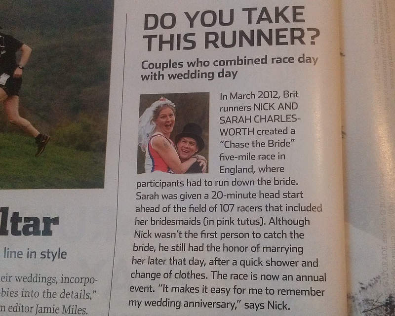
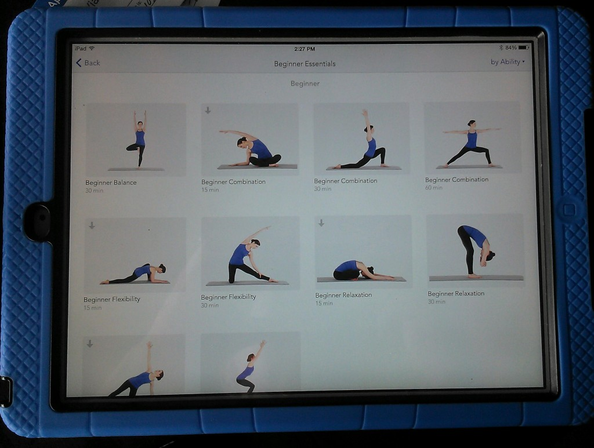
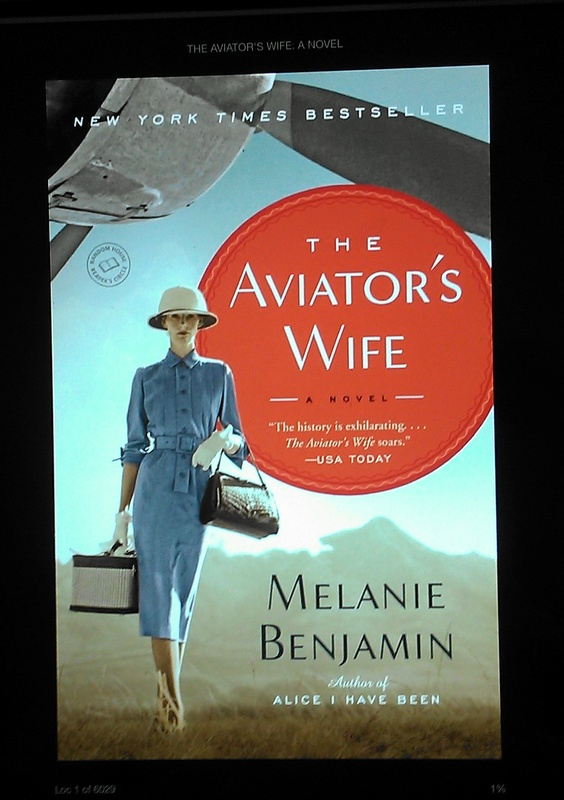

 

It's FRIDAY and I've rounded up some of my favorites from the week to share with you.

## Instagram

 

Looking back on my Instagram account this week I realized that I was heavy on the workouts and light on kiddo/general life photos. \[1\] I [announced this week](http://amotherspace.net/2014/06/the-chicago-marathon-running-for-charity/) that I'm running the Chicago Marathon for the Ronald McDonald House Charities. \[2\] I ran in the rain and loved it. It was one of those nice refreshing runs where the rain was just sprinkling down on me to cool me off. \[3\] My favorite run of the week was a 5 mile speed session that ended up being just plain fun.

Follow me on Instagram ----> [here](http://instagram.com/amotherspace).

## Interesting Reads

[Running Tips - How to Develop a Race Strategy](http://finefitday.com/2014/06/running-tips-how-to-develop-a-race-strategy.html) by Carly at Fine Fit Day

[9 Favorite Photo Editing Apps](http://www.lovelifesurf.com/9-favorite-photo-editing-apps/?utm_content=bufferedaf8&utm_medium=social&utm_source=twitter.com&utm_campaign=buffer) by Christine at Love Life Surf

[Race Travel: 4 Strategies for a Successful Race](http://www.runtothefinish.com/2014/06/tips-for-traveling-to-a-marathon.html?utm_content=buffer544ef&utm_medium=social&utm_source=twitter.com&utm_campaign=buffer) by Amanda at Run to the Finish

[Teach Your Child to Ride a Bike, The Easy Way](http://familysportlife.net/teach-your-child-to-ride-a-bike/?utm_content=bufferb575d&utm_medium=social&utm_source=twitter.com&utm_campaign=buffer)! by John at Family Sport Life

[20 Minute Vacation Resistance Band Workout](http://www.mommyrunfast.com/vacation-resistance-band-workout/?utm_content=bufferdb9ff&utm_medium=social&utm_source=twitter.com&utm_campaign=buffer) by Laura at Mommy Run Fast

And one from the June issue of Runner's World Magazine:

 

 

What a fun idea and a great tradition!

## Favorite Running Gear

While it's not technically 'gear' it is my favorite exercise related helper this week. One of my training goals is to incorporate yoga into my routine. Lately I've been able to fit it in right before bed, usually in my PJ's. Tell me I'm not the only one who does this??? I have the Yoga Studio App on my iPad and love it. I'm still very much a beginner at yoga but I feel more relaxed at bedtime when I can fit it in. I just noticed that they updated the app and have now included yoga for runners! I can't wait to try it after my long run on Saturday.

 

 

## Life Lately

Summertime! We have slowed down for summer and are just enjoying a lot of time at home with each other. I haven't set up any play dates or anything yet, although I need to do that soon. A lot of my friends are teachers so they have extra time in the summer to get together.

We did manage to get to the zoo one morning this week. It was overcast and cool out so the animals were very active.

 

## Currently Reading

My book club meets Monday and so I'm in the middle of our June book, [The Aviator's Wife](http://amzn.to/1mZS0ss) by Melanie Benjamin. It's a historical fiction about Charles Lindbergh and so far it's fascinating. I'm about half way finished so I have a lot to read over the weekend!

 

 

 **What book are you currently reading? I can always use suggestions before we pick our next book!**

**Do you make time for yoga?**

 

I'm running the Chicago Marathon with Team RMHC!

To find out more read my post about [Running for Charity](http://amotherspace.net/2014/06/the-chicago-marathon-running-for-charity/) or head over to my [fundraising page](http://www.kintera.org/faf/donorReg/donorPledge.asp?ievent=1097960&supId=399266070) to make a donation.

——————————-

Find A Mother’s Pace on…

Twitter [@amotherspace3](https://twitter.com/amotherspace3)

Facebook [amotherspace3](http://facebook.com/amotherspace3)

Instagram [amotherspace](http://instagram.com/amotherspace)

Pinterest [amotherspace](http://pinterest.com/amotherspace/)

Bloglovin’ [A Mother’s Pace](http://www.bloglovin.com/en/blog/6680087)

RSS [amotherspace](http://feeds.feedburner.com/amotherspace)
