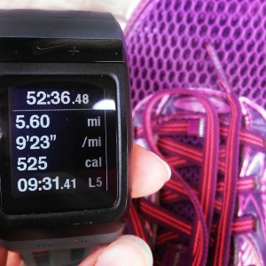
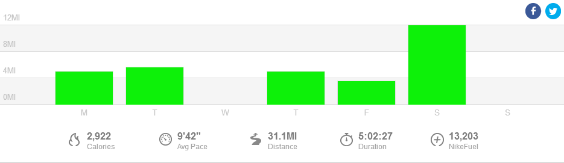

Last week I kicked off the first week of training for the Chicago Marathon. I ended the week with just over 31 miles of running along with a couple of strength workouts and a few yoga sessions. I'm already feeling the benefits of yoga after doing it for a couple of weeks now. I finished the week feeling great on Sunday and now I'm ready for week 2 to begin today!

 

 

## **Weekly Workouts**

 

**Monday:** 5.01 miles (9:25 pace) + 25 minutes Kettlebells and Core Work + 15 minutes relaxation Yoga

This was one of those 'best run' workouts where everything comes together. All throughout my run I had the perfect amount of rain until I was within a couple of minutes from my house and then it really started coming down. I loved it! My training log called for 4-5 easy miles and I started out with the intent to run 4. But the run was SO GOOD that pretty early on I knew I wouldn't stop with 4. This pace felt very easy and my last mile was my fastest. I'm sure the cool rain helped and the fact that the temps for this run were about 10 degrees cooler than I'm used to right now.

**Tuesday:** 5.6 miles (9:23 pace)

My first speed work interval session of the training cycle! I find it humorous interesting that my 'speed work' is only 2 seconds faster per mile than my easy pace yesterday. My warm up mile was much slower than yesterday and that made a big difference.

 

 

**Wednesday:** 30 minutes Spin Bike + 30 minutes Strength

The [Jillian Michaels circuit](http://amzn.to/1a7RDeh) (affiliate link) that I've been doing calls for a treadmill run but I've just been hopping on the spin bike for that portion of the circuit. This workout is tough and I can feel it after I'm finished. Burpees, Mountain Climbers, Planks, they are all in there with a lot of other moves that make me both love and hate this workout at the same time.

**Thursday**: 5 miles (9:02 pace) + 15 minutes Flexibility Yoga

Ah, the perfect run. One of the reasons why I love to run so much is for this moment in time. Everything comes together in one run where it feels easy, light and fast. I was full of energy and on a runner's high when this one was over.

**Friday:** 3.55 miles (9:26 pace)

One of my favorite things about this new training plan is that it gives me an option for mileage. Today's run was 3-4 easy miles. I planned on running 3 (just to keep my first week mileage lower) but was feeling pretty good on the run so I added in a little bit.

**Saturday:** 12 miles (10:21 pace) + 15 minutes Yoga for Runners

This was by far one of the toughest runs I've experienced lately. I felt nauseous, it was super windy and I rolled my ankle toward the end. I dug deep though and even though I wanted to quit I hung in there and finished the run.

**Sunday:** REST

 

 

 

One of my main goals for 2014 is to Run This Year in kilometers. That's 2,014 kilometers or 1,251.44 miles.

Weekly Running Miles: 31.16

Weekly Average Pace: 9:42

June Running Miles: 46.56

2014 Running Miles: 552.42

2014 Running Kilometers: 889.03

 

**How was your running/training week?**

 

I'm running the Chicago Marathon with Team RMHC!

To find out more read my post about [Running for Charity](http://amotherspace.net/2014/06/the-chicago-marathon-running-for-charity/) or head over to my [fundraising page](http://www.kintera.org/faf/donorReg/donorPledge.asp?ievent=1097960&supId=399266070) to make a donation.

——————————-

Find A Mother’s Pace on…

Twitter [@amotherspace3](https://twitter.com/amotherspace3)

Facebook [amotherspace3](http://facebook.com/amotherspace3)

Instagram [amotherspace](http://instagram.com/amotherspace)

Pinterest [amotherspace](http://pinterest.com/amotherspace/)

Bloglovin’ [A Mother’s Pace](http://www.bloglovin.com/en/blog/6680087)

RSS [amotherspace](http://feeds.feedburner.com/amotherspace)
