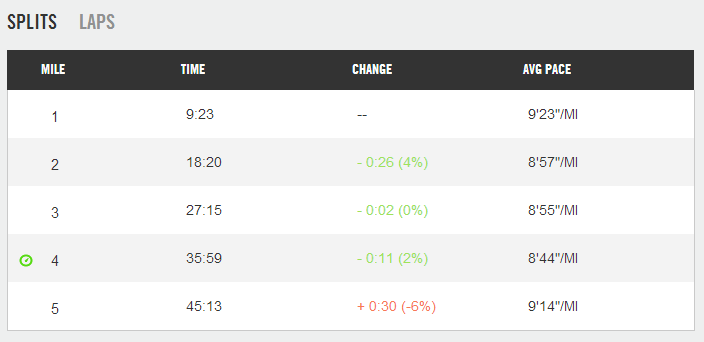
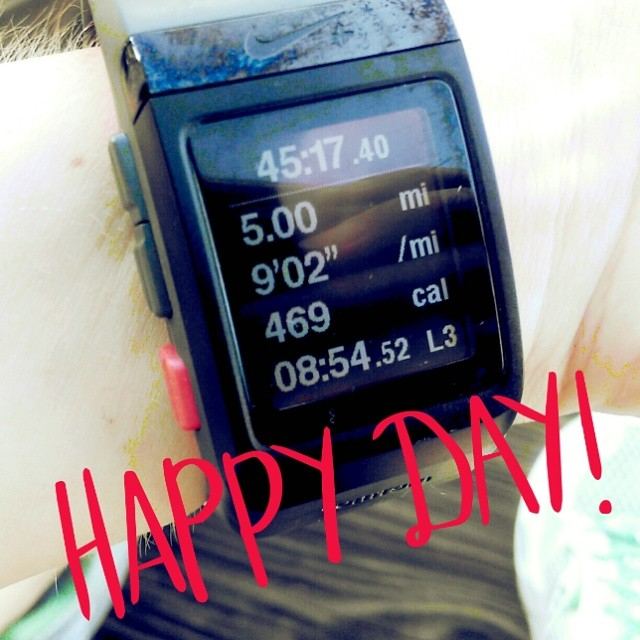
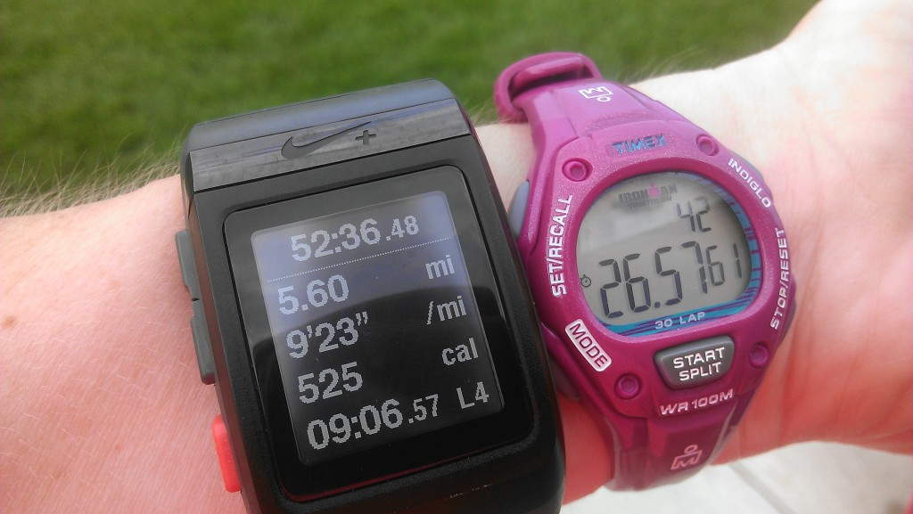

 

## Timed Speed Work

Recently I had one of _those_ runs. The kind where everything falls into place and it feels wonderful. My workout called for a 1 mile warm up before 2 x 2 minutes in zone 4 and 2 x 4 minutes in zone 4 with a short recovery in between, followed by a 1 mile cool down.

What was that again? Yeah, this was one of the workouts I had to reread a few times before my first training cycle with the [Train Like a Mother](http://amzn.to/10eETuP) Own It Plan for half marathons last fall. It felt confusing to me just reading it but after I did it once I had it down and it quickly became a favorite.

Fast forward to my current training plan and it is a run I look forward to when I see it on the plan. Last week I ran a progression run (on accident, really) and it was also much faster than a speed work session just a couple of days before.

 

 

The 'progression' part happened during the 2nd, 3rd and 4th miles. I was running 2 minutes hard, followed by a few minutes easy and then 2 minutes hard again. I then switched over to 4 minutes hard and repeated that cycle once.

I finished my run with a 9:02 average pace, including both the warm up and cool down miles. I had the runner's high afterwards and felt like I had a ton of energy for the rest of the day.

 

 

This type of a run is so much easier for me that I have thought about running a race like this. I have my concerns with doing it though so I'm going to practice on some long runs this training cycle. I'm pretty certain I wouldn't want to run an entire marathon like this but I can see trying it toward the end when my legs are tired. It would give me something to focus on instead of all the miles remaining.

## Distance Speed Work

Also on my training plan are tempo runs. Right now I'm running tempo intervals (2 x 1.5 miles) and regular tempo runs (3 miles) which are so tough. They are the runs that I look at in my training plan and dread. Holding a fast pace for a certain distance when I'm not in a race setting is just not fun for me.

I'm currently in the process of trying to figure out the best way to monitor myself when I'm out running. I love my Nike+ Sportwatch and I don't want to change to a different brand but it is lacking a couple of important features. \[1\] I would love to program my workout into my watch and have it beep at me when it's time to run faster. \[2\] The actual pace is not accurate. It's usually about a minute off.

So in order to figure out my 1.5 tempo pace while running last week I wore two watches.

 

 

Special, I know.

It didn't really work either because when I tapped the splits while I was out running it didn't show me the individual splits right then. I was able to go back after the workout and see my pacing. And I was off by about 30 seconds per mile. I want that immediate feedback so I can adjust my workout when needed. This one was a little tricky because I was trying to track 1.5 miles so it wasn't showing up in my mile splits on my Nike+ watch either.

For my 3 mile tempo run the immediate feedback was somewhat easier. I just made sure that I heard my mile beep and adjusted pace accordingly.

## Timed Speed Work vs. Distance Speed Work

So, as you can tell, I would much rather run by time than distance when it comes to speed work. I know there is great value in both forms of running so I'm working on getting excited about the tempo. I pumped myself up with positive thinking before my 3 mile tempo run yesterday and it worked. I wasn't dreading the run before heading out! I need to feel better about these tempo runs because I'm running a lot of them over the next several months!

**Do you run speed work by time or by distance? Which do you prefer?**

 

I'm running the Chicago Marathon with Team RMHC!

To find out more read my post about [Running for Charity](http://amotherspace.net/2014/06/the-chicago-marathon-running-for-charity/) or head over to my [fundraising page](http://www.kintera.org/faf/donorReg/donorPledge.asp?ievent=1097960&supId=399266070) to make a donation.

——————————-

Find A Mother’s Pace on…

Twitter [@amotherspace3](https://twitter.com/amotherspace3)

Facebook [amotherspace3](http://facebook.com/amotherspace3)

Instagram [amotherspace](http://instagram.com/amotherspace)

Pinterest [amotherspace](http://pinterest.com/amotherspace/)

Bloglovin’ [A Mother’s Pace](http://www.bloglovin.com/en/blog/6680087)

RSS [amotherspace](http://feeds.feedburner.com/amotherspace)
