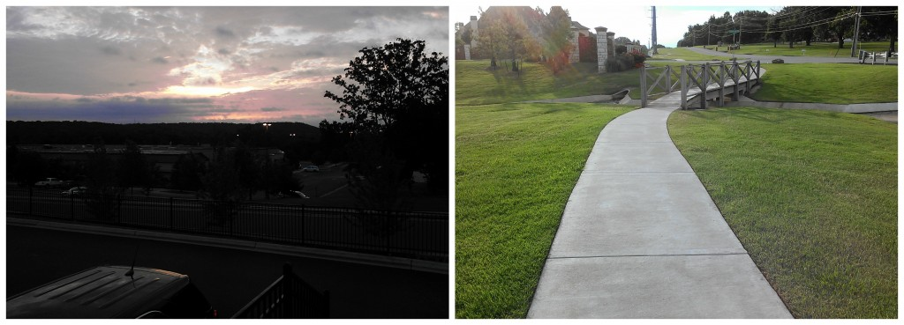
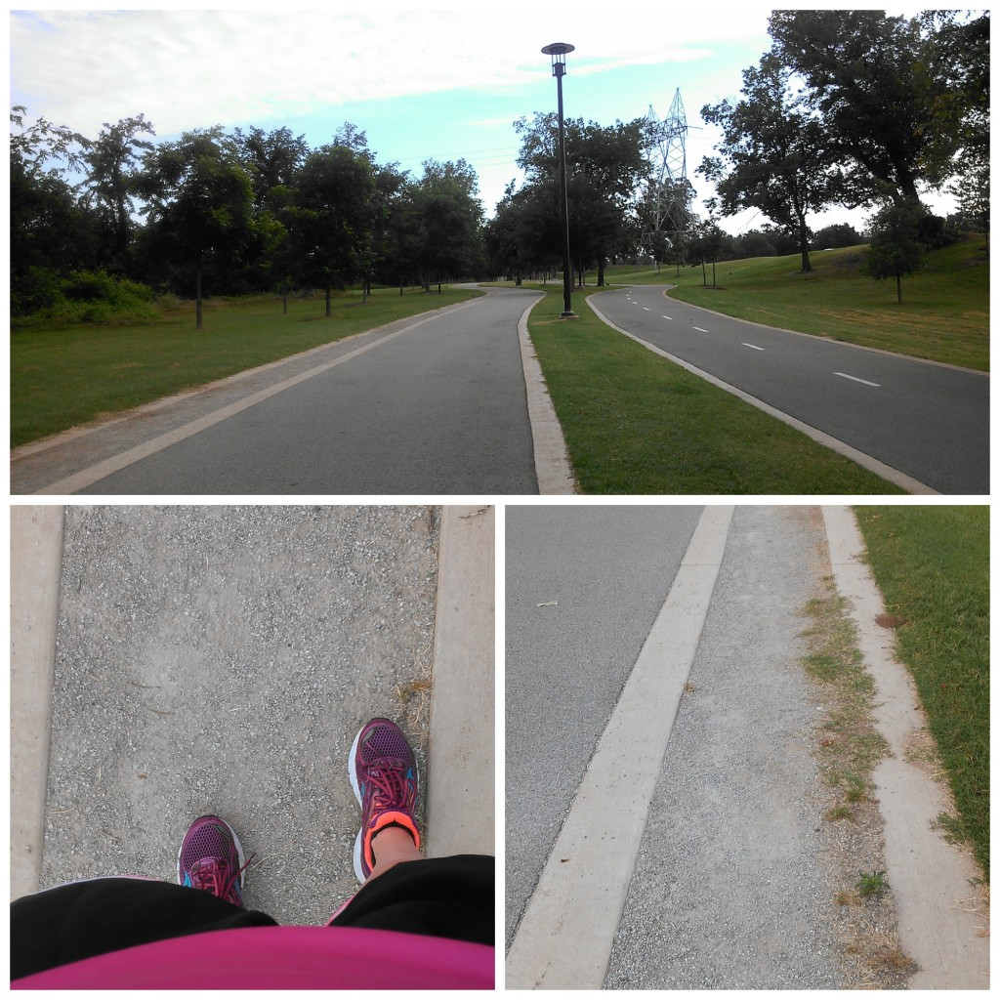
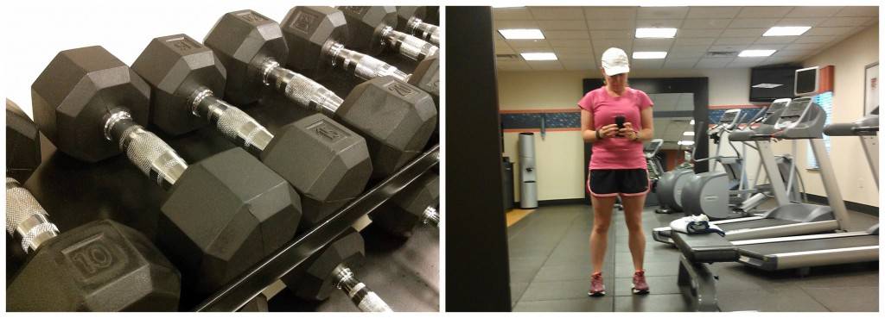
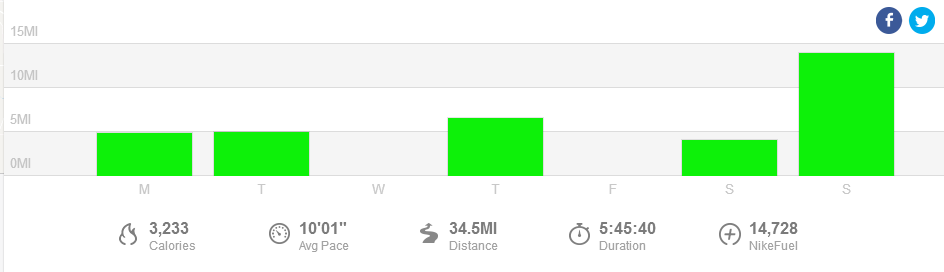

Is it strange that I actually enjoy running on hills?

I live in Kansas and it's definitely known for being a flat state. We do have some hills, for example the Flint Hills, but I live in Wichita which is very flat. The only 'hills' are found in some slight inclines in neighborhoods and the bike path ramps down by the river.

Last week we were on a little mini vacation a couple of hours away in Tulsa, Oklahoma. I was pleasantly surprised to see that Tulsa was pretty hilly (by my standards) and was excited to explore the area on foot.

 

 

The first morning I headed out I went to a familiar area that was close to us. I ran through a shopping district and then found a nice looking neighborhood to wander around. My workout was supposed to be a 'hilly speed work' session, which was great because I had plenty of hills. But by the time I ran into this neighborhood I was too distracted to concentrate on running 2:30 minutes fast at a time. The houses were BEAUTIFUL and the landscaping was gorgeous. I wanted to take pictures of all the yards and replicate them back at my own house. I held myself back though and didn't take any photos.

But I did decide to scrap the faster workout and just concentrate on the hills. Instead I did more of a fartlek workout because I didn't time my faster bursts. This allowed me to really enjoy my vacation run.

 

 

My next run was on Saturday and I ran to a path I had discovered while we were out driving a day earlier. It was only a mile away and ended up being a perfect path. My only wish was that I had packed gels and chafing cream so that I could have ran long on Saturday instead of planning my long run for Sunday morning after we were back home again.

 

 

The path was split in two. One for the cyclists and one for the pedestrians. There were plenty of drinking fountains which was nice because I didn't have any water with me. I ran a mile on the path and then had to turn around. I didn't want to run too much because I had 14 miles scheduled for the next day. Once I turned around I noticed a nice gravel section on the right of the path. I ran on that for the remaining mile on the path because it was such a soft surface.

This path convinced me that I definitely want to go back to Tulsa at some point. It's the perfect area to run a long run.

My hotel also had a gym but I didn't use it as much as I wanted. I managed to get down there one morning and I spent only 8 minutes with some free weights before I headed out for my Saturday run. I just wasn't feeling the weights and I was missing my kettlebells at home.

 

 

This entire trip wasn't planned very much in advance so I didn't spend any time researching running routes like I normally do before visiting a new area. I should have spent a few minutes and googled Tulsa running routes because I would have come up with some pretty routes. That said, I enjoyed what I stumbled upon and it felt great to run in a new environment for a few days.

 

 

## **Weekly Workouts**

 

**Monday:** 4.83 miles (9:49 pace) + 31 minutes Kettlebells and Core Work

I took this run nice and easy today. My plan called for an easy 4-5 + 6 strides. I ran just over 4 and then started in on the strides.

**Tuesday:** 5.01 miles ( pace) + 15 minutes Yoga for Runners

This run was supposed to be a 3 mile tempo run with a 1 mile warm up and cool down. I started out great, running with the wind. My first tempo mile beeped in at 8:30, right on track! Then I turned around and failed miserably at keeping pace heading into the wind. The second tempo mile beeped in at 9:00 and the third at 9:30. Almost a minute off of my goal. But I was working hard and getting a resistance workout all at the same time!

**Wednesday:** Walk the Tulsa Zoo

**Thursday:** 6.6 miles (9:40 pace)

My hilly speed work session turned into a hilly fartlek run. These hills were fun!

**Friday:** Rest

**Saturday:** 4.04 miles (10:01 pace) + 8 minutes strength

Because my hilly run on Thursday was so successful I decided to tackle a larger hill. I ran a couple of larger rolling hills to  a running path by the river.

**Sunday:** 14.01 miles (10:30 pace) + 15 minutes Yoga for Runners

Back home again. I ran a new route because I needed a change. I decided to run this at a slower pace (10:00-10:40) to see how it affected my recovery. My pace range for long runs according to McMillan's Running Calculator is between 9:23 and 10:40 and in the past I've always aimed for the faster end of the spectrum. It's hard to purposefully run slower than you are capable but all types of runs have a purpose in a training plan. I felt great during this run and when it ended I felt as though I could have kept on running.

 

 

One of my main goals for 2014 is to Run This Year in kilometers. That's 2,014 kilometers or 1,251.44 miles.

Weekly Running Miles: 34.49

Weekly Average Pace: 10:01

June Running Miles: 81.05

2014 Running Miles: 586.91

2014 Running Kilometers: 944.54

 

**Do you run while on vacation? Do you plan out a route or just explore?**

 

I'm running the Chicago Marathon with Team RMHC!

To find out more read my post about [Running for Charity](http://amotherspace.net/2014/06/the-chicago-marathon-running-for-charity/) or head over to my [fundraising page](http://www.kintera.org/faf/donorReg/donorPledge.asp?ievent=1097960&supId=399266070) to make a donation.

——————————-

Find A Mother’s Pace on…

Twitter [@amotherspace3](https://twitter.com/amotherspace3)

Facebook [amotherspace3](http://facebook.com/amotherspace3)

Instagram [amotherspace](http://instagram.com/amotherspace)

Pinterest [amotherspace](http://pinterest.com/amotherspace/)

Bloglovin’ [A Mother’s Pace](http://www.bloglovin.com/en/blog/6680087)

RSS [amotherspace](http://feeds.feedburner.com/amotherspace)
