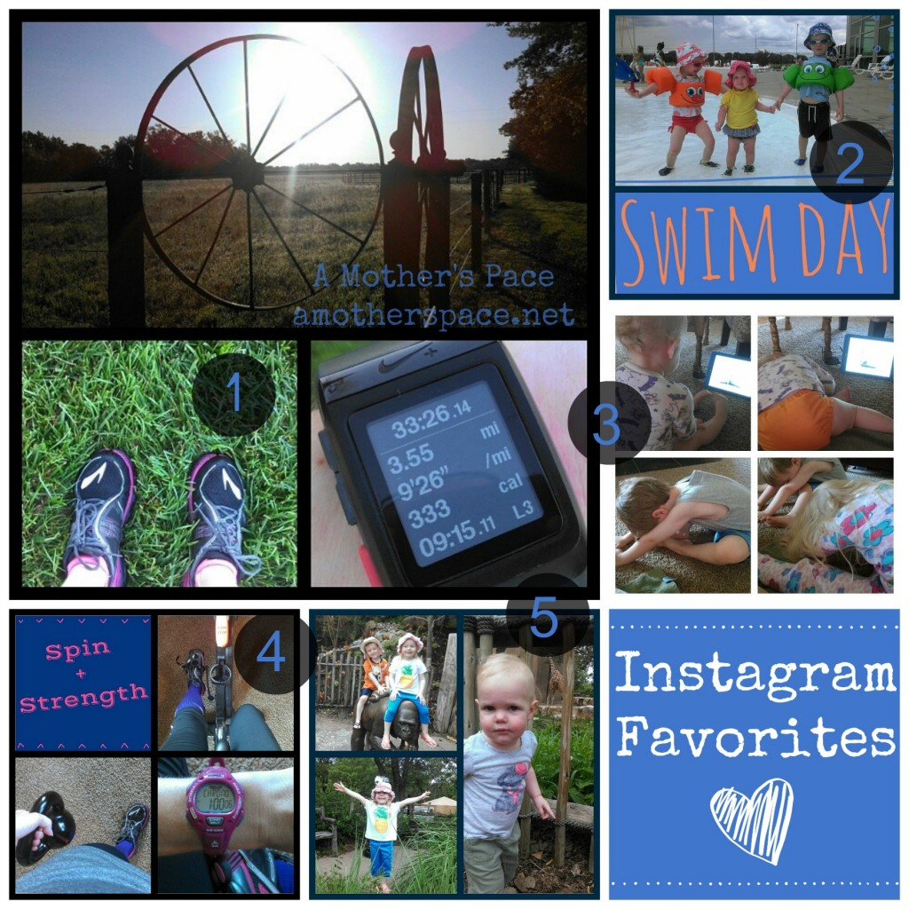
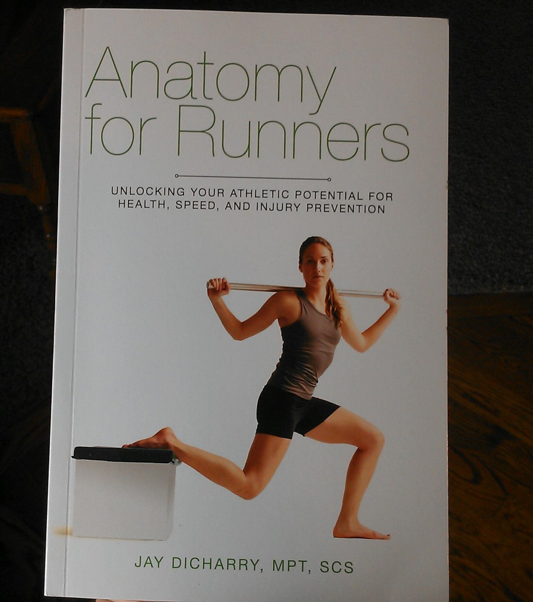

 

I missed my Friday Favorites last week because we were on [vacation in Tulsa](http://amotherspace.net/2014/06/running-in-tulsa-chicago-marathon-training-week-2/ "Running in Tulsa [Chicago Marathon Training: Week 2]"). I'm back this week and so I'm including favorites from the past two weeks as a bonus!

My husband was off of work for 5 work days and Wednesday was our first day back to normal. I don't know what got into me but Wednesday afternoon was incredibly productive. I made phone calls, worked on the computer, cleaned, made dinner did a bunch of mom stuff and it felt great. If only I could be that productive all of the time!

We are enjoying having some family visiting for the weekend so it will be pretty low key. My favorite kind of weekend! Enjoy your Friday and have a great weekend!

## Instagram

 

**\[one\]** One thing you'll definitely see on my Instagram account is a daily update on my workout. Usually accompanied by a shot of my Nike+ Sportwatch, some scenery and maybe my shoes of the day. **\[two\]** We finally made it to our local YMCA pool this week. We made it just in time too because as we were getting out of the pool to head home the pool was cleared due to thunder. **\[three\]** Yoga, I'm loving it and adding it into my routine more often and so are the kids. It's fun to have them stretch out with me after a run, not relaxing, but fun. **\[four\]** My long run was on Sunday this week so I rode the spin bike on Monday. I usually spin for 20 minutes with 10 minutes of climb intervals before I hop off the bike for a strength, core and kettlebell workout. Then I repeat the bike portion for a 60 minute workout. **\[five\]** The Zoo! We love our local zoo and just renewed our membership for the summer.

Follow me on Instagram ----> [here](http://instagram.com/amotherspace).

## Interesting Reads

Michelle Gonzalez: [Eating to Run](http://running.competitor.com/2014/06/saucony-26-strong/michele-gonzalez-eating-run_106078?utm_content=bufferad578&utm_medium=social&utm_source=twitter.com&utm_campaign=buffer) Michelle from [NYC Running Mama](http://www.nycrunningmama.com/) is over on Competitor this week with an article about the importance of eating healthy calories while training hard.

[Catching up with Kara](http://www.oiselle.com/blog/catching-kara?utm_content=buffer1d07c&utm_medium=social&utm_source=twitter.com&utm_campaign=buffer) via Oiselle. Kara Goucher is running a fall marathon and is considering either NYC or CHICAGO. I bet you can guess which one I'm routing for!

[Nailing the Negative Split](http://misszippy1.com/2014/06/nailing-negative-split.html?utm_content=buffer38140&utm_medium=social&utm_source=twitter.com&utm_campaign=buffer) by Miss Zippy. This is something that I'm constantly working on improving!

[Do you Really Need Electrolytes?](http://www.mommyrunfast.com/do-you-really-need-electrolytes/?utm_content=buffere2758&utm_medium=social&utm_source=twitter.com&utm_campaign=buffer) from Laura at Mommy Run Fast. An interesting view on electrolytes with a lot of helpful information.

[5 Reasons You Should Do Kettlebell Swings](http://www.mindbodygreen.com/0-14117/5-reasons-you-should-do-kettlebell-swings.html?utm_content=buffer1330c&utm_medium=social&utm_source=twitter.com&utm_campaign=buffer) from Mind Body Green. I'm loving my kettlebells lately!

 

## Currently Reading

I started reading [Anatomy for Runners](http://amzn.to/1pEHR60) (affiliate link) by Jay Dicharry while I was on vacation last week. I ordered the actual book to read instead of buying it for the Kindle. Boy do I love holding a real book again! I'm only about 25 pages in but I can tell that it is already helping my form. I'm trying to think more about how I'm running instead of just going out the door and hitting the pavement. I'll keep you updated the more I get into this book.

 

 

## Favorite Quotes

_**Go fast enough to get there but slow enough to see**._ -- Jimmy Buffett

_**Out on the roads there is fitness and self-discovery and the persons we were destined to be.**_ \-- Dr. George Sheehan

_**Remember, the feeling you get from a good run is far better than the feeling you get from sitting around wishing you were running.**_ \-- Sarah Condor

 

 **Have you read Anatomy for Runners? What did you think? Do you like reading books about running? What are your favorites?**

\_\_\_\_\_\_\_\_\_\_\_\_\_\_\_\_\_

 

I'm running the Chicago Marathon with Team RMHC!

To find out more read my post about [Running for Charity](http://amotherspace.net/2014/06/the-chicago-marathon-running-for-charity/) or head over to my [fundraising page](http://www.kintera.org/faf/donorReg/donorPledge.asp?ievent=1097960&supId=399266070) to make a donation.

\_\_\_\_\_\_\_\_\_\_\_\_\_\_\_\_\_

Find A Mother’s Pace on…

Twitter [@amotherspace3](https://twitter.com/amotherspace3)

Facebook [amotherspace3](http://facebook.com/amotherspace3)

Instagram [amotherspace](http://instagram.com/amotherspace)

Pinterest [amotherspace](http://pinterest.com/amotherspace/)

Bloglovin’ [A Mother’s Pace](http://www.bloglovin.com/en/blog/6680087)

RSS [amotherspace](http://feeds.feedburner.com/amotherspace)
