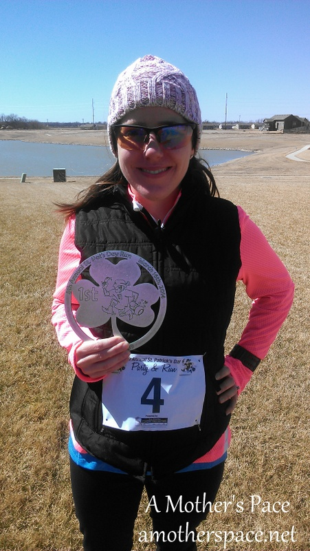
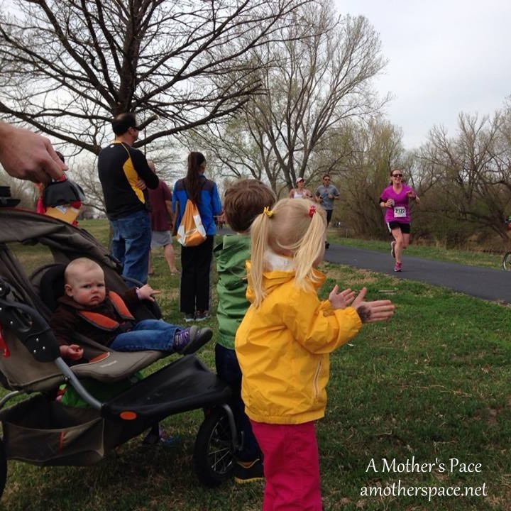
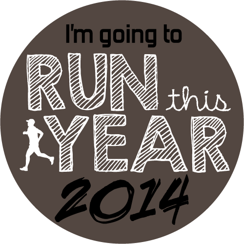
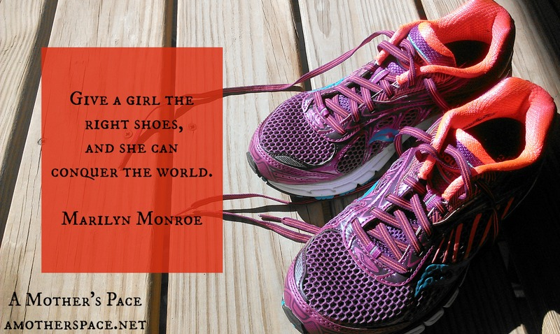

 

Back in January I announced that I had [Big Goals for the New Year](http://amotherspace.net/2014/01/big-goals-for-the-new-year/) and I'm checking in today to update you on my progress for the past 6 months.

 

 

## My Goal Race

I hadn't signed up for Chicago yet or known that it was going to be a lottery system for the first time this year but back in January I announced that my goal race was to run the Chicago Marathon on October 12th. I'm definitely on track with this one because I am in week 4 of my training cycle.

## 14 in 2014

I also planned to run [14 races in the year 2014](http://amotherspace.net/2013/12/14-races-in-2014/). So far I've raced 5 road races and 4 virtual races. Initially I had wanted to only count road races for this goal but I'm not sure that I would make that goal at this point. Virtual races count officially so I'm keeping them in my total for now as well.

 

 

It's been a fun year of PR's in the 5k,10k and the half marathon. I've also managed to place in my age group at a couple of races!

So far I've raced the [Frosty 5k](http://amotherspace.net/2014/01/2014-frosty-5k-race-recap/ "2014 Frosty 5K Race Recap"), [5 by the 5th February](http://amotherspace.net/2014/02/5-by-the-5th-february/ "5 by the 5th: February"), [5 by the 5th March](http://amotherspace.net/2014/03/5-by-the-5th-march/ "5 by the 5th: March"), [St. Patrick's Day Party & Run 4 miler](http://amotherspace.net/2014/03/st-patricks-day-party-and-run-race-recap-2014/ "St. Patrick’s Day Party and Run Race Recap 2014"), [5 by the 5th April](http://amotherspace.net/2014/04/april-5bythe5th-virtual-race/ "April #5bythe5th Virtual Race"), [Easter Sun Run 10k](http://amotherspace.net/2014/04/easter-sun-run-race-recap-2014/ "Easter Sun Run Race Recap 2014"), [World Run Virtual Race](http://amotherspace.net/2014/04/the-boston-marathon-one-week-later/ "The Boston Marathon: One Week Later"), [Prairie Fire Half Marathon](http://amotherspace.net/2014/05/2014-prairie-fire-spring-half-marathon-race-recap/ "2014 Prairie Fire Spring Half Marathon Race Recap") and the [Get Your Rear in Gear 5k](http://amotherspace.net/2014/05/get-your-rear-in-gear-2014-race-recap/ "Get Your Rear in Gear 2014 Race Recap").

 

 

## Run This Year

Lastly, my most lofty goal was to run this year in kilometers. That's 2,014 kilometers for the year or 1,251.44 miles for 2014. I have never ran this many miles in a year before but I knew that in training for a spring half and a fall full this goal would be within my sight. I just need to keep running in between my training plans to get the mileage in for the year.

 

 

So far for the year I've logged 611.07 miles which means I am only 14.65 miles away from the halfway mark. Considering that my mileage is only increasing with the upcoming marathon training long runs, I think this goal is right on track.

 

 

 

**Did you set 2014 goals? How are they coming along?**

 

\_\_\_\_\_\_\_\_\_\_\_\_\_\_\_\_\_\_\_

I'm running the Chicago Marathon with Team RMHC!

To find out more read my post about [Running for Charity](http://amotherspace.net/2014/06/the-chicago-marathon-running-for-charity/) or head over to my [fundraising page](http://www.kintera.org/faf/donorReg/donorPledge.asp?ievent=1097960&supId=399266070) to make a donation.

——————————-

Find A Mother’s Pace on…

Twitter [@amotherspace3](https://twitter.com/amotherspace3)

Facebook [amotherspace3](http://facebook.com/amotherspace3)

Instagram [amotherspace](http://instagram.com/amotherspace)

Pinterest [amotherspace](http://pinterest.com/amotherspace/)

Bloglovin’ [A Mother’s Pace](http://www.bloglovin.com/en/blog/6680087)

RSS [amotherspace](http://feeds.feedburner.com/amotherspace)
