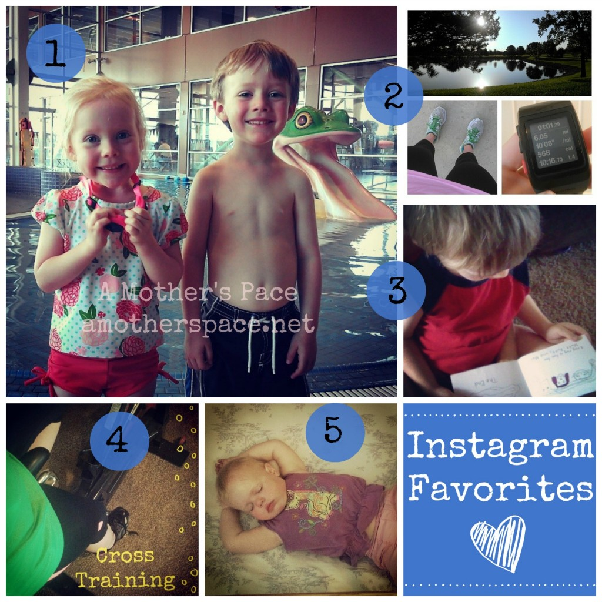
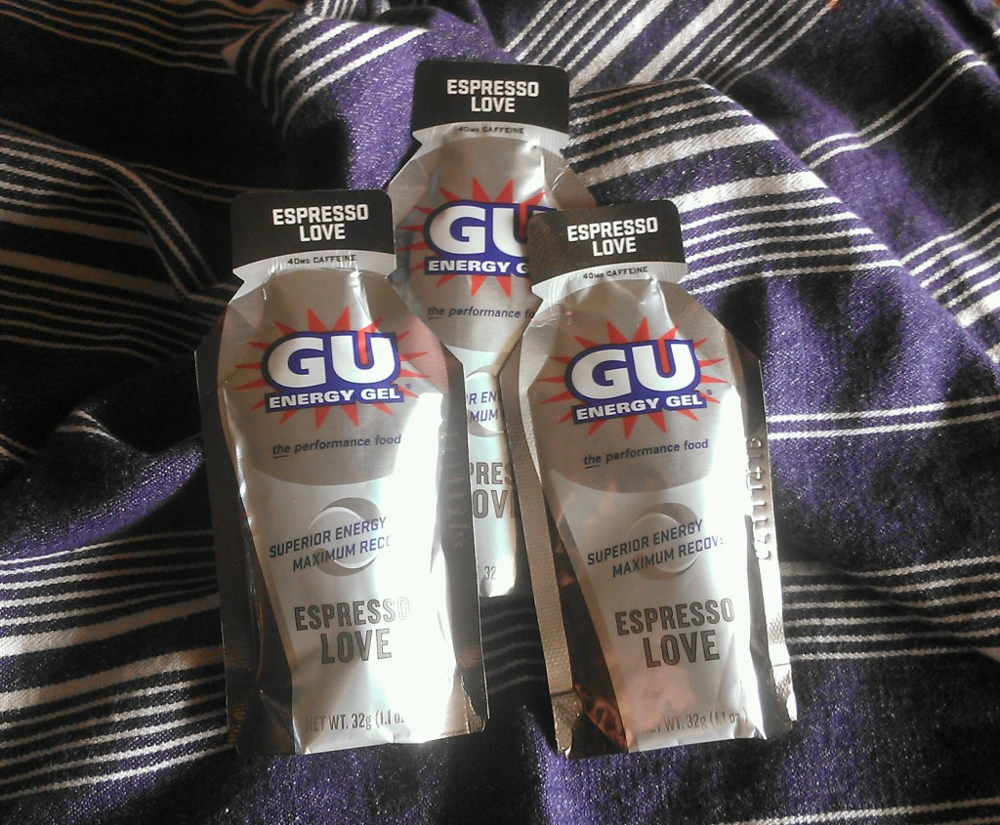

Happy Fourth of July! I'm celebrating today by taking advantage of the holiday and getting my long run for the weekend in early. I have 13 miles with a strong finish on the schedule.

Tonight we'll enjoy the few fireworks that we purchase and then sit outside and watch the big ones that our neighbors set off for as long as the kids will last. Last year they completely surprised me by wanting to be outside for about 20 minutes...my neighbors set off some pretty big fireworks!

## Instagram

**\[one\]** We've started swimming lessons this week! The kids are loving swimming every day. We've been enjoying the pool so much that I've even taken all three of them to the toddler time at the pool by myself. We stay in the shallow water and end up having a blast. **\[two\]** We've had unseasonably cool weather this week. For the record, I am NOT complaining! It has been wonderful and I've even worn capris...in July! **\[three\]** My 4-year-old is reading and I'm one proud mama. He notices print everywhere and I'm constantly impressed by words the he is able to sound out. Signal and Franklin are two of my favorites! **\[four\]** I spent 60 minutes on the spin bike this week. It's still a day I look forward to each week. **\[five\]** A sweet sleeping baby.

Follow me on Instagram ----> [here](http://instagram.com/amotherspace).

## Interesting Reads

[Do You Make These 6 Race Day Mistakes](http://www.runtothefinish.com/2014/06/do-you-make-these-6-race-day-mistakes.html?utm_content=bufferb61d1&utm_medium=social&utm_source=twitter.com&utm_campaign=buffer) from Amanda at Run to the Finish

[How to: Kettlebells Swings](http://www.anniebrees.com/2014/06/how-to-kettlebell-swings.html?utm_content=buffer5c8c2&utm_medium=social&utm_source=twitter.com&utm_campaign=buffer) by Annie at Strong Brees

[6 Summer Salads to Break Out of the Lunch Rut](http://www.mommyrunfast.com/6-summer-salads-to-break-out-of-the-lunch-rut/?utm_content=buffer5034e&utm_medium=social&utm_source=twitter.com&utm_campaign=buffer) from Laura at Mommy Run Fast

[Why I Buy in Bulk and Why You Should Too](http://www.100daysofrealfood.com/2014/07/02/buy-in-bulk/?utm_content=buffer926d0&utm_medium=social&utm_source=twitter.com&utm_campaign=buffer) from Kiran at 100 Days of Real Food

[Give Yourself Some Slack --> RUNNING IN THE HEAT!](http://www.hungryrunnergirl.com/2014/07/give-yourself-some-slack-running-in-the-heat.html?utm_content=buffercd6b2&utm_medium=social&utm_source=twitter.com&utm_campaign=buffer) from Janae at The Hungry Runner Girl

## Favorite Running Gear

Recently, on a long run, I packed an [Espresso Love Gu](http://amzn.to/1mlGSK4) (affiliate link) that was given to me. I haven't been running with Gu regularly (I've switched over the [Honey Stingers](http://amzn.to/1xiAndx).) but I'm trying to use up my stash before some of them expire. On the run I saved the espresso flavor for the last few miles to give me an extra kick when I needed it. Espresso is true to its name and packed with 40 mg of caffeine.

 

 

This was my first run using a Gu that had that much caffeine in it and I could definitely tell a difference right away. I felt like a fog lifted and I could see clearly again. My step felt lighter and after running around 10 miles my pace felt easier.

I went to the running store to replenish my supply. I'll use the Honey Stinger gels for most of my long run but then save an Espresso Love for the miles that I need that extra boost.

## Favorite Quotes

_**If you want to become the best runner you can be, start now. Don’t spend the rest of your life wondering if you can do it.**_ -- Priscilla Welch

**_Everyday is a good day when you run._ --** Kevin Nelson

_**But I realize that winning doesn’t always mean getting first place; it means getting the best out of yourself.**_ -- Meb Keflezighi

 

 

\_\_\_\_\_\_\_\_\_\_\_\_\_\_\_\_\_\_

I'm running the Chicago Marathon with Team RMHC!

To find out more read my post about [Running for Charity](http://amotherspace.net/2014/06/the-chicago-marathon-running-for-charity/) or head over to my [fundraising page](http://www.kintera.org/faf/donorReg/donorPledge.asp?ievent=1097960&supId=399266070) to make a donation.

——————————-

Find A Mother’s Pace on…

Twitter [@amotherspace3](https://twitter.com/amotherspace3)

Facebook [amotherspace3](http://facebook.com/amotherspace3)

Instagram [amotherspace](http://instagram.com/amotherspace)

Pinterest [amotherspace](http://pinterest.com/amotherspace/)

Bloglovin’ [A Mother’s Pace](http://www.bloglovin.com/en/blog/6680087)

RSS [amotherspace](http://feeds.feedburner.com/amotherspace)
