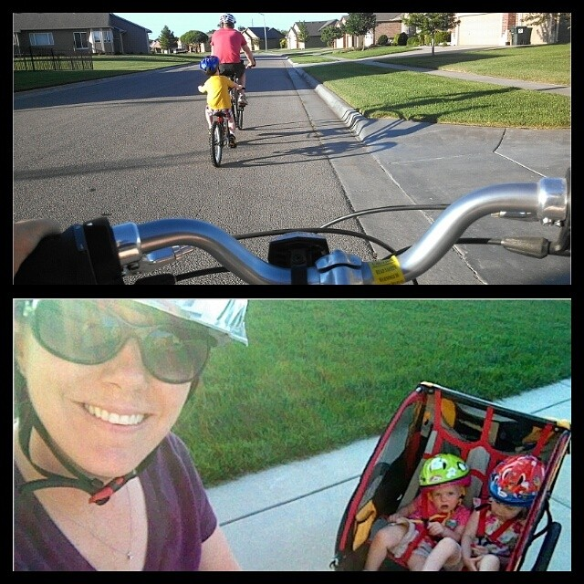
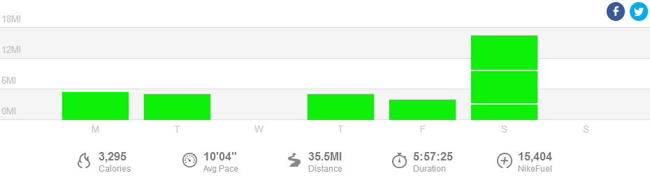

 

I just survived my highest weekly mileage ever AND on top of that have been dealing with an achy Achilles tendon. Let me back up a bit.

 

But first here's a photo from an early run this week. Pretty clouds and if I had been out just a _few minutes earlier_ it would have been an amazing sunrise!

 

 

My tendon, calf and right leg in general have been feeling tired lately. I've had a huge knot in my calf that after a lot of massages from my husband (he really is the best!!) is starting to feel close to normal again. It's a strange thing because my tendon actually feels the best while running and is achy the rest of the day.

I was starting to worry about training and thinking about going to see a doctor but decided to try a couple of things first.

 

I've ditched the flip flops and have been sporting a retired pair of running shoes with compression socks a lot lately and it seems to be getting the job done. It pains me to wear socks in the summer time all day but it is worth it in the end.

My high mileage this week came together with a few 5 milers and a 16 mile long run. This is only the 3rd time that I've ran 16 miles. Ever. My first time was when I was training for my first marathon. My longest training run was only 16 miles and I only ran it once. The second time was, of course, during the marathon. So, this training cycle with 3 20 milers is much, much different from my first. I'm hoping that this will allow me to run a stronger marathon on October 12th!

 

 

## **Weekly Workouts**

 

**Monday:** 5.41 miles (9:39 pace) + 25 minutes Kettlebells and Core Work + 15 minutes Flexibility Yoga

I went to bed early on Sunday and the extra sleep made it much easier to get up in the morning. Go figure! I fit in my miles and strength in the morning and then added the yoga during nap time in the afternoon.

**Tuesday:** 5.06 miles (9:41 pace) + 20 minute family bike ride

This was a fantastic 'best run' with negative splits. My goal was negative splits 2,2,1 so I started out at a 10:13 pace and worked on getting a little faster each mile. My last mile was 8:31. I definitely had a runner's high after this one.

Our family bike rides are one of my favorite activities of the summer. The 3rd wheel bike that we bought for my son this year is a huge hit and it means that we can all head out for a ride at the same time.

 

 

**Wednesday:** 20 minutes Spin Bike + 10 minutes Strength + 15 minutes Flexibility Yoga

After a bad night of sleep I choose to ignore my alarm and get some extra zzz's. Instead I squeezed a spin/strength/yoga session in during nap time. It worked out really well!

**Thursday:** 5 miles (9:24 pace)

I woke up to lightning and rain so I hit the treadmill for the first time in almost 2 months. It was rough. I know the treadmill gets easier (mentally, for me) the more I run on it but I'm still not looking forward to spending most of my miles on it again this winter.

I cut this run short but I did the bulk of the workout. My training plan called for a 10 minute warm up, 6 x 3:30 in zone 3-4, recover as needed. I did 6 3.5 minute intervals but I didn't take as much recovery or cool down time to make this the 7-8 mile run that my training plan wanted me to do. I just couldn't pull out that distance on a treadmill today.

**Friday:** 4.01 miles (10:06 pace) + 15 minutes Kettlebells and Core

My training plan said 3-4 miles and since I cut yesterdays run short I decided to run the long distance today. I even had time for a strength workout when I got back home.

**Saturday**: 16 miles (10:32 pace)

This day is a blog post all on it's own. I'll post it later this week. The very short version is that I ran 3 miles to warm up. Then I ran a local 10k and then I finished the rest of my miles after driving a short distance to a nice running neighborhood nearby. It was a rough day and I'm pretty sure I wouldn't split it up like this again BUT it definitely made the miles entertaining. Even though it was a rough day I'm glad I tried it out.

**Sunday:** REST

Yes, rest. It felt amazing. It's funny how one day of rest can make me excited to run the next day again.

 

 

 

One of my main goals for 2014 is to Run This Year in kilometers. That's 2,014 kilometers or 1,251.44 miles.

Weekly Running Miles: 35.48

Weekly Average Pace: 10:04

July Running Miles: 64.18

2014 Running Miles: 679.30

2014 Running Kilometers: 1093.23

 

**Have you ever tried to run a race in the middle of a long run before?**

 

\_\_\_\_\_\_\_\_\_\_\_\_\_\_\_\_\_

I’m running the Chicago Marathon with Team RMHC!

To find out more read my post about [Running for Charity](http://amotherspace.net/2014/06/the-chicago-marathon-running-for-charity/) or head over to my [fundraising page](http://www.kintera.org/faf/donorReg/donorPledge.asp?ievent=1097960&supId=399266070) to make a donation.

——————————-

Find A Mother’s Pace on…

Twitter [@amotherspace3](https://twitter.com/amotherspace3)

Facebook [amotherspace3](http://facebook.com/amotherspace3)

Instagram [amotherspace](http://instagram.com/amotherspace)

Pinterest [amotherspace](http://pinterest.com/amotherspace/)

Bloglovin’ [A Mother’s Pace](http://www.bloglovin.com/en/blog/6680087)

RSS [amotherspace](http://feeds.feedburner.com/amotherspace)
